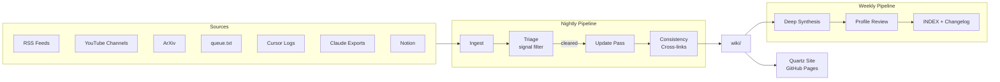

# AI Advancements Wiki

**A self-updating knowledge base (inspired by Andrej Karpathy's LLM Wiki pattern) that distills new and groundbreaking findings in AI - from new products and features, to new methodologies and tools for engineering, to research approaches/findings.**

AI is a rapidly evolving field. Information from the internet and media is constantly being churned out and is usually focused on the latest hype, causing older findings or news to fall by the wayside or become forgotten. Plus, all of this information is scattered across sources, opinionated, partially untrue/AI-generated (at times, or perhaps frequently), and written/shared in a variety of ways.

The Wiki approach establishes a persistent, ever-growing/ever-updating data source (written in markdown), which an AI agent can easily write to and read from. It rewrites, summarizes, or filters information in the way deemed appropriate, so as to focus on the core purpose of the wiki source. This is a Wikipedia centered entirely on the advancements in technology, primarily AI, so that Dean (and others) can remain in-the-loop on what's out there, and stay strong and relevant as an AI engineer.

The wiki is made so as to match my learning style, preferences in selecting new content to read/consume, and existing set of skills/knowledge. It includes content sections pertaining to what I should do/learn (the implications of the new AI hype), based on where I am on my journey - the repo points at a private data source - a `dean.md` that describes my cognitive style, thinking patterns, intellectual life, professional identity, what great content looks like, working style, AI collaboration patterns, preferences and tolerances, life context and values, and deeper life mission (mostly derived from cursor and claude chats over multiple years).

This repo is an example of what's possible when we apply the wiki pattern to information, and do so in a personalized way. It is an example of a personalized wiki.

## How it works

The wiki lives in this repo and is updated through a recurring LLM-based pipeline — no manual curation required.

A nightly GitHub Actions workflow monitors a curated set of sources: RSS feeds from AI research blogs, YouTube channels from researchers I follow, ArXiv papers ranked by attention velocity, and a simple URL queue where I drop links I don't have time to process myself. A separate local agent on my machine syncs exports from my Cursor and Claude sessions into the pipeline automatically.

Everything that gets ingested passes through a triage step before it touches the wiki. The LLM evaluates each piece against a strict signal threshold — is this genuinely groundbreaking, does it have real implications for how humans work with AI, or is it gaining significant traction for a reason? Most content gets filtered out. What clears the bar gets synthesized into a structured wiki page, cross-linked to related topics, and committed here.

Every page includes a **Dean-Relevance** section — an honest assessment of how the development maps to my actual working style, comfort zone, and tools. This is what separates it from a generic AI news aggregator. The wiki isn't tracking everything; it's tracking what matters, filtered through a specific lens.

A weekly pass runs deeper synthesis across topics, surfaces connections between recent developments, and keeps the index current. A `Dean-Profile.md` in the private companion repo acts as the persistent user model the pipeline references on every run — it's what makes the relevance framing consistent over time.

The approach is inspired by [Andrej Karpathy's LLM Wiki pattern](https://gist.github.com/karpathy/442a6bf555914893e9891c11519de94f): let the LLM do the writing and maintenance, focus your own attention on sourcing and direction.

 
### Data Sources
 
| Source | What it is | What it gives the wiki | How the wiki updates |
|---|---|---|---|
| **RSS Feeds** | Structured content feeds from Anthropic, Google DeepMind, OpenAI, Hugging Face, The Batch, and similar blogs | Authoritative first-party announcements — model releases, research posts, product launches, safety findings | Nightly: new posts from the last 24hrs are fetched, passed through triage, and synthesized into new or updated topic pages |
| **YouTube Channels** | Curated list of researchers and educators I follow — Karpathy, Yannic Kilcher, Two Minute Papers, Google DeepMind | Deep technical explainers, conference talks, paper walkthroughs — content that contextualizes *why* something matters, not just what it is | Nightly: transcripts are pulled automatically for videos published in the last 24 hours, triaged, and summarized into wiki pages |
| **ArXiv** | Academic preprint server for cs.AI and cs.LG categories | Frontier research before it becomes mainstream — the ideas that will shape tools and models 6-18 months from now | Weekly: top papers ranked by Semantic Scholar attention score are fetched, filtered to the 5 most significant, and synthesized into research topic pages |
| **queue.txt** | A plain text file in the private repo — one URL per line | Ad-hoc content I stumble on but don't have time to distill myself — articles, threads, release notes, anything worth tracking | Nightly: each URL is fetched, stripped to clean text, passed through triage, and cleared from the queue after processing |
| **Cursor Logs** | Markdown exports of my Cursor AI coding sessions, synced from my local machine via a LaunchAgent | Signals about what I'm actually building, what tools I'm using, what problems I'm running into — the ground truth of my technical work | Nightly (when machine is on): new session files are committed to the private repo and used to update Dean-Profile.md during the weekly profile review pass |
| **Claude Exports** | Monthly conversation export from Claude.ai (Anthropic data export ZIP), processed into markdown | My longer strategic thinking, design decisions, research sessions, and ideas developed conversationally — context that doesn't appear in code | Monthly: ZIP is processed into individual conversation files, integrated into the private sources folder, and surfaced during the weekly synthesis and profile review passes |
| **Notion** | Personal notes I've written myself — original observations, reactions, half-formed ideas, personal context | The one source the pipeline can't generate on its own: my perspective, not the internet's | Nightly: only pages I've personally written are pulled via the Notion API. External content tracked in Notion is retired once the pipeline covers that ground automatically |

### Pipeline
 

 
## Repository structure
 
```
aia-wiki/
│
├── .github/
│   └── workflows/
│       ├── nightly.yml             ← runs every night: ingest → triage → update wiki
│       ├── weekly.yml              ← runs every Sunday: deep synthesis + profile review
│       └── monthly.yml             ← manual trigger: process Claude export ZIP
│
├── pipeline/
│   ├── scripts/
│   │   ├── ingest_notion.py        ← pulls advancements tracker + notes via Notion API
│   │   ├── ingest_rss.py           ← fetches new posts from RSS feed list in sources.yml
│   │   ├── ingest_youtube.py       ← pulls transcripts from curated channels
│   │   ├── ingest_arxiv.py         ← fetches top cs.AI / cs.LG papers by attention score
│   │   ├── ingest_queue.py         ← processes URLs dropped in private/sources/queue.txt
│   │   ├── ingest_claude.py        ← parses monthly Claude export ZIP into markdown
│   │   ├── triage.py               ← runs signal-threshold filter via Claude API
│   │   ├── update_wiki.py          ← writes / updates wiki pages from cleared content
│   │   ├── synthesize.py           ← weekly deep synthesis + cross-topic connections
│   │   ├── review_profile.py       ← weekly: checks if Dean-Profile.md needs updating
│   │   ├── update_index.py         ← regenerates INDEX.md + appends to CHANGELOG.md
│   │   └── sync_private.py         ← pulls latest sources from private repo before run
│   │
│   └── prompts/                    ← LLM prompt templates (public or private — your call)
│       ├── system.md               ← WikiMaster-Dean base identity + instructions
│       ├── triage.md               ← signal threshold evaluation prompt
│       ├── update.md               ← page write/update prompt
│       ├── synthesis.md            ← weekly deep synthesis prompt
│       └── profile_review.md       ← Dean-Profile review + refinement prompt
│
├── wiki/
│   ├── topics/                     ← one page per model, tool, or concept
│   │   ├── gemini-2-5-pro.md
│   │   ├── claude-sonnet-4-5.md
│   │   ├── mcp-protocol.md
│   │   ├── reinforcement-learning-from-human-feedback.md
│   │   └── ...
│   │
│   ├── synthesis/                  ← cross-topic trend analysis and comparisons
│   │   ├── reasoning-evolution.md
│   │   ├── agent-architectures.md
│   │   ├── frontier-model-comparison.md
│   │   └── ...
│   │
│   └── tools/                      ← tool evaluations, comparisons, adoption notes
│       ├── cursor-vs-claude-code.md
│       ├── github-actions-for-ai-pipelines.md
│       └── ...
│
├── sources.yml                     ← curated source list (RSS, YouTube, ArXiv config)
├── requirements.txt                ← python deps for pipeline scripts
├── INDEX.md                        ← auto-generated wiki index (updated weekly)
├── CHANGELOG.md                    ← auto-appended on every pipeline run
├── ARCHITECTURE.md                 ← deep-dive on how the pipeline works
├── ABOUT.md                        ← the Karpathy-inspired philosophy
└── README.md                       ← portfolio-facing overview + pipeline diagram
 
dean-wiki-private/
│
├── profile/
│   ├── Dean-Profile.md             ← persistent user model (the central brain)
│   └── TELOS.md                    ← goals, beliefs, mission, priorities
│
└── sources/
    ├── queue.txt                   ← drop URLs here anytime, pipeline processes nightly
    │
    ├── notion-cache/               ← raw Notion API pulls (overwritten each run)
    │   └── advancements.json
    │
    ├── cursor-logs/                ← synced by local LaunchAgent nightly
    │   ├── 2026-05-20-praxis-backend.md
    │   ├── 2026-05-21-docker-refactor.md
    │   └── ...
    │
    ├── claude-exports/             ← processed from monthly Anthropic ZIP
    │   ├── 2026-04.md
    │   └── 2026-05.md
    │
    └── inbox/                      ← forwarded newsletters, stripped to .txt
        ├── tldr-ai-2026-05-20.txt
        └── ...
```
