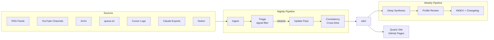

# AI Advancements Wiki

**A self-updating knowledge base (inspired by Andrej Karpathy's LLM Wiki pattern) that distills new and groundbreaking findings in AI - from new products and features, to new methodologies and tools for engineering, to research approaches/findings.**

AI is a rapidly evolving field. Information from the internet and media is constantly being churned out and is usually focused on the latest hype, causing older findings or news to fall by the wayside or become forgotten. Plus, all of this information is scattered across sources, opinionated, partially untrue/AI-generated (at times, or perhaps frequently), and written/shared in a variety of ways.

The Wiki approach establishes a persistent, ever-growing/ever-updating data source (written in markdown), which an AI agent can easily write to and read from. It rewrites, summarizes, or filters information in the way deemed appropriate, so as to focus on the core purpose of the wiki source. This is a Wikipedia centered entirely on the advancements in technology, primarily AI, so that Dean (and others) can remain in-the-loop on what's out there, and stay strong and relevant as an AI engineer.

The wiki is made so as to match my learning style, preferences in selecting new content to read/consume, and existing set of skills/knowledge. It includes content sections pertaining to what I should do/learn (the implications of the new AI hype), based on where I am on my journey - the repo points at a private data source - a `dean.md` that describes my cognitive style, thinking patterns, intellectual life, professional identity, what great content looks like, working style, AI collaboration patterns, preferences and tolerances, life context and values, and deeper life mission (mostly derived from cursor and claude chats over multiple years).

This repo is an example of what's possible when we apply the wiki pattern to information, and do so in a personalized way. It is an example of a personalized wiki.

## How it works

The wiki lives in this repo and is updated through a recurring LLM-based pipeline — no manual curation required.

A nightly GitHub Actions workflow monitors a curated set of sources: RSS feeds from AI research blogs, YouTube channels from researchers I follow, ArXiv papers ranked by attention velocity, and a simple URL queue where I drop links I don't have time to process myself. A separate local agent on my machine syncs exports from my Cursor and Claude sessions into the pipeline automatically.

Everything that gets ingested passes through a triage step before it touches the wiki. The LLM evaluates each piece against a strict signal threshold — is this genuinely groundbreaking, does it have real implications for how humans work with AI, or is it gaining significant traction for a reason? Most content gets filtered out. What clears the bar gets synthesized into a structured wiki page, cross-linked to related topics, and committed here.

Every page includes a **Dean-Relevance** section — an honest assessment of how the development maps to my actual working style, comfort zone, and tools. This is what separates it from a generic AI news aggregator. The wiki isn't tracking everything; it's tracking what matters, filtered through a specific lens.

A weekly pass runs deeper synthesis across topics, surfaces connections between recent developments, and keeps the index current. A `Dean-Profile.md` in the private companion repo acts as the persistent user model the pipeline references on every run — it's what makes the relevance framing consistent over time.

The approach is inspired by [Andrej Karpathy's LLM Wiki pattern](https://gist.github.com/karpathy/442a6bf555914893e9891c11519de94f): let the LLM do the writing and maintenance, focus your own attention on sourcing and direction.


### Pipeline
 

 
## Repository structure
 
```
dean-wiki/                        ← public repo (this one)
├── wiki/
│   ├── topics/                   ← individual model/tool/concept pages
│   │   ├── gemini-2-5-pro.md
│   │   ├── mcp-protocol.md
│   │   └── ...
│   ├── synthesis/                ← cross-topic trend analysis
│   │   ├── reasoning-evolution.md
│   │   ├── agent-architectures.md
│   │   └── ...
│   ├── tools/                    ← tool evaluations and comparisons
│   │   ├── cursor-vs-claude-code.md
│   │   └── ...
│   └── INDEX.md
├── ARCHITECTURE.md               ← how the pipeline works in detail
├── ABOUT.md                      ← the Karpathy-inspired approach
├── CHANGELOG.md                  ← auto-updated on every pipeline run
└── README.md
 
dean-wiki-private/                ← private repo (pipeline engine)
├── profile/
│   ├── Dean-Profile.md           ← persistent user model
│   └── TELOS.md                  ← goals, beliefs, priorities
├── sources/
│   ├── notion-cache/             ← raw Notion pulls
│   ├── cursor-logs/              ← Cursor chat exports
│   ├── claude-exports/           ← monthly Claude ZIP processed here
│   ├── inbox/                    ← forwarded newsletters (.txt)
│   └── queue.txt                 ← drop URLs here, pipeline handles rest
├── pipeline/
│   ├── prompts/
│   │   ├── system.md             ← WikiMaster-Dean base prompt
│   │   ├── triage.md
│   │   ├── update.md
│   │   ├── synthesis.md
│   │   └── profile-review.md
│   └── scripts/
│       ├── ingest_rss.py
│       ├── ingest_youtube.py
│       ├── ingest_arxiv.py
│       ├── ingest_notion.py
│       ├── process_queue.py
│       └── sync_public.py        ← commits wiki/ to public repo
├── .github/workflows/
│   ├── nightly.yml
│   ├── weekly.yml
│   └── monthly.yml
└── sources.yml                   ← curated source list
```
