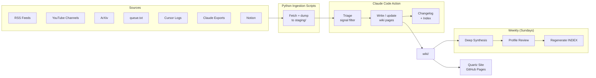

# AI Advancements Wiki

https://dean2727.github.io/aia-wiki/

**A self-updating knowledge base (inspired by Andrej Karpathy's LLM Wiki pattern) that distills new and groundbreaking findings in AI - from new products and features, to new methodologies and tools for engineering, to research approaches/findings.**

AI is a rapidly evolving field. Information from the internet and media is constantly being churned out and is usually focused on the latest hype, causing older findings or news to fall by the wayside or become forgotten. Plus, all of this information is scattered across sources, opinionated, partially untrue/AI-generated (at times, or perhaps frequently), and written/shared in a variety of ways.

The Wiki approach establishes a persistent, ever-growing/ever-updating data source (written in markdown), which an AI agent can easily write to and read from. It rewrites, summarizes, or filters information in the way deemed appropriate, so as to focus on the core purpose of the wiki source. This is a Wikipedia centered entirely on the advancements in technology, primarily AI, so that Dean (and others) can remain in-the-loop on what's out there, and stay strong and relevant as an AI engineer.

The wiki is made so as to match my learning style, preferences in selecting new content to read/consume, and existing set of skills/knowledge. It includes content sections pertaining to what I should do/learn (the implications of the new AI hype), based on where I am on my journey - the repo points at a private data source - a `dean.md` that describes my cognitive style, thinking patterns, intellectual life, professional identity, what great content looks like, working style, AI collaboration patterns, preferences and tolerances, life context and values, and deeper life mission.

This repo is an example of what's possible when we apply the wiki pattern to information, and do so in a personalized way. It is an example of a personalized wiki.

## How it works

The wiki lives in this repo and is updated through a recurring LLM-based pipeline — no manual curation required.

A nightly GitHub Actions workflow monitors a curated set of sources: RSS feeds from AI research blogs, YouTube channels from researchers I follow, ArXiv papers ranked by attention velocity, and a simple URL queue where I drop links I don't have time to process myself. A separate local agent on my machine syncs exports from my Cursor and Claude sessions into the pipeline automatically.

Everything that gets ingested passes through a triage step before it touches the wiki. The LLM evaluates each piece against a strict signal threshold — is this genuinely groundbreaking, does it have real implications for how humans work with AI, or is it gaining significant traction for a reason? Most content gets filtered out. What clears the bar gets synthesized into a structured wiki page, cross-linked to related topics, and committed here.

A weekly pass runs deeper synthesis across topics, surfaces connections between recent developments, and keeps the index current. A `dean.md` in the private companion repo acts as the persistent user model the pipeline references on every run — it's what makes the relevance framing consistent over time.

Every page includes a **Dean-Relevance** section, in the private wiki repo, so I can read quarter-by-quarter markdown files with brief sections on why each piece of new content hitting the wiki matters to my career, goals, learning, and knowledge. I can read this before or after a given wiki entry, as I drink my coffee.

The approach is inspired by [Andrej Karpathy's LLM Wiki pattern](https://gist.github.com/karpathy/442a6bf555914893e9891c11519de94f): let the LLM do the writing and maintenance, focus your own attention on sourcing and direction.

The pipeline is powered by [Claude Code GitHub Actions](https://code.claude.com/docs/en/github-actions) — lightweight Python scripts handle data fetching, and Claude Code handles all triage, synthesis, and wiki writing autonomously.

## Data Sources

| Source | What it is | What it gives the wiki | How the wiki updates |
|---|---|---|---|
| **RSS Feeds** | Structured content feeds from Anthropic, Google DeepMind, OpenAI, Hugging Face, The Batch, and similar blogs | Authoritative first-party announcements — model releases, research posts, product launches, safety findings | Nightly: new posts from the last 24hrs are fetched, passed through triage, and synthesized into new or updated topic pages |
| **YouTube Channels** | Curated list of researchers and educators I follow — Karpathy, Yannic Kilcher, Two Minute Papers, Google DeepMind | Deep technical explainers, conference talks, paper walkthroughs — content that contextualizes *why* something matters, not just what it is | Nightly: transcripts are pulled automatically for videos published in the last 24 days hours, triaged, and summarized into wiki pages |
| **ArXiv** | Academic preprint server for cs.AI and cs.LG categories | Frontier research before it becomes mainstream — the ideas that will shape tools and models 6-18 months from now | Weekly: top papers ranked by Semantic Scholar attention score are fetched, filtered to the 5 most significant, and synthesized into research topic pages |
| **queue.txt** | A plain text file in the private repo — one URL per line | Ad-hoc content I stumble on but don't have time to distill myself — articles, threads, release notes, anything worth tracking | Nightly: each URL is fetched, stripped to clean text, passed through triage, and cleared from the queue after processing |
| **Cursor Logs** | Markdown exports of my Cursor AI coding sessions, synced from my local machine via a LaunchAgent | Signals about what I'm actually building, what tools I'm using, what problems I'm running into — the ground truth of my technical work | Nightly (when machine is on): new session files are committed to the private repo and inform the weekly profile review pass |
| **Claude Exports** | Monthly conversation export from Claude.ai (Anthropic data export ZIP), processed into markdown | My longer strategic thinking, design decisions, research sessions, and ideas developed conversationally — context that doesn't appear in code | Monthly: ZIP is processed into individual conversation files and surfaced during the monthly manual workflow run |
| **Notion** | Personal notes I've written myself — original observations, reactions, half-formed ideas, personal context | The one source the pipeline can't generate on its own: my perspective, not the internet's | Nightly: only pages I've personally written are pulled via the Notion API |
| **Manual injection** | A link I hand to the agent directly via the `inject-article` skill | The thing I found *now* and want in the wiki *now* — articles, papers, repos, release notes I don't want to wait a night for | On demand: the URL is fetched and extraction is verified before anything is written, then triaged and synthesized like a nightly item (write floor 6 instead of 7, since I picked it) |

## Source coverage

_Living tracker — updated by the nightly and weekly Claude runs after each ingestion pass. Canonical source list in [`sources.yml`](sources.yml). Staging filenames use `{feed-slug}-{YYYY-MM-DD}-{title}.md`; counts come from `private/sources/staging/` (read-only during wiki runs)._

<!-- source-coverage:start -->
_Last table update: 2026-06-28 (nightly run)_

| Source | Type | Schedule | Last ingested | Staged (last run) | Coverage window | Last wiki-processed | Notes |
|---|---|---|---:|---|---|---|---|
| Anthropic Blog | RSS | Nightly | 2026-06-28 | 12 | ~30d backfill | 2026-06-28 | Triage + updates in CHANGELOG |
| Google DeepMind Blog | RSS | Nightly | 2026-06-28 | 9 | ~30d backfill | 2026-06-28 | Gemma 4 12B, DiffusionGemma, computer use |
| OpenAI Blog | RSS | Nightly | 2026-06-28 | 46 | ~30d backfill | 2026-06-28 | GPT-5.6, Codex, Jalapeño cluster |
| Hugging Face Blog | RSS | Nightly | 2026-06-28 | 25 | ~30d backfill | 2026-06-28 | PEFT, Holo3.1, fine-tuning posts |
| LangChain Blog | RSS | Nightly | 2026-06-28 | 74 | ~30d backfill | 2026-06-28 | Mostly already-covered; Deep Agents cluster watch |
| The Batch (Andrew Ng) | RSS | Nightly | — | 0 | — | — | No new items in last ingest window |
| Import AI (Jack Clark) | RSS | Nightly | 2026-06-28 | 3 | ~30d backfill | 2026-06-28 | #462 synthesized; #459/#461 watch |
| Ahead of AI (Sebastian Raschka) | RSS | Nightly | 2026-06-28 | 1 | ~30d backfill | 2026-06-28 | Link index only — skipped |
| Hacker News | RSS | Nightly | 2026-06-28 | 10 | ~30d backfill | 2026-06-28 | All skipped (non-AI / periphery) |
| Notion (live feed) | Notion API | Nightly | 2026-06-28 | 1 | 2026-06-28 edit | 2026-06-28 | Context engineering — Track A enrichments |
| YouTube channels | YouTube | Nightly | — | — | — | — | Ingest not enabled in nightly workflow |
| ArXiv (cs.AI, cs.LG) | ArXiv | Weekly | — | — | — | — | Weekly workflow only |
| queue.txt | URL queue | Nightly | — | — | — | — | Ingest not enabled in nightly workflow |
| Manual injection | URL (on demand) | On demand | — | — | — | — | `inject-article` skill; no links injected yet |
| Cursor logs | Local sync | Weekly review | — | — | — | — | Synced locally; reviewed on weekly pass |
| Claude exports | Monthly ZIP | Monthly | — | — | — | — | Monthly workflow |
<!-- source-coverage:end -->

## Pipeline


```mermaid
flowchart LR
  subgraph sources["Sources"]
    A["RSS Feeds"]
    B["YouTube Channels"]
    C["ArXiv"]
    D["queue.txt"]
    E["Cursor Logs"]
    F["Claude Exports"]
    G["Notion"]
  end

  subgraph ingest["Python Ingestion Scripts"]
    H["Fetch + dump\nto staging/"]
  end

  subgraph claude["Claude Code Action"]
    I["Triage\nsignal filter"]
    J["Write / update\nwiki pages"]
    K["Changelog\n+ Index"]
    I --> J --> K
  end

  subgraph weekly["Weekly (Sundays)"]
    L["Deep Synthesis"]
    M["Profile Review"]
    N["Regenerate INDEX"]
    L --> M --> N
  end

  sources --> H
  H --> I
  J --> wiki["wiki/"]
  wiki --> L
  wiki --> site["Quartz Site\nGitHub Pages"]
```

## Injecting a link by hand

When I find something interesting and don't want to wait for the nightly run, I hand the link to the agent
and the [`inject-article`](.cursor/skills/inject-article/SKILL.md) skill takes over: it verifies the page is
reachable and parseable, tells me what's blocking extraction if it isn't (and what would fix it), then
triages and synthesizes the material with the nightly rules.

The fetch/verify/stage step is a normal script, so it can be run directly. `PRIVATE_REPO_PATH` defaults to
`../dean-wiki-private`.

```bash
# 1. Check only — is the page reachable, and does real text come out? Writes nothing.
uv run python pipeline/scripts/ingest_url.py --check https://example.com/post

# 2. Stage it for triage, recording why it caught my eye
uv run python pipeline/scripts/ingest_url.py --note "why this matters" https://example.com/post

# 3. Escape hatch when the page is JS-only, paywalled, or bot-blocked: paste the text yourself
uv run python pipeline/scripts/ingest_url.py --from-file ~/Downloads/article.md \
  --title "Exact Article Title" https://example.com/post
```

Useful flags: `--allow-thin` (stage a genuinely short piece), `--min-chars N` (extraction floor, default
800), `--force` (re-stage a URL already in `.seen_urls.txt`), `--json` (machine-readable report),
`--staging-dir PATH` (write somewhere other than the private repo).

Expected output is one verdict block per URL — `ok` plus the staged path and word count, or a failure
status with a one-line `fix:` hint. Exit code `0` means every URL is clean, `2` means at least one needs a
decision. Staged files land in `private/sources/staging/` as `injected-YYYY-MM-DD-<title-slug>.md`.

## Repository structure

```
aia-wiki/                           ← public repo (this one)
│
├── .github/
│   └── workflows/
│       ├── nightly.yml             ← fetch → Claude Code (triage + update)
│       ├── weekly.yml              ← fetch → Claude Code (synthesis + profile review)
│       ├── monthly.yml             ← manual: process Claude export ZIP
│       └── deploy-quartz.yml       ← build + deploy Quartz site to GitHub Pages
│
├── .cursor/
│   ├── rules/                      ← pipeline coding rules
│   └── skills/
│       └── inject-article/         ← on-demand: verify a link, then triage + write
│
├── pipeline/
│   └── scripts/                    ← data fetching only (no LLM calls)
│       ├── ingest_rss.py
│       ├── ingest_url.py           ← ad-hoc link injection (backs inject-article)
│       ├── ingest_youtube.py
│       ├── ingest_arxiv.py
│       ├── ingest_notion.py
│       ├── ingest_queue.py
│       └── ingest_claude.py
│
├── wiki/
│   ├── technical/
│   │   ├── synthesis.md              ← living "this year in tech" doc,
│   │   │                               themes across technical advancements,
│   │   │                               research methods and breakthroughs
│   │   │                               that redefined how something works (weekly update)
│   │   ├── models/                   ← transformer, VLA, MoE architectures
│   │   ├── algorithms/               ← research-origin findings
│   │   │                               (verifiers, RLHF, test-time compute)
│   │   ├── tools/                    ← software tool evaluations
│   │   └── engineering-approaches/   ← practitioner-origin methods
│   │                                   (spec-driven dev, RAG patterns,
│   │                                    parallel agents)
│   │
│   ├── world/
│   │   ├── synthesis.md              ← living "this year in the world" doc,
│   │   │                               how AI is manifesting in products,
│   │   │                               culture, and society — themes across
│   │   │                               what shipped, what changed, and what
│   │   │                               it means for people and careers (weekly update)
│   │   ├── products/                 ← new products and devices
│   │   ├── features/                 ← capability updates worth attention
│   │   └── signals/                  ← evolving topics with career/human
│   │                                   implications (layoffs, education,
│   │                                   human growth, future of engineering)
│   │
│   ├── overview.md                   ← quarterly synthesis connecting
│   │                                   technical breakthroughs to
│   │                                   world-facing implications
│   └── index.md                      ← Quartz site landing page
│
├── site/                            ← Quartz 5 static-site generator (publishes wiki/ to GitHub Pages)
│   ├── content → ../wiki            ← symlink: edit pages in wiki/, never here
│   ├── quartz.config.yaml           ← site config (title, baseUrl, plugins)
│   ├── install-plugins.mjs          ← community-plugin installer (workaround for Quartz 5.0.0 bug)
│   ├── quartz/                       ← Quartz framework source
│   └── public/                       ← generated output (gitignored)
│
├── CLAUDE.md                       ← agent instructions (replaces all prompt files)
├── sources.yml                     ← curated source list
├── pyproject.toml                   ← Python project + dependency definitions
├── uv.lock                          ← locked Python dependencies
├── INDEX.md                        ← auto-regenerated weekly
├── CHANGELOG.md                    ← auto-appended every run
├── ARCHITECTURE.md
├── ABOUT.md
└── README.md

dean-wiki-private/                   ← private repo (data only, no code)
│
├── profile/
│   ├── dean.md             ← persistent user model
│   └── TELOS.md
│
├── relevance/                     ← Dean-Relevance notes (quarterly)
│   └── spring-2026.md             ← one file per quarter; next: summer-2026.md, fall-2026.md, …
│
└── sources/
    ├── queue.txt                   ← ad-hoc URLs that interest Dean, not included in the other data
    ├── staging/                    ← ingestion landing zone for nightly/weekly runs (cleared each run)
    ├── notion/
    │   ├── seed/                   ← one-time Notion seed dump (wiki candidates + foundational KB)
    │   │   ├── notion-YYYY-MM-DD-*.md
    │   │   └── dean-foundational-knowledge/  ← Notion `knowledge_base` pages (calibration context)
    │   └── new-notes/              ← later: incremental Notion pulls (if enabled)
    ├── cursor-logs/                ← synced by local LaunchAgent
    ├── claude-exports/             ← claude chats - the monthly diff
    └── inbox/
```

## GitHub Secrets required

| Secret | Description |
|---|---|
| `ANTHROPIC_API_KEY` | Anthropic API key for Claude Code Action |
| `PRIVATE_REPO_TOKEN` | PAT with read access to dean-wiki-private |
| `PRIVATE_REPO_NAME` | Full name of private repo (e.g. `yourusername/dean-wiki-private`) |
| `NOTION_API_KEY` | Notion integration token |
| `NOTION_DATABASE_ID` | ID of the personal notes database |
