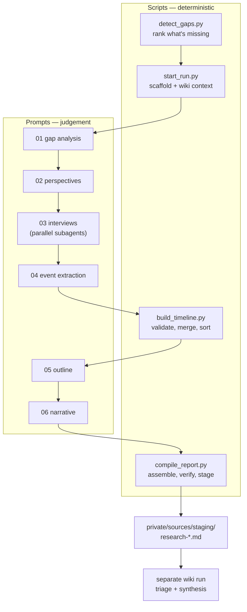

# Research backfill

Wiki pages describe what something *is*. This produces what came before it: the prior art, the
limitation each step removed, and why the current design looks the way it does — as a sourced report
that a later wiki run ingests.

A page that arrives from an injected link is the typical trigger. It lands describing a new thing in
the present tense, naming one year, assuming a decade of background that nobody wrote down. That
gap is measurable, and this pipeline fills it.

## The split

Python does the deterministic work — indexing, ranking, date sorting, validation, staging. It makes
no LLM and no network calls, matching how `pipeline/scripts/` already works. Judgement lives in
`prompts/`, driven by the [`deep-research`](../.cursor/skills/deep-research/SKILL.md) skill.



The three ideas the pipeline is built on:

- **Brief the researcher on the wiki first.** A general research system seeds structure by pulling
  related Wikipedia articles. This wiki *is* the encyclopedia, so `wiki-context.md` hands over the
  seed page, its link neighborhood, and a one-line definition of every existing page. The report
  supplements what is there instead of restating it.
- **Ask from several angles, not one.** Three or four non-overlapping perspectives, each running a
  multi-round interview where follow-up questions come from what the last round returned. One query
  finds what you already suspected.
- **Structure before prose.** Dates are extracted into a flat event list, validated, deduplicated and
  sorted by a script *before* anything is narrated. The narrative is then written from the sorted
  timeline, and the compiler rejects any year the timeline cannot support.

## Running it

```bash
# 1. Is a backfill warranted? Look for SHALLOW HISTORY and DANGLING LINK.
python research/scripts/detect_gaps.py --page text-diffusion-llms

# 2. Scaffold the run and its wiki-context brief.
python research/scripts/start_run.py --seed-page text-diffusion-llms

# 3..6. Work research/prompts/ in order — this is the LLM half.
#       Phases 1-3 write gaps.json, perspectives.json, findings/*.md, events.jsonl.

# 4. Build the chronological backbone.
python research/scripts/build_timeline.py research/runs/2026-08-08-text-diffusion-llms

# 5..6. Prompts 05 and 06 write outline.md and narrative.md.

# 7. Assemble, verify, and stage for the next wiki run.
python research/scripts/compile_report.py research/runs/2026-08-08-text-diffusion-llms --stage
```

Exit codes follow the pipeline convention: `0` clean, `2` needs a human decision, `1` internal
failure. A `2` always names the verdict and the fix.

`compile_report.py --stage` writes into `$PRIVATE_REPO_PATH/sources/staging/` (default
`../dean-wiki-private`). Nothing else touches the private repo, and run artifacts under `runs/` are
gitignored.

## Scripts

| Script | Does | Notable flags |
|---|---|---|
| `events.py` | The event model: date grammar, timeline-bullet grammar, duplicate rule. Library only — shared so the two writers cannot drift | — |
| `wiki_graph.py` | Parses `wiki/**` into a link graph (inbound, outbound, dangling) and each page's `## Timeline` into events. Library for the rest; run it directly for a health summary | `--json`, `--events`, `--wiki-dir` |
| `detect_gaps.py` | Ranks missing background: pages whose timeline is too thin to place them in time, concepts linked but undefined, unlinked mentions, orphan/stale/thin pages | `--page`, `--hops`, `--min-events`, `--min-years`, `--top`, `--json` |
| `start_run.py` | Creates `runs/<date>-<slug>/` with `run.json` and `wiki-context.md` | `--seed-page`, `--topic`, `--hops`, `--force` |
| `build_timeline.py` | Validates events, parses partial dates, merges duplicates, sorts, writes `timeline.md` + `timeline.json` | `--check`, `--min-events`, `--drop-unsourced`, `--allow-sparse` |
| `compile_report.py` | Assembles `report.md`, verifies it, stages it as `type: research` | `--check`, `--stage`, `--min-sources`, `--allow-unanchored` |
| `merge_timeline.py` | **The only sanctioned writer of a wiki page's `## Timeline`.** Parses existing bullets back into events, merges and dedupes the incoming ones, sorts, rewrites the section in canonical position | `--from-run`, `--event`, `--only`, `--check`, `--dry-run`, `--replace` |
| `build_global_timeline.py` | Rolls every page's timeline into `wiki/timeline.md`, one slider over the whole wiki | `--skip-wiki-events`, `--dry-run` |
| `seed_timelines.py` | One-time migration (safe to re-run): seeds each page's timeline with `wiki`-kind events derived from `CHANGELOG.md` | `--page`, `--dry-run`, `--bump` |

`detect_gaps.py` is useful on its own, with no run attached — `python research/scripts/detect_gaps.py`
scans the whole wiki and ranks every gap it can prove.

## Ingesting a finished run

The report is staged for a separate wiki run, but the events go onto pages through one command:

```bash
# Merge a run's whole timeline onto the seed page
python research/scripts/merge_timeline.py model-compression --from-run research/runs/2026-08-09-model-compression

# Move a subset onto a neighbouring page instead
python research/scripts/merge_timeline.py gemma-4 --from-run research/runs/... --only "Gemma 2"

# Record a one-off event, e.g. the page's own edit history
python research/scripts/merge_timeline.py model-compression --event '2026-08|wiki|Backfilled the compression lineage'

# Then refresh the wiki-wide page
python research/scripts/build_global_timeline.py
```

Never hand-edit a `## Timeline` section: the site parses it strictly, and `merge_timeline.py --check`
is what tells you whether it still parses.

## What the checks actually catch

The two that earn their keep:

- **`sparse_timeline`** — fewer than 8 events or spanning under 3 years. This is nearly always a
  scoping failure: every perspective pointed at the present and nobody researched the past.
- **`unanchored_dates`** — the narrative names a year with no sourced event behind it. This is where
  invented history comes from, and it is silent unless something checks for it.

## A run directory

```
runs/2026-08-08-text-diffusion-llms/
├── run.json            ← manifest: topic, seed page, neighborhood, seed sources
├── wiki-context.md     ← what the wiki already knows (generated)
├── gaps.json           ← stage 1: what the page cannot explain
├── perspectives.json   ← stage 2: the angles and their budgets
├── findings/           ← stage 3: one file per perspective, the audit trail
├── events.jsonl        ← stage 4: flat, dated, sourced facts
├── timeline.md/.json   ← generated: the verified chronology
├── outline.md          ← stage 5: eras and the thesis
├── narrative.md        ← stage 6: the prose
└── report.md           ← generated: what gets staged
```

Progress is derived from which files exist — there is no run state to keep in sync. Re-running any
script picks up wherever the directory actually is.
