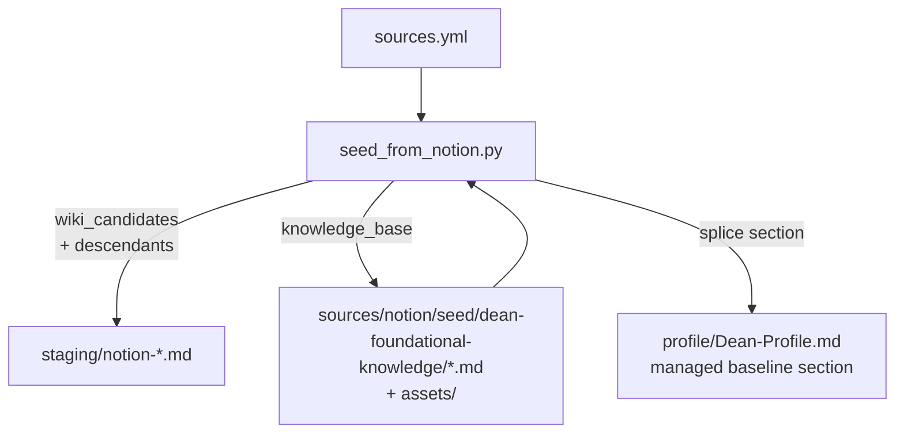
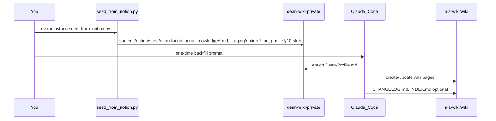

# Notion seed backfill (seed_from_notion.py only)

## Scope boundary

**In scope now:** [`seed_from_notion.py`](aia-wiki/seed_from_notion.py) — local, one-time backfill of GenAI notes from [`sources.yml`](aia-wiki/sources.yml).

**Out of scope (later):** `ingest_notion.py`, `notion.live_feed`, nightly workflow, CLAUDE.md updates.



---

## Config rules (unchanged)

- `wiki_candidates`: **always `include_descendants: true`** in code
- `knowledge_base`: **page only** (no descendants)
- `live_feed`: ignored by seed
- YAML = **IDs only** (no manual `include_descendants` keys)

---

## Two outputs for `knowledge_base`

| Output | Path | Purpose |
|--------|------|---------|
| **Raw archive** | `dean-wiki-private/sources/notion/seed/dean-foundational-knowledge/{slug}.md` | Full fetched notes; agent can drill in |
| **Profile baseline** | [`dean-wiki-private/profile/Dean-Profile.md`](dean-wiki-private/profile/Dean-Profile.md) | Curated “what Dean already knows” for wiki triage/synthesis |

Wiki candidates still go to **`staging/` only** (no profile update).

---

## Dean-Profile.md update (knowledge_base)

### Managed section (idempotent re-runs)

Add marker pair to Dean-Profile (once, if missing):

```markdown
<!-- notion-knowledge-baseline:start -->
(generated — do not edit by hand)
<!-- notion-knowledge-baseline:end -->
```

`seed_from_notion.py` **replaces only** content between markers on each run.

### New profile section structure (insert as §10 or after §7 Frontier)

```markdown
## 10. AI knowledge baseline (from Notion)

*Last seeded: YYYY-MM-DD. Source: Notion `knowledge_base` pages in sources.yml.*

### Topics Dean has documented deeply

| Topic | Notion source | Depth signal |
| --- | --- | --- |
| The Transformer | sources/notion/seed/dean-foundational-knowledge/the-transformer.md | H2: Attention, Embeddings, … |

### Per-topic summaries

#### The Transformer
- **Knows:** bullet from H2/H3 headings + first substantive paragraph
- **Related subtopics:** Multi-Headed Attention, Embeddings, …
- **Not wiki fodder:** foundational — agent should not re-teach basics in wiki pages
```

### How content is produced (**deterministic, no LLM in seed**)

After KB pages are fetched to `sources/notion/seed/dean-foundational-knowledge/`:

1. Parse each file’s markdown (headings, lists, first ~500 chars of body text)
2. Build topic table (title, local file link, top headings as “depth signal”)
3. Build per-topic bullets: `**Knows:**` from heading inventory + short excerpt
4. Splice into Dean-Profile

**Why deterministic:** Matches pipeline rule (Python fetch only). Produces a structured inventory the nightly/weekly **Claude agent** uses so wiki pages skip re-explaining transformers, embeddings, etc.

**Optional later:** `--synthesize-profile` flag calling Anthropic API for prose polish (out of scope now).

### Sources line in profile header

Update top-of-file `*Sources:*` to include: `Notion knowledge_base seed (YYYY-MM-DD)`.

---

## Tables and images in Notion pages

### Tables

Notion `table` blocks have **`has_children: true`**; rows are `table_row` blocks fetched via the same `GET /blocks/{id}/children` recursion already planned for nested content.

| Step | Behavior |
|------|----------|
| Fetch | Paginate `table` → `table_row` children |
| Convert | Each `table_row` → markdown pipe row from `cells[][]` rich text |
| Edge cases | Empty cells → `""`; wide tables kept as-is; no HTML fallback |

### Images

Notion-hosted file URLs **expire** (~1 hour). External URLs may be stable but should still be mirrored for offline use.

| Step | Behavior |
|------|----------|
| Detect | `image` blocks (`file` or `external`) |
| Download | `GET` image URL → `sources/notion/seed/dean-foundational-knowledge/assets/{page_slug}/{block_id}.{ext}` |
| Markdown | `` (relative path) |
| Failure | Fallback: `*[Image unavailable — see Notion page]({notion_page_url})*` |
| Scope | Download for **knowledge_base + wiki_candidates** (both land under private repo) |

Wiki staging files reference the same relative asset paths if images appear on wiki-candidate pages (assets colocated under `sources/notion/seed/dean-foundational-knowledge/assets/` or shared `notion-assets/` — pick one dir in implementation).

### Other block types (v1)

| Type | Treatment |
|------|-----------|
| paragraph, heading_1–3, bulleted/numbered_list, to_do, code, quote, divider, callout | → markdown |
| table + table_row | → markdown table |
| image | → download + relative link |
| bookmark, embed, video, pdf, equation, synced_block | → stub line: `[Notion {type} — see source page]` |
| child_page, child_database | → skip in body (structure handled by page tree, not inline) |
| unsupported | → HTML comment `<!-- notion:block:{id} type=... -->` |

---

## Default `main()` flow

1. Load `sources.yml` (`knowledge_base`, `wiki_candidates`; ignore `live_feed`)
2. Resolve page IDs (wiki: expand subtrees via cache or live DFS)
3. For each page (tqdm): fetch blocks → markdown (+ assets)
4. Write wiki → `staging/notion-{date}-{slug}.md`
5. Write KB → `sources/notion/seed/dean-foundational-knowledge/{slug}.md`
6. **Rebuild Dean-Profile baseline section** from all KB markdown files
7. Log summary (pages written, images saved, profile updated)

### Secondary flags

| Flag | Purpose |
|------|---------|
| `--export-structure` | DFS → `page-structure.json` |
| `--validate-sources` | Uncategorized pages vs cache |
| `--skip-profile` | Fetch only; do not touch Dean-Profile |
| `--request-delay` | Override API throttle (default 0.35s) |

---

## Implementation location

All logic in [`seed_from_notion.py`](aia-wiki/seed_from_notion.py) for this phase (no `pipeline/lib/notion.py` yet).

New functions: `blocks_to_markdown()`, `download_image()`, `table_rows_to_markdown()`, `build_profile_baseline_section()`, `update_dean_profile()`.

---

## Implementation order

1. Block→markdown with table + image support; dual write paths (staging / sources/notion/seed/dean-foundational-knowledge)
2. Profile marker splice + deterministic baseline builder from KB files
3. Flip default `main()` to ingest; `--export-structure` for JSON tree
4. Local run with `.env`

---

## Deferred (Python seed scope ends above)

- `ingest_notion.py`, `live_feed`, nightly workflow
- Parallel API requests

---

## Phase 2: LLM pass (after Python seed) — how to populate Dean-Profile + wiki

Python seed **gathers** data; **Claude Code** **synthesizes** it. Do not call the LLM inside `seed_from_notion.py`.



### What Python already wrote (before any LLM)

| Artifact | LLM uses it to… |
|----------|------------------|
| `sources/notion/seed/dean-foundational-knowledge/*.md` | Understand Dean’s foundational AI notes in full |
| `profile/Dean-Profile.md` §10 (markers) | Mechanical inventory — **LLM rewrites this into readable prose** |
| `staging/notion-*.md` | Source material for **wiki pages** (triage each file) |

### Why not use the nightly workflow as-is

[`nightly.yml`](aia-wiki/.github/workflows/nightly.yml) today:

- Reads `staging/` but assumes **RSS-style nightly deltas**, not a bulk Notion backfill
- **`Do NOT touch any files in private/`** — so it **cannot** update `Dean-Profile.md`
- [`weekly.yml`](aia-wiki/.github/workflows/weekly.yml) explicitly says profile observations go to **CHANGELOG only**, not Dean-Profile

Initial Notion seed needs a **dedicated one-time LLM pass** with permission to write **both repos**.

---

### Recommended: two commands (local, first time)

**Step 1 — Fetch (no LLM):**

```bash
cd aia-wiki && source .env
uv run python seed_from_notion.py
```

**Step 2 — Synthesize (LLM):** Run in **Cursor Agent** on the wiki project (both repos open), or add a manual GitHub workflow (below). Use **one session, two logical jobs** (can be one prompt):

#### Job A — Enrich `Dean-Profile.md` (private repo)

**Reads:**

- `dean-wiki-private/profile/Dean-Profile.md` (full file)
- All `dean-wiki-private/sources/notion/seed/dean-foundational-knowledge/*.md`

**Writes:**

- Replace content between `<!-- notion-knowledge-baseline:start/end -->` with a **prose** “AI knowledge baseline” (topics Dean already knows deeply; what wiki should **not** re-teach)
- Optionally update **§7 Frontier vs. Dean’s Zone** table rows informed by KB (e.g. transformers/RAG = high comfort)
- Update top `*Sources:*` line with seed date
- Do **not** delete Dean’s hand-written sections 1–9

**Does not read** `staging/notion-*` for profile (those are frontier wiki fodder).

#### Job B — Populate `wiki/` (public repo)

**Reads:**

- `Dean-Profile.md` (after Job A)
- All `private/sources/staging/notion-*.md` where `type: notion-wiki-candidate`

**Writes (per [`CLAUDE.md`](aia-wiki/CLAUDE.md)):**

- Triage each file 1–10; **expect most Notion backfill to score 7+** (these are pre-curated wiki candidates)
- Create/update pages in `wiki/technical/` and `wiki/world/` (and update `wiki/overview.md` when it materially changes)
- Full page template including **Dean-Relevance**
- Append **`CHANGELOG.md`** with created/updated/skipped
- **`INDEX.md`**: regenerate once at end of backfill (nightly skips this; weekly normally does — do it here for first seed)

**Rules:**

- Do not paste raw Notion markdown into wiki — synthesize
- Use `sources/notion/seed/dean-foundational-knowledge/` only to **calibrate depth** (don’t re-explain basics Dean already documented)
- Skip duplicating a topic if an existing wiki page already covers it — update instead

---

### Optional: GitHub `workflow_dispatch` for Step 2

Add [`.github/workflows/notion-seed-llm.yml`](aia-wiki/.github/workflows/notion-seed-llm.yml) (manual only, not cron):

1. Checkout `aia-wiki` + `dean-wiki-private` (PAT with **write** on both)
2. **Do not** re-run Python seed (assume you already ran locally and pushed private data)
3. Claude Code Action with `--max-turns 80` and a prompt combining Job A + Job B
4. Two commits: private (profile) + public (wiki + CHANGELOG + INDEX)

Keeps long wiki backfill off your laptop and documents the one-time process.

---

### Ongoing vs one-time

| When | Python | LLM |
|------|--------|-----|
| **One-time Notion backfill** | `seed_from_notion.py` | Dedicated seed prompt (above) |
| **Nightly** (later) | `ingest_notion.py` on `live_feed` only | Existing nightly prompt on **new** staging files |
| **Weekly** | RSS/ArXiv/etc. | Deep synthesis; profile **observations** in CHANGELOG unless you later allow profile edits |

---

### Deliverable to add when implementing Phase 2

- [`prompts/notion-seed-llm.md`](aia-wiki/prompts/notion-seed-llm.md) — copy-paste prompt for Cursor or workflow
- Short pointer in [`CLAUDE.md`](aia-wiki/CLAUDE.md): `sources/notion/seed/dean-foundational-knowledge/` = profile context; `staging/notion-*` = wiki triage; §10 markers = seed inventory, LLM polishes
