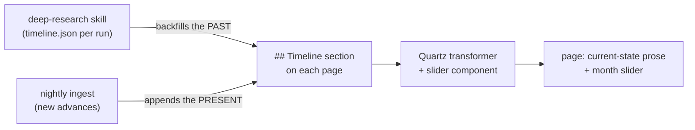

# Temporal wiki — current state by default, history on a slider

## The idea

The wiki's default view stays what it is today: the current state of affairs in AI across
`technical/` and `world/` — products, engineering approaches, tools, models, algorithms. What
changes is that every page gains a **temporal layer**: a stream of dated events (month
granularity) attached to the topic. In the UI, a slider with month ticks sits on each page;
scrubbing it moves through the topic's history, showing the events and research associated with
each month. At rest, the slider sits at *now* and the page reads exactly like the current wiki.

The two content pipelines split cleanly along the time axis:



This supersedes the earlier `wiki/technical/lineages/` proposal: history no longer needs its own
folder, because it decomposes into per-page dated events, and the slider is the reading interface
for it. The deep-research feature needs no redesign — `build_timeline.py` already produces exactly
the event records this layer consumes.

## Semantics: what the slider actually scrubs

**Decision needed, recommendation below.** Two possible meanings of "the page at month M":

| Level | Meaning | Verdict |
|---|---|---|
| 1 — event layer | Prose is always current-state. The slider filters the topic's *event stream*: at month M, events up to M are shown with M's events highlighted | **Recommended** |
| 2 — prose time-travel | The entire page rewrites to "what we believed at month M" | Rejected |

Level 2 is rejected on the merits, not just cost: it requires storing N prose versions per page
(agents would maintain histories of paragraphs, and every nightly edit would fork them), git
history can't reconstruct it (pages are rewritten in place and the wiki is only months old), and
the reader value is low — Dean wants to know *what happened when*, not to read stale prose.

Level 1's contract: **prose = present, events = past.** A claim in the prose that deserves a date
gets one inline; anything narrative about how the topic evolved lives in the event stream's
`significance` text, not in the prose.

Recommended scrub behavior: slider at *now* shows the full cumulative timeline below the prose.
Scrubbing to month M dims events after M, highlights events in M, and shows M's event details
(text, significance, sources). This keeps the interaction meaningful for sparse timelines (most
pages will start with a handful of events).

## Data model

An event is what `research/runs/<id>/timeline.json` already contains:
`(date, event, kind, significance, sources)` — month precision for the UI, day precision kept in
the data when a source supports it.

**Storage: in the page markdown, as a `## Timeline` section.** One bullet per event, strict
format, oldest first:

```markdown
## Timeline

- `2021-07` (paper) Austin et al. publish D3PM, structured denoising diffusion in discrete state
  spaces — first serious attempt to move diffusion from pixels to tokens.
  [source](https://arxiv.org/abs/2107.03006)
- `2026-06` (release) DeepMind releases DiffusionGemma, a 26B MoE diffusion head on Gemma 4.
  [source](https://developers.googleblog.com/en/introducing-diffusion-gemma/)
```

Grammar per bullet: `` - `YYYY-MM[-DD]` (kind) text[ — significance][ [source](url)...] ``, with
`kind` from the existing `EventKind` enum (`paper`, `method`, `release`, `benchmark`, `tooling`,
`org`, `milestone`) plus a new `wiki` kind (see below).

Why in-page rather than a sidecar JSON per page:

- Agents author one file per topic. The whole system rests on "the LLM can easily read and write
  the wiki"; a two-file contract per page doubles the ways an update can half-happen.
- Graceful degradation. On raw GitHub, in an editor, or with JS off, the section reads as a
  normal, useful timeline list.
- `wiki_graph.py` already parses page sections; sidecars would need a parallel loader, plus Quartz
  emitter changes to ship them.

The `wiki` event kind: when a nightly run materially updates a page, it appends an event
(`` - `2026-08` (wiki) Added DiffusionGemma coverage after the June release ``). The slider then
doubles as the page's changelog, and "when did the wiki learn this" becomes a first-class,
scrubbable fact. Cheap to do, easy to drop if it proves noisy.

## Page skeleton v2

Today 57 of 62 pages follow `What it is / Why it matters / How it works / [Sources] / Related`.
The skeleton gains one section, keeping that uniformity:

```markdown
# Topic

> One-sentence definition.

**Category**: …
**Last updated**: YYYY-MM-DD
**Status**: …

## What it is
## Why it matters
## How it works
## Timeline        ← new; strict event bullets, oldest first
## Sources         ← optional, as today
## Related
```

Timelines may open with a single short italic line (an "arc" sentence) when a backfill produced a
thesis worth keeping — but the narrative itself decomposes into the events' significance text. The
full deep-research report remains archived in private staging; the wiki carries the structured
residue.

## What changes where

### Prerequisite naming fixes (phase 0)

- Eight pages link `[[self-improving-ai-agents]]`; the content lives at
  `wiki/technical/synthesis.md` (H1 "Self-Improving AI Agents"), so all eight are broken on the
  live site. Rename the file to match its H1 and reconcile the README's claim that
  `technical/synthesis.md` is the weekly living doc (that living doc can be recreated as an
  actual synthesis page, or the claim updated).
- Two files named `synthesis.md` make `[[synthesis]]` ambiguous to both Quartz
  (`markdownLinkResolution: shortest`) and `wiki_graph.py`. After the rename, at most one remains;
  prefer zero (world's becomes `world-synthesis.md` or similar).
- CLAUDE.md documents `Status: active | watching | deprecated`, but 24 pages use `baseline` or
  `reference`. Document the real vocabulary while touching the skeleton spec.

### Pipeline scripts (phase 2)

| Piece | Change |
|---|---|
| `research/scripts/merge_timeline.py` (new) | Deterministically merge events into a page's `## Timeline`: parse existing bullets, add incoming events (from a run's `timeline.json` or from stdin fragments), dedupe with `build_timeline`'s similarity logic, sort, rewrite the section. Agents never hand-sort or hand-dedupe markdown timelines. Also serves as the format validator (`--check`) |
| `research/scripts/wiki_graph.py` | Parse `## Timeline` sections into per-page event lists; expose event count and month span per page |
| `research/scripts/detect_gaps.py` | Re-base `shallow_history` on timeline coverage (event count, span) instead of counting years in prose — a cleaner signal, and it stops re-flagging pages whose history correctly lives in the timeline |
| `pipeline/scripts/*` | No changes; staging formats are untouched |

### Agent rules (phase 1)

- **CLAUDE.md skeleton**: add `## Timeline` with the event grammar and the oldest-first rule.
- **Nightly runs**: a substantive page update appends dated events (the advance itself, month
  stamped from the source's publication date, plus optionally a `wiki` event). New pages start
  with whatever dated events the staged source supports.
- **Deep-research ingest** (rewrites the current "Deep research backfills" section): instead of a
  `## Background` prose section, merge the run's `timeline.json` events into the seed page's
  `## Timeline` (via `merge_timeline.py`), distribute events that belong to other
  `suggested_wiki_pages`, date existing prose claims where supported, and keep at most one arc
  sentence. Small backfills and large ones now take the same path — the earlier 250-word
  threshold rule disappears.

### Migration of the 62 existing pages (phase 3)

Every page gets a `## Timeline` section in one pass:

1. Seed from dated claims already in the prose (few — 15 pages name zero years, most name one or
   two; that's fine, the slider works with two ticks).
2. Seed a `wiki` event per page from CHANGELOG history (`Created` entries carry dates; this is
   deterministic grep work).
3. Accept sparseness. Sparse timelines are the honest state, and they are exactly what
   `detect_gaps.py` will rank for the backfill campaign (phase 5): current top of the list is
   `llm-agent-evaluation` (19 inbound links, no years), `model-compression` (17), and
   `agentic-patterns` (16).

### Quartz UI (phase 4)

The framework source is vendored in `site/quartz/` with a Preact component registry, so this is
buildable in-repo with no new dependencies:

- **Transformer**: parses the `## Timeline` section's bullets into structured page data at build
  time and tags the section for the component (raw list remains as no-JS fallback).
- **`TopicTimeline` component**: the slider. Month ticks from the page's earliest event to the
  current month; default position *now*; scrubbing filters/highlights as described above. Plain
  DOM + Preact, no library.
- **Isolation rule**: custom code lives in a clearly separated directory (e.g.
  `site/quartz/components/custom/`) with a README note, so upgrading vendored Quartz stays a
  clean overwrite plus re-add. Quartz 5.0.0 already needs one workaround (`install-plugins.mjs`),
  so upgrade friction is a live concern.
- **Optional**: a global `/timeline` page aggregating every page's events — nearly free once the
  transformer exists, and it is the "current state of affairs" view across the whole wiki with
  the same slider.
- `deploy-quartz.yml` needs no changes (it builds whatever `site/` contains); this is the one
  phase where testing happens via `npx quartz build` locally rather than in CI.

## Risks

- **Malformed event bullets** written by agents drift the format. Mitigation: `merge_timeline.py`
  is the only sanctioned writer and doubles as the validator; the transformer logs (not crashes)
  on unparseable bullets.
- **Timeline sections grow long** on hot topics. The 800-line page rule should exempt the Timeline
  section (it's data, and the UI collapses it); revisit if a page's timeline exceeds ~100 events.
- **Custom Quartz code vs upgrades** — addressed by the isolation rule; the custom surface is one
  transformer and one component.
- **The slider under-delivers on sparse pages.** Mitigated by defaulting to the cumulative view
  (a two-event timeline still reads fine) and by the backfill campaign targeting the highest-value
  pages first.

## Open decisions

1. **Slider semantics** — Level 1 event-layer scrubbing (recommended) vs prose time-travel.
2. **Event storage** — in-page `## Timeline` markdown (recommended) vs sidecar JSON per page.
3. **Scrub behavior** — cumulative-up-to-M with M highlighted (recommended) vs only-M's-events.
4. **`wiki` events** — should nightly runs log their own edits as scrubbable events? (recommended
   yes; trivially removable later)
5. **Lineage narratives** — strictly decompose into events (recommended), or keep an escape hatch
   for a rare standalone lineage page when a story genuinely spans many pages?
6. **Global `/timeline` page** — in scope for phase 4 or deferred?
