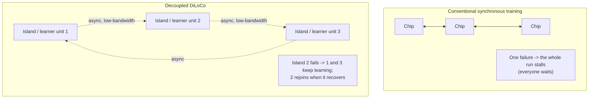

# Decoupled DiLoCo

> A distributed training architecture that trains one model across distant data centers by breaking the run into asynchronous "islands" of compute — so a failure in one island doesn't stall the others, and ordinary internet-grade bandwidth is enough.

**Category**: topics
**Last updated**: 2026-05-28
**Status**: active

## What it is

Traditional frontier-model training depends on a large, *tightly coupled* system: thousands of identical chips kept in near-perfect synchronization. That works today but becomes a logistics nightmare at the next scale — every chip waits on every other, and any failure ripples across the whole run.

Decoupled DiLoCo (Distributed Low-Communication) divides a training run into **decoupled "islands" of compute** (called *learner units*) with **asynchronous data flowing between them**. Local disruptions are isolated to their island, so the rest of the system keeps learning. Crucially, it does this *without* the communication delays that made earlier distributed methods (like global Data-Parallel) impractical at scale.

It builds on two prior DeepMind advances: **Pathways** (a distributed system based on asynchronous data flow) and **DiLoCo** (which slashed the bandwidth needed between data centers). Decoupled DiLoCo fuses them.

Source: Google DeepMind, *"Decoupled DiLoCo: A new frontier for resilient, distributed AI training"* (2026-04-23).

## Why it matters

This attacks the constraint that increasingly shapes who can train frontier models: not raw FLOPs, but **the fragility and co-location requirements of synchronous training.**

- **Resilience as a first-class property.** Under "chaos engineering" tests (artificial hardware failures injected mid-run), Decoupled DiLoCo continued training after losing entire learner units, then *seamlessly reintegrated them* when they came back online — self-healing infrastructure. As failure rates rise, its "goodput" (useful training) stays high while conventional methods nosedive.
- **Stranded compute becomes usable.** Because it tolerates internet-scale bandwidth, a run can tap *any* unused compute wherever it physically sits, turning idle capacity in different facilities into one training pool.
- **Mixed hardware generations in one run.** It can combine, e.g., TPU v6e and v5p — chips running at different speeds still matched single-chip-type ML performance. That extends the useful life of older hardware and smooths the fact that new chips don't arrive everywhere at once.

The proof point: a **12B-parameter model trained across four separate U.S. regions** over only **2–5 Gbps** of wide-area networking (achievable over existing internet links, not custom infrastructure) — and it reached the target **more than 20× faster** than conventional synchronization, by hiding communication inside longer compute windows instead of blocking on it. Validation runs with [[gemma-4]] models matched the ML performance of conventional training.

## How it works

The core idea is **isolation + asynchrony**, with communication overlapped onto computation rather than gating it.

- **Islands (learner units)** train largely independently; each absorbs its own hardware failures locally.
- **Asynchronous data flow** (inherited from Pathways) means islands exchange updates without blocking — no global barrier where the slowest unit holds everyone hostage.
- **Low-communication exchange** (inherited from DiLoCo) keeps cross-island bandwidth needs orders of magnitude below conventional methods, so 2–5 Gbps WAN links suffice.
- **Overlap, not block** — required communication is folded into longer periods of computation, which is where the >20× wall-clock speedup over conventional sync comes from under realistic conditions.

The reframing in the post is worth keeping: increasingly the gains come less from any single layer (hardware, software, research) and more from **rethinking how the layers fit together** — Decoupled DiLoCo is a systems-level rather than a model-level win.

## Dean-Relevance

**Adoption path**: watch
**Why**: Dean won't be pre-training frontier models, so this isn't hands-on — but it's a textbook *systems-thinking* result, which is his native lens. It's a clean case study in turning a tightly-coupled, failure-amplifying system into a loosely-coupled, failure-isolating one by introducing asynchrony and removing global barriers — the same move that shows up in distributed software, microservices, and resilient product architecture. The "overlap communication with computation instead of blocking on it" principle generalizes directly to agent and data-pipeline design.
**Analogy**: Conventional training is a rowing eight — if one rower catches a crab, the whole boat lurches. Decoupled DiLoCo is a flotilla of small boats heading the same way, occasionally shouting coordinates to each other: lose a boat and the rest sail on, and it rejoins when it's seaworthy again. The bandwidth trick is shouting *summaries* across the water, not narrating every stroke.
**Suggested next step**: None hands-on. Keep the pattern — *isolate failure domains, communicate asynchronously, overlap coordination with work* — as a reusable architectural heuristic for Praxis's pipelines and any multi-agent orchestration where one slow/failed component currently blocks the rest.

## Related
- [[gemma-4]]
- [[deepseek-v4]]
- [[model-compression]]
- [[train-time-rl-scaling]]
