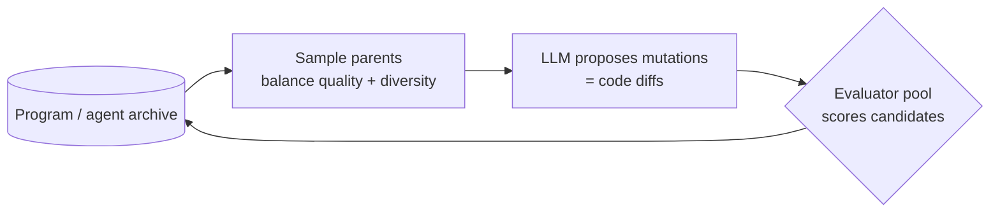
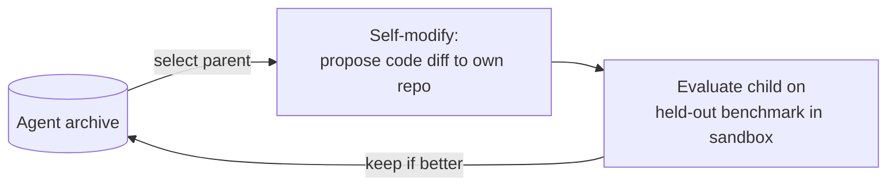

# Evolutionary Search & Self-Improving Agents

> Wrapping an LLM's creativity in an evolutionary loop — generate, evaluate, keep the winners, mutate — to *discover* new solutions (AlphaEvolve), agents that rewrite their own code (Darwin Gödel Machine), and agents that run the full research cycle (AI Scientist).

**Category**: topics
**Last updated**: 2026-05-25
**Status**: active

## What it is

The fundamental question: *can we build agents that not only solve problems, but actively discover new, more efficient solutions?* The shared recipe is **LLM creativity + evolutionary search + a reliable evaluator**:

It's the population-level cousin of [[test-time-compute-scaling]]: instead of N independent samples for one query, you maintain an **archive** of solutions that *compound* over generations, each new proposal inspired by the best so far. Three systems mark the progression from *evolving solutions* → *evolving the solver* → *evolving the whole research loop*.

## Why it matters

This is the most direct expression of the "director, not operator" idea: you define *what* (the objective + evaluator) and the system figures out *how*, iterating without you. AlphaEvolve has already produced **genuinely novel** results (improved matrix-multiplication algorithms, a denser sphere packing, a 0.7% recovery of Google's worldwide compute via better cluster scheduling, a 23% faster Gemini matmul kernel). The Darwin Gödel Machine and AI Scientist push toward recursive self-improvement — "an algorithm for making algorithms." For a builder whose explicit goal is automation and who wants to be a director of agents, this is the frontier of that ambition — bounded by the same verification bottleneck as everything else in [[self-improving-ai-agents]].

## How it works

### AlphaCode → AlphaCode 2 (the search precursor)

**AlphaCode** solves competitive programming end-to-end by *massive sampling + selection*: generate ~1M candidate programs per problem (½ Python, ½ C++, randomized prompt tags, high temperature), **filter** to those passing the example tests (~99% discarded), **cluster** semantically-equivalent programs (using a learned test-input generator), and submit ~10 diverse candidates. It reached the top ~54% of Codeforces competitors — proof that **scaling samples + good selection** beats clever single-shot.

**AlphaCode 2** swaps hand-tuned filtering for **LLMs (Gemini Pro)**: a *family* of fine-tuned models maximizes diversity, and a separate **scoring model** estimates correctness before submitting. It hit ~85th percentile and matched AlphaCode's 1M-sample performance with **~100 samples** — i.e. *a better model/scorer lets you cut test-time cost dramatically*. The pattern — **a family of models generates, another model scores** — is the template the later systems generalize.

### AlphaEvolve — evolving solutions

A general-purpose discovery engine. A human defines the **"what"** (evaluation criteria, an initial solution, optional background knowledge); AlphaEvolve figures out the **"how"**:

- **Program database** (archive) holds programs + quality scores; a **prompt sampler** builds rich prompts containing past trials and ideas; an **LLM ensemble** proposes improved programs; an **evaluators pool** scores them in parallel.
- Edits are expressed as **SEARCH/REPLACE diffs** — precise, scalable to large files, robust (a diff is ignored if the LLM hallucinates the SEARCH block), and auditable.
- **Automated evaluation cascade** prunes the search space cheaply-to-expensively; multi-objective scoring (speed + accuracy + memory) often beats single-metric by encouraging diversity.
- Predecessors it generalizes: **FunSearch** (small single Python functions, minimal context) and **AlphaTensor** (RL-based, non-LLM search for matmul/tensor decompositions).
- Open-source reimplementation to tinker: **OpenEvolve**.
- **Limitation**: needs a machine-gradable evaluator — stalls in subjective domains or where real-world experimentation is required.

### Darwin Gödel Machine (DGM) — evolving the solver

DGM turns the loop inward: the agent **edits its own codebase**. It builds a growing **archive of agents**, interleaving **self-modification** with **downstream task evaluation**:

- Named for Schmidhuber's **Gödel Machine** (2007) — a self-referential agent that rewrites itself *only when it can prove the rewrite helps*. That proof search is computationally impractical, so DGM swaps **formal proof for empirical validation** (run it on a benchmark).
- Example loop: SWE-bench failures involve multi-file navigation → hypothesis "navigation is the bottleneck" → self-edit: add AST indexing + chunking → re-run benchmark: pass rate + latency improve → keep this child and evolve from there.
- **Key finding**: *both* self-improvement **and** open-ended exploration are needed — ablating either stalls progress (it improves on both SWE-bench and Polyglot, beating baselines lacking either component).
- **Emergent meta-capabilities**: better code-editing tools, long-context handling, peer-review among variants, task-specific utilities — it improves *how it improves* (the slope), not just task scores.
- **Safety & governance** (essential for self-modifying systems): sandboxing/isolation, lineage tracking of every self-edit, human oversight for high-risk actions, evaluation-gated progression.

### AI Scientist (v1 → v2) — evolving the research loop

An agent that runs the **full research cycle** in three phases — **idea generation** (LLM ideation → novelty check via Semantic Scholar → scoring/archiving) → **experiment iteration** (code via Aider, run, update plan) → **paper write-up** (LaTeX section-by-section with self-reflection, 20 rounds of reference search, compile/debug).

- **v1 limitations**: restricted to a given domain, needs codebase templates, generates very similar ideas across runs/models, fails to implement a significant fraction of ideas, **hallucinates** details (hardware/library versions), sometimes **misinterprets results** (framed a KL-divergence increase as an improvement), struggles to cite relevant papers.
- **v2** adds **tree-based experimentation** run by an **Experiment Manager Agent** (preliminary investigation → hyperparameter tuning → research-agenda execution → ablation studies) and a **parallelized agentic tree search**: each node generates a plan + code; errors → "buggy," successes → take notes, plot, and **verify with a VLM**; best-first search branches buggy nodes to debug and non-buggy nodes to improve; an LLM judges which nodes advance. (Papers still weren't accept-to-conference level.)

## Dean-Relevance

**Adoption path**: experimental
**Why**: This is Dean's automation/"director-not-operator" thesis in its strongest form — define the objective + evaluator, let the system discover the *how*. The AlphaEvolve loop (archive + LLM-proposed diffs + parallel evaluators) is buildable today on his stack for any task with a programmatic scorer, and **OpenEvolve** is a concrete on-ramp. The DGM "agent that improves its own tooling" pattern is the shape of the leverage he wants; the AI Scientist's honest failure modes (hallucination, result misinterpretation) are a useful reality check on how far unattended agent pipelines can be trusted.
**Analogy**: Selective breeding for code. You don't design the prize-winning orchid — you keep crossing the best plants and culling the rest, and the *evaluator* (which blossom counts as best) is what makes the whole garden converge instead of drift.
**Suggested next step**: Pick one Praxis component with a cheap automatic scorer (e.g. a prompt template scored by an eval, or a retrieval config scored on recall) and stand up a minimal AlphaEvolve loop with OpenEvolve — archive of candidates, LLM-proposed diffs, parallel evaluation — to feel the evolve-don't-handcraft workflow on his own problem.
**Watch for**: Self-modifying-agent frameworks (DGM-style) becoming safe/packaged enough to point at a real repo — that's the moment "agent that improves its own tooling" stops being a research demo.

## Related
- [[test-time-compute-scaling]]
- [[verifiers-in-llm-reasoning]]
- [[agentic-rl-exploration]]
- [[self-improving-ai-agents]]
- [[harness-and-scaffolding]]
- [[spec-driven-development]]
- [[vision-language-action-models]]
