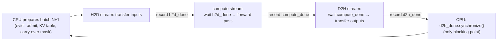
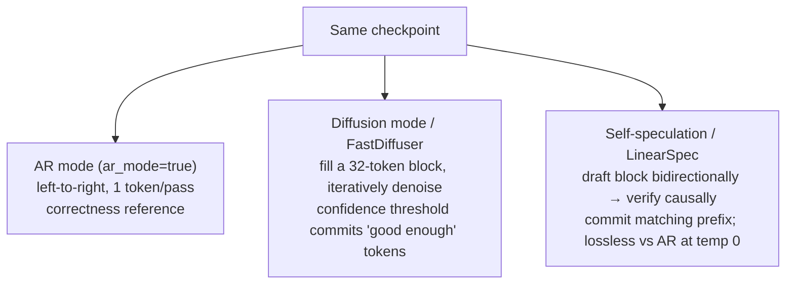

# LLM Inference-Serving Internals

> The serving-layer mechanics — CPU/GPU overlap, RL-rollout correctness, and parallel/diffusion decoding — that decide the latency, throughput, and cost you actually pay per token, even when you never touch the GPU yourself.

**Category**: topics
**Last updated**: 2026-05-28
**Status**: active

## What it is

Three otherwise-unrelated Hugging Face posts converge on one truth: a model's quoted speed is a property of *how it is served*, not just *what it is*. The same checkpoint can run 20%+ faster, return logprobs that quietly poison an RL run, or emit 4–6× more tokens per forward pass — all without changing a single weight. This page collects the three serving-layer levers:

- **(a) Asynchronous continuous batching** — overlapping CPU batch-prep with GPU compute so the GPU never idles between steps. A pure scheduling win.
- **(b) vLLM V0→V1 correctness in RL serving** — why an inference-engine *rewrite* (V0→V1) silently broke an RL training loop, and the discipline of fixing backend correctness before touching the objective.
- **(c) Nemotron-Labs Diffusion** — generating multiple tokens per pass (diffusion / self-speculation) instead of strictly one-at-a-time, attacking the autoregressive memory-bound ceiling.

You consume models through OpenRouter, so none of this is something you operate. But all three explain *why your Praxis agent's latency curve looks the way it does* — and where a provider's "fast" or "cheap" tier is actually coming from.

## Why it matters

The headline cost driver in agent serving is not FLOPs — it is **coordination and memory traffic**. Each post isolates one form of waste that a naive serving stack pays for invisibly:

| Lever | Waste it removes | Who pays it today |
|---|---|---|
| Async batching | GPU idle while CPU schedules next batch (~24% of runtime) | Your provider's throughput → your per-token price |
| RL-serving correctness | Silent train/inference logprob drift that corrupts post-training | The labs that make the models you call |
| Diffusion / self-speculation | Memory-bound, one-token-at-a-time decoding | Your end-to-end latency, especially at batch size 1 |

For a hosted user, the practical reading: when a model gets cheaper or a "fast" variant ships, it is often *this* layer that changed, not the architecture. And lever (b) is the cautionary tale — the reason model providers obsess over inference/training parity is that a subtle serving bug (fp32 vs lower-precision projection, a cache that ignores a weight-update boundary) can degrade a model before it ever reaches you.

## How it works

### (a) Asynchronous continuous batching — disentangling host and device

Continuous batching already packs requests tightly so no compute is wasted on padding. But by default it is **synchronous**: the CPU (host) and GPU (device) take turns. While the GPU runs a forward pass, the CPU waits; while the CPU samples outputs, updates request state, evicts finished requests, and schedules the next batch, the GPU waits. In a loop running hundreds of steps/sec, those gaps compound.

Measured on an 8B model generating 8K tokens at batch size 32: total time **300.6s, with the GPU idle 24.0% of it**. That idle quarter is pure scheduling overhead — no kernel could fix it.

The fix overlaps batch-prep for batch N+1 with the GPU compute of batch N. The machinery:

- **CUDA streams** — an ordered queue of GPU operations. Same-stream ops are sequential; different-stream ops run concurrently. The trap is the **default stream**, which is *synchronizing*: any op on it waits for all other GPU work to flush, and vice versa. So a single default-stream op (even a "non-blocking" copy) re-serializes everything. Rule: keep all work off the default stream. Use three — **H2D** (host→device input transfer), **compute**, **D2H** (device→host output transfer).
- **CUDA events** — markers recorded into a stream that another stream can wait on. `stream.record(event)` inserts the marker; `stream.wait(event)` holds *that stream* (not the CPU) until it fires. This restores the necessary ordering across independent streams without blocking the host.

The pipeline becomes data-dependency-driven instead of turn-taking:

Two hazards arise from running N and N+1 close together:

1. **Race conditions** — if N and N+1 share device-side input buffers, the CPU may overwrite N+1's inputs while the GPU still reads N's. Fix: **double-buffer** (slots A/B, alternate). Cost: ~2× the input/output tensor RAM/VRAM — acceptable, especially with **FlashAttention**, which needs no attention mask (the largest input tensor). Because CUDA graphs are captured against fixed addresses, two slots need two graphs; a **shared memory pool** lets both graphs allocate from the same buffer (safe because N must finish before N+1 starts), so two graphs cost roughly one graph's VRAM. Capture the largest graph first to avoid fragmentation.
2. **Carry-over** — a request in both N and N+1 produces its N+1 input token *as N's output*, which doesn't exist yet at prep time. Fix: build N+1 with placeholder token `0`, then after N completes (and before N+1's forward pass) run a cheap 4-op **carry-over** (select carried tokens → zero the rest → truncate → add to the zero-placeholder inputs). A `-1` carry-over mask entry means "don't carry"; the op is captured in the CUDA graph.

Result on the same benchmark: GPU active **99.4%** of runtime (up from 76.0%), total time **300.6s → 234.5s, a 22% speedup** — close to the 24% theoretical ceiling, the remaining gap being the one unavoidable CPU sync point per step. No new kernels, no model changes. Shipped in the `transformers` library (`ContinuousBatchingAsyncIOs`). The authors flag this as a step toward SOTA throughput for **long generation (16K+, e.g. RL rollouts)**, with offloading and decode-specific kernels still to come.

### (b) vLLM V0→V1: correctness before corrections in RL serving

PipelineRL uses vLLM as the rollout-generation engine: it samples tokens *and* returns token logprobs, which the trainer turns into policy ratios, KL, clip rate, entropy, and reward. Any discrepancy in how those logprobs are computed changes training dynamics. vLLM V1 is a substantial rewrite of V0, so migrating (reference vLLM `0.8.5` → V1 `0.18.1`) introduced a **train-inference mismatch**: the initial V1 run's logprobs and reward drifted from the V0 reference early in training (visible in `clamp_log_ratio_new_old_indicator`, `kl_new_old`, entropy, reward).

The discipline: separate failure into three layers and rule them out *in order*, resisting the temptation to jump to the objective.

| Layer | Meaning | Temptation to avoid |
|---|---|---|
| **Semantic mismatch** | Backend returns logprobs that *mean* something different | — |
| **Inference-path mismatch** | Different runtime defaults (caching, scheduling) → different execution path | — |
| **Objective mismatch** | The RL objective itself needs a correction for residual staleness | Suspected too early; would mask a backend bug |

Four backend fixes restored parity:

1. **Logprob semantics** — V1 returns logprobs from *raw* model outputs (before temperature, penalties, top-k/p). The trainer expected the *processed* sampler distribution. Fix: `logprobs-mode=processed_logprobs`. This removed the mean offset; the policy ratio re-centered on ~1.0. A gap remained.
2. **Runtime defaults** — the early run silently inherited V1's `0.18.1` defaults for **prefix caching** and **async scheduling**, plus an ad-hoc `disable-cascade-attn` override outside the committed recipe. Made explicit and *disabled* for parity. Prefix caching is normally correctness-preserving for a *fixed* model — but in online RL a cache hit can reuse state computed *before* a weight update if the cache ignores that boundary. Disabling it removed a V1-only degree of freedom.
3. **Inflight weight updates** — V0 effectively blocked at an engine boundary, loaded weights, and resumed *without* invalidating cached state. The V1 analogue: `pause_generation(mode="keep", clear_cache=False)` → `collective_rpc_async("receive_weight_update", ...)` → `resume_generation()`. `mode="keep"` (not `wait`/`abort`) and `clear_cache=False` match the V0 inflight model. Weight **lag** (steps the rollout server is behind the trainer) was a useful diagnostic: the buggy path carried more persistent lag.
4. **fp32 `lm_head`** — final parity required matching the numerical path for the logits projection. The trainer used an **fp32 `lm_head`**; the rollout backend had to match. Because RL consumes token logprobs directly, tiny logit changes surface in policy ratios, KL, and clipping. (The same fix appears in the MiniMax-M1 report and the ScaleRL recipe ablates fp32 head computation as a useful design choice.)

Negative ablations that ruled out wrong explanations: `processed_logprobs` *alone* didn't close the gap; **batch invariance** didn't fix it (higher lag, higher clip rate, NCCL complications); the first V1 run was a *confounded* baseline because of stacked V1-only defaults. Only after backend parity did the authors say the *next* improvement is ordinary async/off-policy hygiene — keep behavior-policy logprobs from rollout time, recompute trainer-side old-policy logprobs at optimization time, separate backend-mismatch correction from the policy-update ratio, and track ESS. **The lesson: fix backend correctness first, then add corrections for the mismatch that remains** — otherwise an objective-side correction silently compensates for a broken backend and the training curve becomes uninterpretable.

### (c) Nemotron-Labs Diffusion — attacking the autoregressive ceiling

Autoregressive (AR) decoding generates one token per full model pass, and *every weight must be loaded from memory before computation starts*. At small batch sizes that makes generation **memory-bound** — the GPU spends most of its time on memory traffic, not compute. AR also can't revise a committed token, so early mistakes propagate.

Nemotron-Labs Diffusion (text models at **3B / 8B / 14B**, plus an 8B VLM; base + instruct variants; open license) treats AR and diffusion as **modes of one model**, selectable at deploy time with ~no application change:

The trick (from **Efficient-DLM**): convert a *pretrained AR model* into a DLM via continued pretraining with a **block-wise attention** change — preserving AR capability while enabling **KV-cache-friendly** parallel decoding, which had historically been the DLM blocker. Trained with a joint AR+diffusion objective (1.3T pretrain tokens + 45B SFT tokens). The generate-and-refine property also gives a **runtime compute dial**: fewer refinement steps = less compute. Diffusion mode is also naturally suited to revision and fill-in-the-middle, not just left-to-right drafting.

Performance (measured in **TPF — tokens per forward pass**, a hardware-agnostic decoding-efficiency metric):

| Mode | Speed | Accuracy |
|---|---|---|
| AR (baseline) | 1× TPF | — |
| Diffusion | **2.6× TPF** | comparable |
| Linear self-speculation | **6× TPF** | comparable (lossless vs AR @ temp 0) |
| Quadratic self-speculation | **6.4× TPF** | comparable |

The 8B beats Qwen3 8B by **+1.2% average accuracy** while delivering those speedups; LinearSpec hit **~865 tok/s on B200** (~4× the AR baseline on the same hardware). Deployment via **SGLang** (landing in main; currently behind an issue-tracker request).

## Sources

- Hugging Face — *Unlocking asynchronicity in continuous batching* (2026-05-14), `huggingface.co/blog/continuous_async`
- ServiceNow-AI / Hugging Face — *vLLM V0 to V1: Correctness Before Corrections in RL* (2026-05-06), `huggingface.co/blog/ServiceNow-AI/correctness-before-corrections`
- NVIDIA / Hugging Face — *Towards Speed-of-Light Text Generation with Nemotron-Labs Diffusion Language Models* (2026-05-23), `huggingface.co/blog/nvidia/nemotron-labs-diffusion`

## Related
- [[deepseek-v4]]
- [[llm-memory-architectures]]
- [[model-compression]]
- [[gemma-4]]
- [[training-at-scale-infrastructure]]
- [[rl-post-training-libraries]]
- [[train-time-rl-scaling]]
