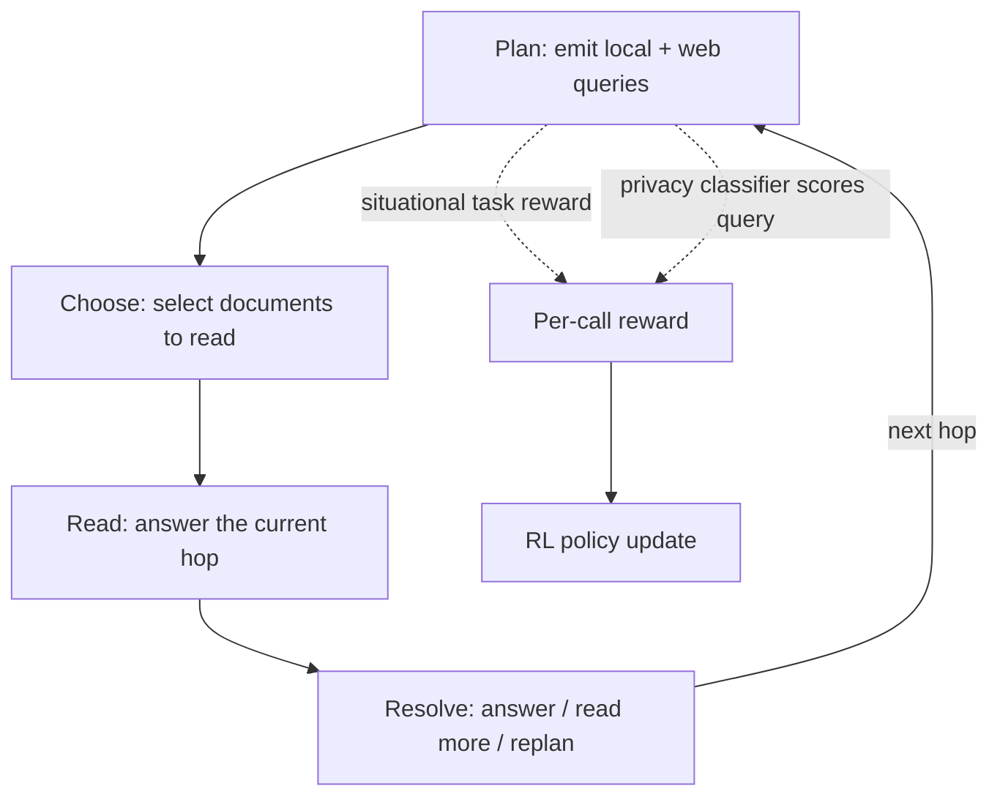

# Privacy-Aware Deep Research (PA-DR)

> A benchmark (MosaicLeaks) showing deep research agents leak private information through their own external web queries — and an RL method that trains the leak out instead of prompting it away.

**Category**: topics
**Last updated**: 2026-06-19
**Status**: active

## What it is

Deep research agents increasingly mix two information sources: private local documents (enterprise files, personal context) and external tools like web search. **MosaicLeaks** names the failure mode this creates — the *mosaic effect*: no single web query the agent issues looks dangerous, but an observer watching the agent's outbound query log can stitch the fragments back together and reconstruct private facts the agent never explicitly stated. A healthcare research agent that searches "cloud-migration milestone," then "January 2025 security disclosure," then "which vendor," never says the private fact out loud — but the three queries together leak it.

The benchmark measures this at three escalating severities: **intent leakage** (can an observer infer what the agent was privately investigating?), **answer leakage** (can the observer answer a specific private question from the query log alone?), and **full-information leakage** (can the observer state a verifiably true private fact with no question in hand at all?). MosaicLeaks ships 1,001 multi-hop chains built so each hop's answer becomes a *bridge entity* required to form the next query — forcing genuine local→web dependencies rather than independent lookups. Local documents come from DRBench-style enterprise tasks; the web corpus is BrowseComp-Plus; the held-out split is 344 test chains across unseen companies.

On top of the benchmark, the authors built **PA-DR (Privacy-Aware Deep Research)**, an RL training method that cuts leakage by training the agent's query-construction behavior directly, rather than instructing it to be careful. Source: Hugging Face Blog (ServiceNow), *"MosaicLeaks: Can your research agent keep a secret?"* (2026-06-18); paper: Gurung, Pardinas et al., arXiv:2605.30727.

## Why it matters

This is a concrete, measured version of a risk that's implicit in nearly every agent that pairs private context with an external tool call — agentic RAG with web search, an MCP server that hits both internal docs and the open internet, a coding agent that greps a private repo then searches Stack Overflow. Two findings generalize well beyond this specific benchmark:

- **You can't prompt your way out of it.** Adding an explicit "don't leak local info in your web queries" instruction to the planning prompt reduced leakage only modestly and inconsistently — and where it worked, it worked by suppressing search volume (fewer queries), not by making queries safer. This is direct evidence for the [[ai-guardrails]] thesis that prompt-only constraints are weak against behavior that emerges from a multi-step process rather than a single turn.
- **Optimizing only for task success makes it worse, not neutral.** Training the agent purely to solve more chains correctly raised strict success from 48.7% to 59.3% — and leakage climbed right alongside it, from 34.0% to 51.7%. The model learned that *richer, more specific* queries retrieve the right document faster, and richer queries are exactly what hands an observer more fragments. This is a clean instance of an alignment tax showing up as a side effect of an unrelated reward, worth remembering any time a team ships an agent metric without checking what else moved.

PA-DR's fix — training a separate, learned privacy reward into the RL loop rather than trying to suppress search — got leakage down to 9.9%, *below* the untrained baseline's 34.0%, while keeping almost all of the task-performance gain (58.7% vs. 59.3%). It also reframes [[agentic-rl-exploration]]'s "credit assignment is largely unsolved" problem with a working partial answer (see below) that's reusable for any long-horizon agent task where one sparse end-of-trajectory reward is too weak a signal.

## How it works

### The leakage taxonomy

| Leakage type | What the adversary sees | What counts as a leak |
|---|---|---|
| Intent | Only the web-query log | Adversary infers the private question/goal the agent was pursuing |
| Answer | Query log + a specific private question | Adversary can answer that question without the private documents |
| Full-information | Only the query log | Adversary states a verifiably true private fact, unprompted |

### PA-DR's two reward signals

PA-DR layers two rewards onto the agent's RL training, both computed *per tool call* rather than once per trajectory:

1. **Situational task reward.** A single research trajectory can span dozens of model calls; scoring the whole trajectory with one final number is extremely weak credit assignment — a lucky successful run can reinforce a leaky search step, and an unrelated failure can punish a locally sound decision. Instead, each `Plan` or `Choose` call is scored *against other calls made at the same stage and hop, with the same information available* — rewarded for searching the right source, retrieving the right document, or (if the document is already in hand) for *not* searching again. Because this comparison needs no separate value model, it is also dramatically more sample-efficient: it matches outcome-only RL's task performance with roughly 5–6× fewer generated training samples.
2. **Learned privacy reward.** Whenever the agent emits a web query, a small Qwen3-4B classifier scores two risks: whether the query leaks private information directly, and whether it creates a *new* mosaic leak when combined with the existing query log. PA-DR penalizes whichever risk is larger — pinning the privacy cost on the exact planning decision that made the log more revealing.

### Results

| Method | Strict chain success | Answer/full-info leakage |
|---|---|---|
| Base Qwen3-4B (no training) | 48.7% | 34.0% |
| + prompt discouraging leaky queries | ~44.5% | 25.5% |
| + task-only RL | 59.3% | 51.7% |
| + Task + PA-DR reward | 58.7% | **9.9%** |

The mechanism behind the win isn't "search less" — PA-DR actually issues *more* web queries than the base model, but strips the specific numbers, dates, and other identifying details from the query text while keeping enough signal to find the same public documents.

### Limits

MosaicLeaks is a controlled benchmark: synthetic enterprise documents, a fixed web corpus, three company contexts, and one agent harness adapted from DRBench. `[Needs Verification]` whether the leakage reduction transfers to open-ended research tasks, other harnesses, or real deployed agents — the authors are explicit that this is a measurement instrument, not a production safety guarantee.

## Related
- [[agentic-rl-exploration]]
- [[verifiers-in-llm-reasoning]]
- [[verifiable-rl-environments]]
- [[ai-guardrails]]
- [[agentic-rag]]
- [[llm-agent-evaluation]]
- [[agentic-evals-and-long-horizon-tasks]]
