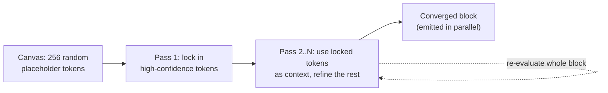

# Text Diffusion LLMs

> Language models that generate text in parallel blocks via iterative denoising instead of one autoregressive token at a time — trading some quality for large local-inference speedups and bidirectional editing.

**Category**: topics
**Last updated**: 2026-06-28
**Status**: active

## What it is

Almost every production LLM is **autoregressive**: it emits one token at a time, left to right, each conditioned on all the tokens before it. Text-diffusion models borrow the recipe from image diffusion instead — start from a block of random placeholder tokens and iteratively refine the *whole block at once* over several passes, locking in confident tokens and using them as context to fix the rest, until the block converges.

DeepMind's **DiffusionGemma** (June 2026, Apache 2.0, experimental) is the first mainstream open instance built on a frontier-quality base: a 26B-total MoE (3.8B active) with a "diffusion head" bolted onto the Gemma 4 family, drafting 256 tokens per forward pass. It is explicitly positioned as a *research/local-workflow* model, not a quality flagship — for maximum quality, DeepMind still points you at standard autoregressive Gemma 4.

## Why it matters

The interesting claim is **where** diffusion wins, and it's the opposite of where you'd expect:

- **It's a *local*, single-user win, not a cloud win.** Autoregressive decoding is memory-bandwidth bound: on a single dedicated GPU serving one user, the chip mostly idles waiting for the next token. Diffusion shifts the bottleneck from memory bandwidth to *compute*, handing the GPU a big chunk of work per pass and saturating it — ~4× faster (1000+ tok/s on an H100, 700+ on an RTX 5090). In high-QPS cloud serving, where autoregressive models already batch thousands of requests to saturate compute, that advantage collapses and can even cost more. This is a rare case where the *deployment topology* (local, low-concurrency) determines whether an architecture is worth it — directly relevant to the local-inference frontier Dean tracks (see [[gemma-4]], [[llm-inference-serving-internals]]).
- **Bidirectional attention unlocks non-linear text.** Because all 256 tokens in a block attend to each other, the model is naturally good at tasks where a token depends on *future* tokens: in-line editing, code infilling, closing complex markdown/bracket structures, and structured layouts. Unsloth fine-tuned DiffusionGemma to solve Sudoku — a task autoregressive models struggle with precisely because each cell depends on cells "after" it.
- **Self-correction is built in.** Iterative refinement means the model re-evaluates the whole block each pass and can fix its own earlier mistakes, rather than being locked into a bad token the moment it's sampled (contrast the irreversible-history problem in [[context-engineering]]).

The honest trade-off: at equal scale, diffusion output quality is currently *below* autoregressive Gemma 4. This is a speed/interactivity bet, not a capability bet — useful when latency and editability matter more than peak quality.

## How it works

1. **Canvas** — the model starts each block as a field of random placeholder tokens (the text analogue of visual static).
2. **Iterative refinement** — over multiple forward passes it commits the tokens it's most confident about and treats them as fixed context clues for refining the rest.
3. **Final polish** — the block converges to clean output and is returned all at once.

Efficiency specifics: as a 26B MoE activating only 3.8B params, it fits in ~18GB VRAM when quantized (consumer high-end GPUs). DeepMind co-optimized it with NVIDIA's **NVFP4** (4-bit float) kernels for near-lossless accelerated compute on Hopper/Blackwell, and it serves via MLX, vLLM, and Transformers, with llama.cpp support arriving. Task-specific quality can be recovered through fine-tuning (Hackable Diffusion, Unsloth, NeMo).

## Related
- [[gemma-4]]
- [[llm-inference-serving-internals]]
- [[test-time-compute-scaling]]
- [[model-compression]]
