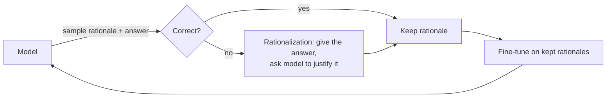

# Train-Time RL Scaling

> Baking the inference-time search back into the weights — letting a model learn from its own correct samples via reinforcement learning, so it gets the answer right the first time.

**Category**: topics
**Last updated**: 2026-05-25
**Status**: active

## What it is

[[test-time-compute-scaling|Test-time scaling]] gets accuracy by sampling many answers and selecting the good ones at inference. Train-time RL scaling asks: why pay that cost every query? **Generate samples, keep the ones a verifier marks correct, and train the model on them** — so the behavior moves into the weights and you get it greedily next time.

Three insights anchor the whole area:

1. **A model can learn from its own outputs.** You don't need new human data; you need the model's own correct trajectories, filtered by a [[verifiers-in-llm-reasoning|verifier]].
2. **Compute can substitute for parameters/data.** RL on self-generated, verifier-checked data is a way to spend compute to raise capability without more labels.
3. **Small algorithmic fixes matter enormously.** The gap between "RL that diverges" and "RL that works" is a handful of stabilization tricks (see DAPO below).

## Why it matters

This is the machinery behind the reasoning-model era (o-series, R1-style models). Understanding it explains a result that should change how you *use* these models:

> **RL fine-tuning improves Maj@K, not Pass@K.**

I.e. RL mostly **elicits / sharpens** behaviors the base model could already produce somewhere in its sample distribution — it concentrates probability on good trajectories rather than expanding the frontier of what's reachable at all. So a reasoning model isn't "smarter" in raw capability so much as "better at reliably surfacing its best self." That matters for model selection and for knowing when more sampling ([[test-time-compute-scaling]]) will still help even on an RL'd model.

Dean is API-based, so this is mostly **conceptual leverage** — but it's the conceptual key to why reasoning models behave as they do, and it directly informs [[agentic-rl-exploration]] (RL is the substrate of agentic learning).

## How it works

### STaR — the bootstrap loop

**STaR** (Self-Taught Reasoner) is the seed idea:



- **Bootstrapping**: keep only chains that reach the right answer, train on them, repeat.
- **Rationalization**: for problems it got wrong, hand the model the correct answer and let it produce a working-backwards rationale — recovering hard examples it would otherwise never solve.
- Descendants: **V-STaR** (also train a verifier on the failures), **Quiet-STaR** (learn to think before *every* token), **ReFT** (RL fine-tuning over SFT to explore multiple reasoning paths).

### GRPO — RL without a critic

PPO needs a separate **value/critic network** (≈ as big as the policy) to estimate baselines. **GRPO** (Group Relative Policy Optimization) removes it:

| | PPO | GRPO |
|---|---|---|
| Baseline | Learned critic network | **Mean reward of a group** of samples for the same prompt |
| Advantage | `r − V(s)` | `(r − group_mean) / group_std` (normalize within group) |
| Memory | Policy + critic | Policy only (~50% less) |

Sample a group of completions per prompt, score them, and push up the above-average ones / push down the below-average ones. Simpler, cheaper, and the workhorse of recent open reasoning models.

### DeepSeekMath's unifying view

All these gradients have the same shape:

```
gradient = GradientCoefficient × ∇ log p(output)
```

SFT, rejection sampling, PPO, and GRPO differ only in **what sets the GradientCoefficient** (1, a reward, an advantage, a group-normalized advantage). It's one knob — "how much do I reinforce this token" — wearing different hats.

### DAPO — the four fixes that make GRPO actually scale

Naive GRPO stalls and collapses entropy. **DAPO** adds four targeted fixes (AIME: naive GRPO ~30 → DAPO ~50):

| Fix | Problem it solves |
|---|---|
| **Clip-Higher** (asymmetric clipping) | Symmetric PPO clipping suppresses *exploration* of better tokens; raise the upper clip so promising rare tokens can grow. |
| **Dynamic Sampling** | Drop prompts where all samples are right or all wrong (zero advantage signal) — don't waste compute on them. |
| **Token-Level Loss** | Average loss over *tokens*, not *sequences*, so long correct chains aren't drowned out by short ones. |
| **Soft Overlong Punishment** | Gently penalize runaway-length generations instead of hard-truncating, avoiding reward-hacking via length. |

### When to reach for which

| Situation | Method |
|---|---|
| Have a verifier + want a simple self-improvement loop, no RL infra | **STaR** (bootstrap + rationalize, fine-tune) |
| Have RL infra, want sample-efficient policy optimization | **GRPO** |
| GRPO is unstable / entropy collapsing / long outputs | **DAPO** (add the four fixes) |

**Open problems**: stable exploration (entropy collapse), credit assignment over long trajectories, and reward design — all of which are the bottlenecks elaborated in [[agentic-rl-exploration]].

## Dean-Relevance

**Adoption path**: watch
**Why**: Dean builds on API models (OpenRouter), not custom training, so GRPO/DAPO aren't tools he'll run — but "**RL elicits, it doesn't expand**" is a load-bearing mental model for *choosing* and *prompting* reasoning models, and the STaR bootstrap loop is the cleanest template for any future self-improvement pipeline he might run on a small open model. Local LLM training sits in his 🟡 curious-but-cautious zone, so this is knowledge-to-have, not build-now.
**Analogy**: RL fine-tuning is a coach, not a tutor. It doesn't teach the athlete new moves they couldn't physically do — it drills them until the best move comes out under pressure instead of one-in-ten times.
**Suggested next step**: — (conceptual; revisit if he ever fine-tunes a small open model with a verifier-gated loop).
**Watch for**: Turnkey hosted RL/GRPO services (à la "fine-tune with a reward function") that remove the infra barrier — that would move this from watch to experimental for a verifier-rich task.

## Related
- [[test-time-compute-scaling]]
- [[verifiers-in-llm-reasoning]]
- [[agentic-rl-exploration]]
- [[self-improving-ai-agents]]
- [[synthetic-data]]
