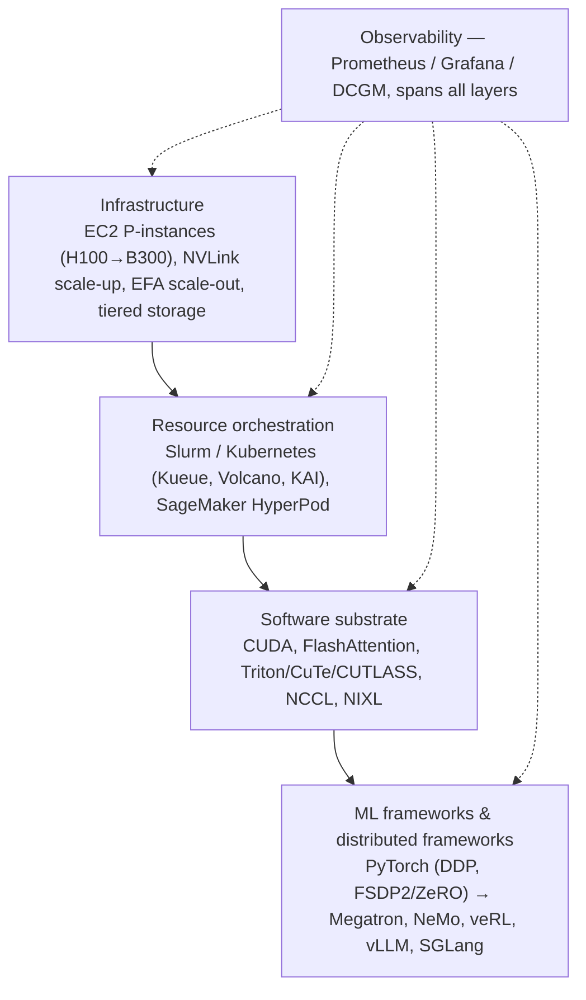
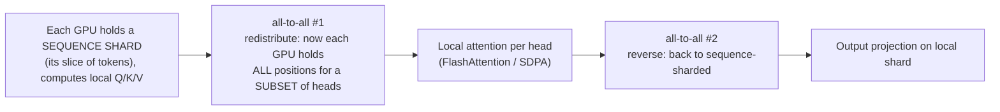
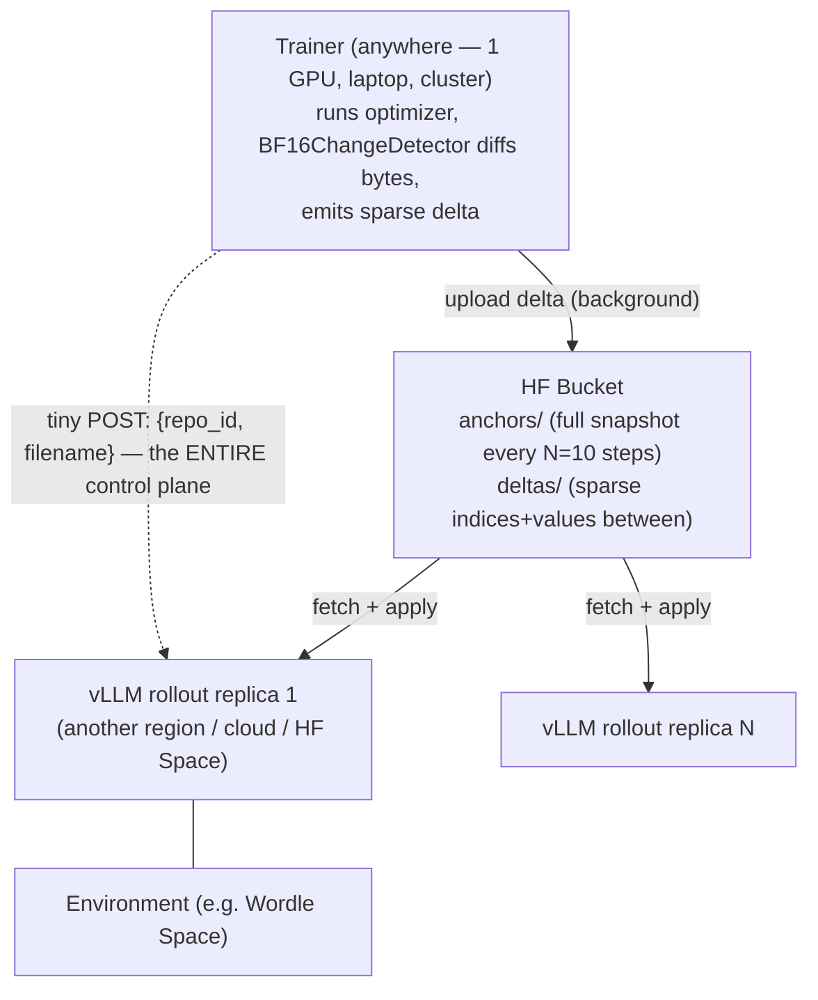

# Training-at-Scale Infrastructure

> The systems layer beneath frontier models — how compute, network, storage, and coordination are arranged so that a single training or RL run can span thousands of GPUs, million-token sequences, and machines that never share a network.

**Category**: topics
**Last updated**: 2026-05-28
**Status**: active

## What it is

This is a grouped reference for four 2026 Hugging Face posts that, read together, map the *systems substrate* of large-scale model training and inference. None of them is about a model. They are about the plumbing: what the hardware/orchestration stack actually looks like (AWS building blocks), how you split a single sequence across GPUs when it won't fit on one (Ulysses sequence parallelism), how you move a trillion parameters between machines without a dedicated fabric (delta weight sync over a Hub bucket), and the storage primitive that makes that movement cheap (HF Storage Buckets + Xet).

The unifying thesis — and the reason these belong on one page for a systems thinker — is that **at scale, the model is the easy part. The bottleneck is always movement**: moving tokens between GPUs (attention), moving weights between trainer and rollout fleet (RL sync), moving checkpoints and data between compute and storage. Every post is a different answer to the same question: *what moves, how often, and over what fabric?*

A second thread runs through all four: **the object store is quietly becoming the coordination layer.** Two of the posts replace tightly-coupled RDMA/NCCL communication with a shared bucket that both sides poll. The "wire" stops being a network link and becomes a content-addressed blob store. That is a genuine architectural inversion worth internalizing.

## Why it matters

The old mental model — "scaling = spend more compute on pre-training, loss goes down per Kaplan et al." — is dead. NVIDIA's *three scaling laws* framing (pre-training, post-training/RL, test-time compute) means the lifecycle now stresses infrastructure in three different shapes, but they **converge on the same requirements**: tightly-coupled accelerator compute, high-bandwidth low-latency networking, and a distributed storage backend, plus orchestration and observability spanning all of it. Scaling didn't fragment the infra; it reinforced it.

What changes because these techniques exist:

- **Long-context training stops being gated by single-GPU memory.** Sequence parallelism lets the *sequence itself* be sharded, so book-length (250k+ token) training is a config flag, not a research project.
- **Async RL stops requiring a colocated mega-cluster.** If 99% of weights are bit-identical between steps, you ship ~1% over commodity object storage — and the trainer and rollout fleet no longer need to live in the same data center, or even the same cloud.
- **The storage tier becomes a first-class design variable**, not an afterthought. Where your data physically sits relative to compute directly sets throughput; content-defined chunking makes "ship the whole checkpoint" cost only what actually changed.

The transferable lesson for any distributed system (not just ML): **identify the thing that moves on the critical path, measure how much of it is actually novel each cycle, and route only the delta through the cheapest fabric that works.**

## How it works

### (a) Building blocks for foundation-model training & inference

The AWS post frames the stack as **four layers, each constraining the one above** — a misconfigured driver bottlenecks a run as effectively as a bad parallelism strategy.

**Infrastructure — three coupled building blocks:**

| Block | What it is | Systems insight |
|---|---|---|
| **Compute** | NVIDIA GPUs across generations: H100 (0.99 PFLOPS BF16, 80GB) → H200 (141GB) → B200 (2.25 PFLOPS, 180GB) → B300 (288GB HBM3e) | Dominant scaling axes are Tensor throughput, **HBM capacity/bandwidth**, and interconnect BW — not just FLOPS |
| **Network** | Two regimes: **scale-up** (NVLink/NVSwitch, 7.2→14.4 TB/s intra-node) and **scale-out** (EFA, OS-bypass RDMA via SRD protocol, ~400–800 GB/s) | At scale, step time is dominated by **collective communication & memory movement, not raw compute** |
| **Storage** | Tiered: local NVMe (hot, 30 TB ephemeral) → FSx for Lustre (shared, TB/s, POSIX) → S3 (durable) | Both training (checkpoints) and inference (weight staging, KV cache) motivate the hierarchy |

Two scale knobs worth noting: **UltraClusters** place thousands of instances on a petabit nonblocking network; **UltraServers** (GB200 NVL72) extend the *NVLink domain* to 72 GPUs / 13.4 TB HBM3e in one coherent fabric — critical for MoE expert-parallelism where all-to-all token dispatch is the bottleneck and you want to keep traffic off the slower scale-out fabric.

**Orchestration — the gang-scheduling problem.** A 512-GPU job needs 64 nodes co-scheduled *atomically* (all-or-nothing) and released atomically on failure. **Slurm** does this natively (job-level allocation, backfill, topology-aware placement encoding the EFA fabric). **Kubernetes** schedules per-*pod*, so a multi-node job can partially start — some ranks running, others Pending — wasting GPUs or deadlocking. Add-ons fill the gap: **Kueue** (admission/gang/quota), **Volcano** / **NVIDIA KAI** (gang + topology-aware placement). SageMaker HyperPod layers on training-specific tricks: **checkpointless training** (continuous peer-to-peer state replication, so failure recovery reconstructs lost state over EFA instead of reading TB checkpoints from Lustre/S3) and **elastic training** (jobs expand/contract with available capacity).

**ML software stack (5 sub-layers):** kernel drivers (GPUDirect RDMA, GDRCopy, EFA, Lustre client) → CUDA + custom kernels (**FlashAttention** fuses attention into one memory-efficient pass; Triton/CuTe/CUTLASS for shape/precision-specialized fused kernels — this layer often sets end-to-end perf as much as the framework) → communication (**NCCL** for collectives; all-to-all is the MoE expert-parallel bottleneck since every GPU talks to every other; **NIXL** for point-to-point KV-cache transfer in disaggregated prefill/decode serving) → **PyTorch** (DDP replicates + all-reduces gradients; **FSDP2** shards params/grads/optimizer states via ZeRO) → top-level frameworks (Megatron/NeMo for 3D parallelism, **veRL** for RLHF with HybridFlow sharing weights in-memory between actor and rollout, vLLM/SGLang for serving — see [[llm-inference-serving-internals]]).

**Observability** is a prerequisite, not a nicety: DCGM-Exporter for GPU health (SM activity beats raw utilization; XID 63/64/94/95 errors warrant immediate node replacement), EFA counters + `NCCL_DEBUG` for network diagnosis, Lustre client metrics for storage. At thousands of GPUs the question is never "is it broken" but "*which layer* is the bottleneck right now."

### (b) Ulysses sequence parallelism — million-token-context training

The problem: attention is **O(n²) compute and memory**. FlashAttention tiles the computation down to O(n) *memory*, but the O(n²) *compute* remains, and data parallelism doesn't help — each GPU still processes the full sequence inside the attention block. Beyond ~32k tokens you're fighting single-GPU memory.

Ulysses SP (from Snowflake's Arctic Long Sequence Training / DeepSpeed Ulysses) makes a clever trade: **shard the sequence across GPUs, then trade sequence-locality for head-locality at the attention step**, exploiting the fact that attention heads are independent.

The genius is the **all-to-all swap**: heads are independent, so once a GPU owns a full head it computes exact attention with no approximation. Two all-to-alls per layer, total comm **O(n·d/P) per GPU** — a factor of **P less** than Ring Attention's O(n·d), and lower latency because all-to-all uses full bisection bandwidth in one collective step rather than serializing P−1 ring hops.

A subtlety that signals real engineering maturity: at these lengths a **4D attention mask would itself be ~1TB at 128k tokens** — as prohibitive as the attention scores. Both Ulysses and Ring Attention use `position_ids` for causal masking instead (O(n) memory). And because the sequence is split across ranks, **loss must be aggregated weighted by valid-token count per rank** (ranks holding only padding contribute zero) — handled automatically in the Transformers Trainer / TRL SFTTrainer.

**Ulysses vs. Ring Attention:**

| Aspect | Ulysses (DeepSpeed) | Ring Attention (FSDP2) |
|---|---|---|
| Method | Attention-head partitioning | Ring-based KV exchange |
| Comm volume / GPU | **O(n·d / P)** | O(n·d) — factor of P more |
| Communication | 2× all-to-all per layer | P2P ring (P−1 sequential hops) |
| Attention impl | FlashAttention 2/3, SDPA | SDPA only |
| Hard constraint | **num_heads ≥ sp_size** | none |

**Benchmarks (Qwen3-4B, 4× H100 80GB, ZeRO-3):** SP=4 cuts per-GPU memory **3.3×** at equal sequence length, enabling **96K tokens** (12× the 8K DP baseline) within 80GB; 128K OOMs. Throughput scales with length as quadratic attention amortizes the comm overhead — **64K hits 13,396 tok/s, 3.7× the baseline**. Critically, controlled A/B runs show canonical token-normalized NLL between DP and SP matches to **~4e-6** — SP is mathematically equivalent, not an approximation. (Combine with 2D parallelism SP×DP, ZeRO-3 + CPU offload, Liger-Kernel's FusedLinearCrossEntropy/TiledMLP, and `expandable_segments` to push further. Note: `GAS` must scale with `SP` to keep effective tokens-per-step matched.)

### (c) Shipping a trillion parameters — Hub bucket + delta weights

Async RL's dirty secret: **every step, the trainer must ship the whole model to the inference engine.** 14GB for a 7B in bf16; ~1TB for a frontier 1T checkpoint — *per step*, on the critical path, as wasted idle GPU time where no tokens are being generated.

The insight that breaks this: **between two consecutive RL optimizer steps, ~99% of bf16 weights are bit-identical (never below 98% worst case).** This isn't luck — it falls out of bf16 arithmetic. A bf16 number has 7 mantissa bits, so adjacent values around |w| are spaced ~|w|·2⁻⁷ apart. An Adam update at RL learning rates (η ≈ 3e-6) produces |Δw| ≈ η, but the **bf16 visibility threshold is |w|/256 ≈ 4e-5 to 4e-4** for typical weights (median |w| ≈ 0.019 per PULSE). The update is *smaller than the rounding grid* — "the optimizer is whispering, and bf16 cannot hear it." The byte doesn't flip. PULSE (Mihai & Belilovsky, 2026) measures ~99% mean sparsity (σ 0.2–0.4%) across Qwen2.5, Llama-3.2-3B, Gemma-3-4B over 400 steps.

So instead of broadcasting the full model, **encode only the changed elements as a sparse safetensors file and route it through a shared bucket.** On Qwen3-0.6B the per-step payload drops from **1.2GB to 20–35MB**.

**How the delta is found (ground truth, not prediction):** a `BF16ChangeDetector` registers pre/post optimizer-step hooks, snapshots the bf16 bytes before, diffs after — a boolean mask of flipped bytes. They *tried* predicting the mask analytically from Adam's m/v stats, but recall was only ~30% (Adam's normalization is messier than the textbook formula), so they pay for one CPU bf16 snapshot and just compare bytes.

**Wire format = safetensors.** Anchors are normal full-bf16 checkpoints (metadata `sparse=False`); deltas store, per changed param, an `int32` indices tensor + a `bf16` values tensor (metadata `sparse=True, sparsity=0.9938, changed_params=[...]`). A delta is a *file* — `safe_open` it, inspect it, no proprietary framing, zero-copy via mmap. New replicas grab the latest anchor and replay deltas since.

**Why the bucket is the architecture.** The trainer and rollout server **never talk to each other about weights** — they exchange a tiny `{repo_id, filename}` POST, and all byte transfer happens between each side and the bucket, in parallel. Consequences: rollout servers can be behind NAT / in another cloud / in an HF Space; N replicas pull the same delta and **Xet deduplicates across all of them**; the trainer needn't know how many replicas exist or whether one crashed. The four-phase `_sync_weight`: (1) upload delta *while inference keeps serving the old policy*, (2) pause vLLM (~hundreds of ms), (3) signal `/update_weights` with bucket coordinates, (4) resume. Measured: **inference paused 1.1s** out of a 9.4s total sync — the upload happened in the background. NCCL would have charged the *full* sync time as pause time.

The vLLM side is a **30-line `DeltaWeightTransferEngine`** registered via `--worker-extension-cls` — **no fork of vLLM required.** (It currently keeps a CPU bf16 snapshot to reconstruct full tensors, since vLLM's `load_weights` expects full tensors; vLLM PR #40096 adds native in-place sparse transfer — reporting **0.16MB in 0.40ms vs. 942MB in 192ms** for a dense send on Qwen3-1.7B — which will drop the snapshot.)

**Scaling napkin math** (why this becomes the *only* sensible architecture at frontier scale):

| Model | Full bf16 | Delta (~1% + ~130× encoding) | Full sync pause | Delta visible pause |
|---|---|---|---|---|
| Qwen3-0.6B | 1.2 GB | 20–35 MB (measured) | — | ~1s |
| Llama-3.1-405B | 810 GB | ~6 GB | ~8s @ 100GB/s RDMA | ~couple seconds |
| 1T (Fireworks, fp8) | 1024 GiB | 20.3 GiB measured (~50×) | — | — |

Inside a cluster, delta already cuts visible pause ~4× and bytes ~130×. **Across clouds NCCL simply doesn't work** — at 1 GB/s internet a full 810GB broadcast takes 13 minutes; the delta does it in ~6s. Independently validated by Fireworks ("*Frontier RL Is Cheaper Than You Think*", 20.3 GiB delta = 1.98% of a 1T checkpoint) and Cursor's Composer 2 (training/inference in different regions stitched by a shared S3 bucket of compressed diffs, "requiring no direct connectivity to the training cluster"). TRL is the `pip install`-able open-source version.

### (d) HF Storage Buckets — the storage primitive underneath

Production ML generates a constant stream of **mutable intermediate files** (checkpoints, optimizer states, processed shards, logs, agent traces) that change often, arrive from many jobs at once, and rarely need version control. **Git/LFS is the wrong abstraction** for this — no commit ceremony needed, you just want to write fast, overwrite, sync, and delete.

A **Bucket** is a non-versioned, S3-like object container on the Hub: namespaced, permissioned, public/private, browsable, addressable as `hf://buckets/username/my-bucket`. CLI (`hf buckets create/sync/cp/remove`, with `--dry-run` and saveable `--plan`), Python (`create_bucket`, `sync_bucket`, `list_bucket_tree`, plus `batch_bucket_files`/`download_bucket_files` used by the delta-sync above), and **fsspec** integration (`HfFileSystem`) so pandas/Polars/Dask read/write `hf://` paths directly.

The non-obvious part is **Xet** — the content-defined chunking backend. Files are sliced into chunks *by content* (not fixed offsets) and deduplicated against everything already in the bucket. So successive checkpoints with frozen layers, or a processed dataset mostly identical to its raw form, **transfer only the changed chunks** — even if you naively upload full files every step. This is *why* the delta-weight architecture composes so cleanly: sparse encoding + Xet means you pay for what moved, and you pay once. (Enterprise billing is on *deduplicated* storage, so overlap cuts cost too.)

**Pre-warming** brings hot data close to compute — you declare the cloud/region where your jobs run (AWS and GCP at launch) and Buckets ensure the data is already there, instead of crossing regions on every read. This directly closes the loop with post (a): **storage location is a throughput variable**, and a global-by-default store needs a locality escape hatch for distributed training.

## Sources

- Hugging Face / Amazon, *Building Blocks for Foundation Model Training and Inference on AWS* (2026-05-11)
- Hugging Face, *Ulysses Sequence Parallelism: Training with Million-Token Contexts* (2026-03-09)
- Hugging Face, *Shipping a Trillion Parameters With a Hub Bucket: Delta Weight Sync in TRL* (2026-05-27)
- Hugging Face, *Introducing Storage Buckets on the Hugging Face Hub* (2026-03-10)

## Related

- [[decoupled-diloco]]
- [[deepseek-v4]]
- [[gemma-4]]
- [[model-compression]]
- [[llm-inference-serving-internals]]
- [[open-model-releases-spring-2026]]
