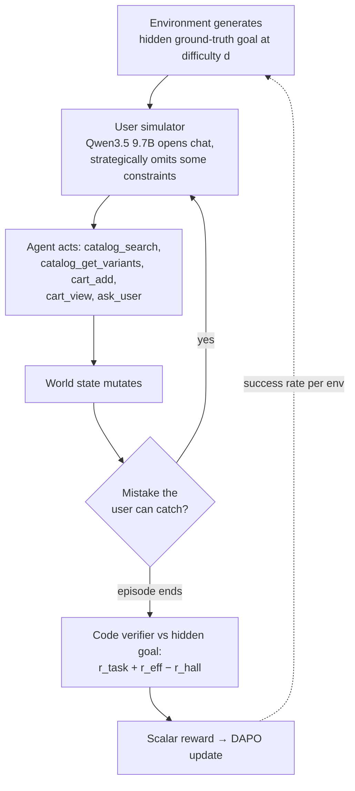

# Verifiable RL Environments

> Training agents by reinforcement learning against environments where the reward is computed by code against a hidden ground-truth goal — no LLM-as-judge — and where difficulty auto-scales to the agent's current ability.

**Category**: topics
**Last updated**: 2026-05-28
**Status**: active

## What it is

A **verifiable RL environment** is a training arena where two normally-fuzzy things become deterministic: the *task* and the *reward*. The environment procedurally generates a problem with a hidden ground-truth solution, the agent acts, and a **program** — not a human annotator, not another LLM — scores the result by comparing the agent's actions against that hidden goal. This is the RLVE ("RL with Verifiable Environments") line of work, originally demonstrated on single-turn algorithmic puzzles (sorting, multiplication, Sudoku) in RLVE-Gym's 400 environments.

**Ecom-RLVE** (HF blog, 2026-04-16; from the PyTorch OpenEnv Hackathon) is the notable extension: it carries the verifiable regime out of single-turn text-in/text-out puzzles and into **multi-turn, tool-augmented conversations** where the agent must *act* (call tools, mutate world state) rather than merely *reason* and produce a text answer. The insight that makes this possible is narrow but powerful: e-commerce outcomes *can* be checked algorithmically. Was the cart exactly correct? Were the recommended products ones the agent actually retrieved? Was the right order line returned? Each is a program-checkable fact about a hidden goal the environment itself generated.

EcomRLVE-GYM ships **8 verifiable environments** — product discovery, substitution, cart building, returns + replacement, order tracking, policy QA, bundle planning, and multi-intent journeys — each with procedural problem generation, a **12-axis difficulty curriculum**, and code-computed rewards. The viability study trains a **Qwen 3 8B** model with **DAPO** for 300 steps on the cart-building environment.

## Why it matters

The headline problem it attacks is the one every conversational-agent builder hits: **fluency ≠ task completion**. An LLM can hold a perfectly natural shopping conversation and still fail to invoke the right search, hallucinate a product ID it never retrieved, or pick the Lightning variant when the user said USB-C. Supervised fine-tuning teaches surface-level tool use from demonstrations but cannot cover the combinatorial space of constraint configurations, partial-information dialogues, and multi-step transactional workflows. RL optimizes the *outcome* instead — but only works if you can construct rewards that are both **verifiable** (no judge subjectivity) and **adaptive** (difficulty grows with the policy).

What changes because this exists:

- **A template for turning a conversational domain into a trainable one.** The contribution isn't "RL for shopping bots." It's the *recipe*: identify the structurally-checkable outcomes in your domain, generate problems with hidden goals, write code verifiers, and let difficulty self-schedule. That recipe generalizes to any conversational agent whose success can be reduced to checkable facts.
- **It kills LLM-as-judge for the cases where it's avoidable.** LLM judges are slow, expensive, and inject the very subjectivity RL is trying to optimize away. Where an outcome is structurally verifiable, a code verifier is faster, free, and gives a clean gradient.
- **Adaptive difficulty as a first-class training signal.** Static difficulty produces either *saturation* (too easy, no signal) or *starvation* (too hard, no progress). Tracking per-environment success rate and only advancing when the agent passes reliably keeps every environment training at the capability frontier — the curriculum is the optimizer's partner, not a fixed dataset.

## How it works

### The three-part code-computed reward

Every environment scores with the same decomposition — all computed by a program with access to the hidden goal:

| Component | What it measures | Example mechanic |
|---|---|---|
| **Task reward** | Did the agent complete the goal? | F1 over `(product, variant, qty)` tuples for cart building; partial credit for partially-correct carts, perfect score only if every item matches |
| **Efficiency reward** | Did it finish without wasting turns? | Bonus for fewer turns — but turns the *user* caused (follow-ups, confirmations) don't count against the agent; **only turns caused by agent mistakes do** |
| **Hallucination penalty** | Did it only recommend products it actually retrieved? | Recommending a product ID never looked up during the session is penalized — the agent can't invent results from memory |

Malformed JSON or illegal tool calls trigger an **immediate failure score**, creating pressure for well-formed output from step one.

### Adaptive difficulty: one knob, twelve axes

A single difficulty number `d` (0–12) controls 12 independent task aspects simultaneously, because real conversations are hard in many ways at once. Four representative axes:

| Axis | Easy (d=0) | Medium (d=6) | Hard (d=12) |
|---|---|---|---|
| Constraints the user has | 2 | 5 | 8 |
| How often the user omits a constraint | 5% | 70% | ~80% |
| Fraction of search results that are distractors | 0% | 12% | 24% |
| Items going out of stock mid-conversation | 0% | 30% | 50% |

The other eight: turn budget, input noise (typos, slang), context switches, retrieval depth, order-history size, policy complexity, tool budget. **Adaptive scheduling**: each environment tracks its own success rate and only advances once the agent passes the current level reliably.

### The verification loop

### Why the user simulator is part of the verifier

A verifiable environment needs a *realistic* user, so Ecom-RLVE uses an LLM (Qwen3.5 9.7B) to generate varied messages — but with two design choices that protect the reward's integrity:

- **Preferences match stated constraints.** Each simulated user has hidden preferences (price sensitivity, brand loyalty, shipping speed) *deliberately biased toward whatever the user actually said*. If the user said "under $25," the reward function genuinely cares about price — so the agent is never penalized for correctly following instructions.
- **Strategic omission.** The simulator withholds some constraints from the opening message to force clarifying questions, and the system tracks exactly what was and wasn't said — so the agent is never penalized for information it was never given.

When the agent picks a wrong variant, the simulated user can *correct it mid-dialogue* ("that's the Lightning version, but I need USB-C"), giving a chance to self-correct before scoring.

### Worked example: the failure cascade the curriculum surfaces

Two real Qwen 3 8B episodes in the cart-building environment, same agent, difficulty alone changed:

- **d=1** (1 item, no variants): agent finds the product, adds it, done in 3 turns (2 effective). `r_task=+1.00, r_eff=+0.33, r_hall=0.00 → +0.80`.
- **d=8** (3 items, variants + typos): agent adds Bamboo instead of Charcoal, XL instead of XS, *never fixes the air fryer despite two user corrections*, then hallucinates that the Charcoal variant doesn't exist (it had seen it earlier), user gives up. 8 turns, 6 effective. `r_task≈0.00, r_eff=−0.43, r_hall=0.00 → −0.06`.

This multi-step error cascade — exactly what static benchmarks hide and what adaptive RL is meant to teach recovery from — is the whole point of generating problems at the agent's frontier.

### Environment scaling

Nested collections `C1 ⊂ C2 ⊂ C4 ⊂ C8` (Cart → +Substitution → +Discovery/Returns → +Status/Policy/Bundle/Journey). The hypothesis, consistent with the RLVE paper: **C8 generalist agents outperform single-environment specialists even on the specialist's own task** — environment diversity is a capability multiplier, not a dilution.

### Setup (viability study)

Qwen 3 8B, DAPO (G=8 rollouts/prompt), LR 1e-5, a 2M-product FAISS catalog (`gte-modernbert-base`, 768-dim), user sim Qwen3.5 9.7B, 300 steps on cart building. Early result: **progressive growth in difficulty reached**, confirming adaptive scheduling produces a steady learning signal rather than saturation or starvation. Results are explicitly "early" and the project is still evolving. [Needs Verification] for any claim of transfer beyond the C1 viability study — the C8-beats-specialist result is stated as a hypothesis, not yet demonstrated here.

## Dean-Relevance

**Adoption path**: experimental
**Why**: Praxis is a conversational agent, and the central pattern here is directly transferable: *decompose what "good" means into program-checkable facts, generate problems with hidden goals, and let difficulty self-schedule.* Dean is already in the reward-design / verifiable-environments / conversational-metrics frontier zone, and the three-part reward (task + efficiency − hallucination) plus the "only penalize agent-caused turns, never penalize the agent for info it was never given" rule are reward-shaping moves he could lift into Praxis evals *today* without training a model. He won't be running DAPO on Qwen any time soon — but the verifier design and the saturation/starvation framing for difficulty are the genuinely portable parts. Experimental rather than watch because the eval-design half is usable now even if the RL-training half isn't.
**Analogy**: It's a flight simulator with an automatic instructor. The simulator (environment) invents scenarios; the autopilot examiner (code verifier) grades against an objective flight plan the pilot can't see — not a subjective human opinion. And crucially, the examiner *raises the weather and adds engine failures only once you've mastered calm skies* (adaptive difficulty), so you're always flying at the edge of your ability and never penalized for turbulence nobody warned you about.
**Suggested next step**: Take one Praxis conversational outcome (e.g., "did the agent surface a growth-zone item the user could actually act on?") and try to express its reward as Ecom-RLVE does — a task component, an efficiency component that ignores user-caused turns, and a hallucination penalty for recommending content not actually retrieved from Qdrant. If you can write that as code rather than an LLM-judge prompt, you've found a verifiable slice of Praxis worth instrumenting first.

## Sources

- Hugging Face Blog, *"Ecom-RLVE: Adaptive Verifiable Environments for E-Commerce Conversational Agents"* (2026-04-16) — https://huggingface.co/blog/ecom-rlve. Code: `github.com/owlgebra-ai/EcomRLVE-Gym`; catalog: `owlgebra-ai/Amazebay-catalog-2M`.
- Zeng, Ivison, Wang et al., *RLVE: Scaling Up RL for Language Models with Adaptive Verifiable Environments*, ICML 2025 (arXiv:2511.07317).
- Yu, Zhang, Zhu et al., *DAPO: An Open-Source LLM RL System at Scale* (arXiv:2503.14476).

## Related
- [[verifiers-in-llm-reasoning]]
- [[train-time-rl-scaling]]
- [[agentic-rl-exploration]]
- [[llm-agent-evaluation]]
- [[agentic-evals-and-long-horizon-tasks]]
- [[agent-evaluation-and-failure-modes]]
- [[rl-post-training-libraries]]
- [[agentic-patterns]]
