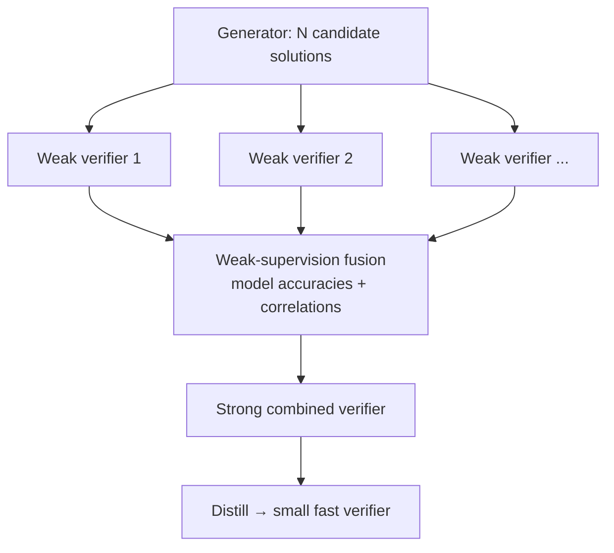

# Verifiers in LLM Reasoning

> The reliability bottleneck of self-improvement — how you *check* a model's answer, from final-answer verifiers to step-level process reward models to ensembles of weak judges.

**Category**: topics
**Last updated**: 2026-05-25
**Status**: active

## What it is

Both [[test-time-compute-scaling|test-time]] and [[train-time-rl-scaling|train-time]] scaling rest on one assumption: that you can tell a correct answer from an incorrect one. The verifier is that judge. The recurring empirical fact across this literature:

> **Verification is easier than generation** — but only if the verifier is reliable. An unreliable verifier silently caps everything downstream.

Denny Zhou's summary from the reasoning lectures: *"a reliable verifier is the most crucial component in RL fine-tuning."* A verifier is the difference between sampling 1,000 answers and getting smarter vs. sampling 1,000 answers and drowning in plausible-wrong ones.

## Why it matters

The verifier is the part of the self-improvement loop most under your control as an *application* builder — you can't easily retrain a frontier model, but you can build a better judge. The lineage below is essentially "how do we get verification signal without armies of human annotators," which is exactly the constraint a small team faces. It's the same skill as building good evals (see [[llm-agent-evaluation]]) — a verifier *is* an eval used inside a loop instead of after one.

## How it works

The field's progression, roughly chronological — each step loosens the human-labeling bottleneck:

### 1. Outcome verifiers (Cobbe et al. 2021, GSM8K)

Train a separate model to predict "is this final answer correct?" Sampling many solutions and ranking by this **Outcome Reward Model (ORM)** beat fine-tuning alone — the first clean demonstration that *generation > verification* pays. But the ORM only sees the final answer; it can't say *where* a wrong chain went wrong.

### 2. Process supervision (Lightman et al. 2023, "Let's Verify Step by Step")

Score **every reasoning step**, not just the outcome — a **Process Reward Model (PRM)**.

| | ORM (outcome) | PRM (process) |
|---|---|---|
| Supervises | Final answer only | Each intermediate step |
| Signal | Sparse | Dense — pinpoints the first wrong step |
| Result | Good | **Better**, and generalizes out-of-distribution |
| Cost | Cheap labels | Expensive step labels (→ **PRM800K** dataset, active learning to label efficiently) |

Process supervision won, and it generalizes better OOD — but it needs step-level labels, which is the new bottleneck.

### 3. Automated step labels (Math-Shepherd)

Remove the human step-annotator. For a given step, run many rollouts to the end and **define the step's value by how often it leads to a correct answer**:

- **Hard Estimate (HE)**: does *any* rollout reach the right answer?
- **Soft Estimate (SE)**: what *fraction* of rollouts reach it?

This auto-generates PRM training data. Math-Shepherd + step-level PPO reached ~84.1% on GSM8K with no human step labels.

### 4. Weak-verifier ensembles (Weaver)

When you only have many *weak, noisy* verifiers (cheap LLM judges, heuristics), combine them. **Weaver** borrows **weak supervision** (the Snorkel idea): model each verifier's accuracy and correlations, then fuse their votes into a far stronger signal than any one alone — then **distill** the expensive ensemble down (e.g. 70B → 400M) while preserving ~97% of the gains.

### The generator–verifier gap as a design target

A theme threaded through [[self-improving-ai-agents|the whole field]]: many systems work by **exploiting the gap** between how hard a problem is to *solve* and how easy it is to *check*. Code (run the tests), math (check the proof in Lean), CUDA kernels (compile + benchmark) all have near-perfect verifiers — which is exactly why self-improvement works best there and stalls in subjective domains where the verifier is itself an LLM that can be reward-hacked.

## Dean-Relevance

**Adoption path**: experimental
**Why**: Verifiers are the most *application-layer* idea in the self-improvement stack — Dean can't retrain Claude, but he can build a better judge over his RAG and agent outputs, which is the same machinery as [[llm-agent-evaluation]]. The weak-verifier-ensemble pattern (fuse several cheap LLM judges into one reliable signal, then distill) is a concrete, training-free upgrade for Praxis quality gates, and the Math-Shepherd "value a step by how often it leads to success" trick is a clean way to grade multi-step agent trajectories.
**Analogy**: A grader for a hard exam. One TA is noisy; a panel of TAs whose biases you've measured gives a grade you can trust — and once you trust the panel, you can train a single fast grader to imitate it.
**Suggested next step**: Replace the single LLM-judge in one Praxis eval with a 3-judge Weaver-style fusion (estimate each judge's agreement with a small gold set, then weight), and measure judge reliability before trusting any best-of-N selection built on top of it.
**Watch for**: Cheap, calibrated reward models released as endpoints — a reliable hosted PRM would let him add step-level verification to agent loops without building one.

## Related
- [[test-time-compute-scaling]]
- [[train-time-rl-scaling]]
- [[llm-agent-evaluation]]
- [[agentic-rl-exploration]]
- [[self-improving-ai-agents]]
- [[ai-guardrails]]
