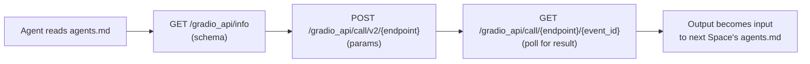

# Agent-Callable Building Blocks (agents.md)

> Hugging Face Spaces now expose a plain-text `agents.md` manifest that tells a coding agent exactly how to call them — turning the Hub's open-weight model catalog into chainable building blocks an agent can glue together with zero integration code.

**Category**: topics
**Last updated**: 2026-06-10
**Status**: active

## What it is

Every Gradio Space on the Hugging Face Hub now auto-exposes a plain-text `/agents.md` endpoint describing exactly how an agent can call it: the API schema URL, the call/poll endpoint templates, the file-upload format, and the auth header. No client SDK, no hand-written integration — an agent reads the file and can drive the Space end-to-end:

```
API schema:    GET  .../gradio_api/info
Call endpoint: POST .../gradio_api/call/v2/{endpoint}  {"param_name": value, ...}
Poll result:   GET  .../gradio_api/call/{endpoint}/{event_id}
File inputs:   POST .../gradio_api/upload -F "files=@file.ext"
Auth:          Bearer $HF_TOKEN
```

The framing comes from Mitchell Hashimoto's "building block economy": AI agents are mediocre at building everything from scratch but very good at *gluing together proven pieces*. That thesis has mostly been told about code libraries (npm/pip packages). `agents.md` extends it to multimedia AI — image generation, 3D reconstruction, TTS, and more — where each SOTA open-weight model on the Hub becomes a callable primitive instead of an integration project.

**The worked example**: given just two `agents.md` URLs, a coding agent chained `ideogram-ai/ideogram4` (text → image) into `VAST-AI/TripoSplat` (image → 3D Gaussian splat) to build a 3D gallery of Paris monuments. The agent did the "glue" work itself — fixing TripoSplat's Y-down orientation, auto-framing each monument, compressing `.ply` files to `.ksplat` (~3× smaller), building a Three.js scroll/drag viewer, and deploying it as a static Space. Reusing the *same two Spaces*, "now do Japan" and "now do Egypt" each produced a full new gallery for about one sentence of prompting.

## Why it matters

- **A lightweight, decentralized complement to MCP.** Instead of a central registry or a hand-written MCP server per model, the model's own Hub page carries its own agent-readable contract. See [[mcp-and-a2a]] for the heavier-weight protocol version of the same idea — `agents.md` is the "just curl it" version.
- **Integration cost collapses to a sentence.** Any SOTA open-weight model with a Gradio Space (which is most of them) is immediately agent-callable. Prototyping a multi-modal pipeline — image generation feeding a 3D viewer, or TTS feeding a video pipeline — moves from "a project" to "a sentence." This is directly aligned with Dean's low-tolerance-for-friction, automation-first working style.
- **The agent owns judgment about the pipeline, not just execution.** When a wide glass pyramid splatted poorly or a thin obelisk looked dull, the agent adjusted *which* monuments and prompts to feed the pipeline based on the actual 3D output — a small but real instance of "outsourced R&D, fast iteration" where the iteration loop is a conversation, not a re-run.

## How it works



- Fetch any Space's manifest with `curl https://huggingface.co/spaces/<org>/<space>/agents.md` — it returns the schema URL, call/poll templates, file-upload format, and the `Authorization: Bearer $HF_TOKEN` hint.
- **Chaining** is just piping the output of one Space's call into the next Space's call — the mechanics are plain HTTP, but the *discovery* step (what to call, how) is solved per-Space instead of per-integration.
- The pattern generalizes beyond images → 3D: any two Spaces with compatible input/output types (text → image, image → video, audio → text, etc.) become a pipeline an agent can assemble on request, with no client library written by a human.

## Related

- [[mcp-and-a2a]]
- [[agentic-patterns]]
- [[harness-and-scaffolding]]
- [[skills-rules-subagents]]
