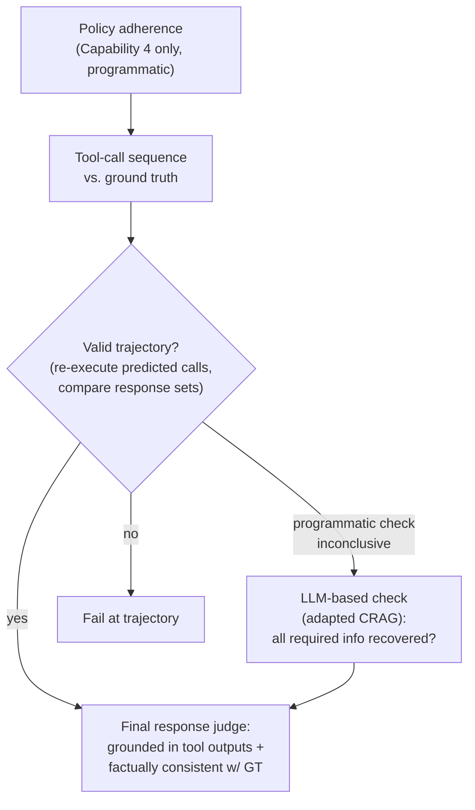
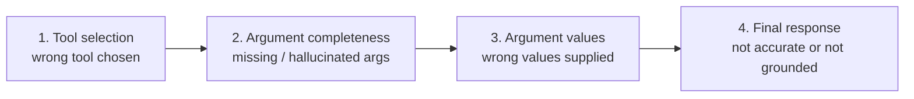
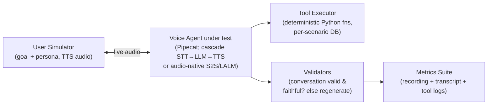

# Agent Evaluation & Failure Modes

> Three 2026 releases that converge on the same lesson: agents fail at the *seams* — tool selection, multi-hop composition, policy adherence, spoken entities — and your eval is only honest if it observes the whole trajectory and resists being gamed.

**Category**: topics
**Last updated**: 2026-05-28
**Status**: active

## What it is

A cluster of recent work on how agents actually break and how to measure it without fooling yourself. Three pieces:

- **VAKRA** (IBM Research) — a tool-grounded, *executable* benchmark for enterprise agents: 8,000+ locally hosted APIs over real databases across 62 domains, with 3–7 step reasoning chains. It scores the full execution trace, not just the final answer, and ships a stage-wise failure taxonomy.
- **EVA** (ServiceNow) — an end-to-end framework for *voice* agents that scores two axes jointly: **EVA-A** (accuracy) and **EVA-X** (experience). It runs realistic bot-to-bot spoken conversations and surfaces failures that single-axis benchmarks can't see.
- **Open ASR Leaderboard private-data update** — a small, generalizable lesson in *eval integrity*: how to keep a public, open benchmark from being benchmaxxed once everyone can see the test set.

The through-line: surface-level tool competence is not reliability. Models that "can call an API" still collapse on compositional reasoning under execution constraints — and the only way to know is to instrument the trajectory and guard the measure itself.

## Why it matters

Every one of these is a direct attack on the gap between "passes a demo" and "works in deployment" — the gap Dean lives in when he ships Praxis as a real conversational agent.

- **VAKRA** gives a vocabulary for *where* an agent breaks (tool selection vs. argument hallucination vs. argument values vs. final synthesis), so a failure becomes a diagnosable stage rather than a vague "the agent got it wrong." That stage isolation is the difference between debugging and guessing.
- **EVA** proves a tradeoff that any conversational-agent builder feels intuitively but rarely measures: **task-correct and pleasant-to-talk-to pull against each other.** Optimizing only for task completion silently degrades the experience, and vice versa. If you score one axis, you are blind to the other.
- **The ASR lesson** is the meta-point: a benchmark is only useful while it stays *ungamed*. Once a test set is public and a metric becomes a target (Goodhart's Law), scores drift upward without real-world gains. The fix generalizes far beyond speech.

## How it works

### 1. VAKRA — the failure-mode taxonomy of reasoning + tool use

VAKRA is built as four capabilities, each isolating a different competence. Crucially, it runs in a live executable environment — agents *actually* call the APIs against real backing databases, and the evaluator re-executes the predicted tool calls to verify intermediate outputs.

| # | Capability | Scale | What it stresses |
|---|---|---|---|
| 1 | **API Chaining** (Business Intelligence APIs: SLOT-BIRD / SEL-BIRD) | 2,077 instances, 54 domains | Sequencing 1–12 tool calls; filling many (often optional) parameters correctly |
| 2 | **Tool Selection** (Dashboard / REST APIs) | 1,597 instances, 17 domains | Picking the right tool from 6–328 per domain (avg 116) — exceeds OpenAI's 128-tool limit, forcing a shortlisting step |
| 3 | **Multi-Hop Reasoning** | 869 instances, 38 domains | 1–5 logical hops, each needing a correct API call, combined to one answer |
| 4 | **Multi-Hop, Multi-Source + Policy** | 644 instances, 41 domains | API + document retrieval (RAG) + multi-turn dialog + plain-text tool-use policies |

**The execution-centric evaluator (waterfall pipeline).** Later stages only run if earlier ones pass — this is what makes the taxonomy clean:

Because the environment is executable, agents may reach the answer via a *different but valid* set of APIs. VAKRA handles this by comparing the **set of tool responses** (does the predicted trajectory recover all the information the ground truth did?) rather than enforcing strict step-by-step matching — first programmatically, then with an LLM judge for semantic-equivalence edge cases (ordering, aggregation, formatting). The principle worth stealing: **reward getting there by a valid, complete path — not by memorizing the one blessed path.**

**The stage-wise failure taxonomy.** Every failure is assigned to its *earliest* breakdown point, so categories are disjoint (no double-counting):

Findings — the part that maps onto real systems:

- **Tool-set shape dictates the dominant error.** With *few generic tools but many parameters* (SLOT-BIRD), models mostly failed at producing correct **argument names**. With *many specialized tools but few parameters* (SEL-BIRD), errors shifted to **tool selection** — choosing from a larger, dynamic tool set is the hard part. (GPT-OSS-120B was the standout on chaining, almost entirely because it nailed schema/argument understanding.)
- **Synthesis fails even when tool calls are perfect.** In the Tool Selection capability, models (notably Gemini-3-flash-preview, Claude-Sonnet-4-5) made all the right calls and *still* couldn't synthesize a correct answer from the responses — a large drop-off at the final stage. Correct tool use ≠ correct answer.
- **Hop depth degrades accuracy monotonically.** All models did best at 1 hop, worse at 2, worse again at 3+. Adding document retrieval (RAG/hybrid hops) made it harder still.
- **Models skip tools they think they "know."** On 1-hop RAG (Wikipedia-entity-flavored) questions, GPT-OSS-120B answered from parametric memory instead of retrieving — a grounding failure that only appears because the question *looked* answerable without a tool.
- **Policies are the reliability cliff.** When a tool-use policy restricted access to the most relevant source, nearly every model dropped. They "understood" the policy but either violated it or failed to retrieve enough — i.e., they struggle to fold *external constraints* into their reasoning. This is the gap between "can reason over tools" and "reliable for real deployment."

### 2. EVA — evaluating VOICE agents on two axes at once

EVA's premise: a voice agent must satisfy two intertwined objectives — **accuracy** (complete the task correctly and faithfully) and **conversational experience** (do it naturally, concisely, with good timing). Mishearing a confirmation code makes perfect LLM reasoning worthless; a wall of spoken options overwhelms a caller who can't skim. Prior benchmarks scored one or the other; EVA scores both end-to-end over **live audio** in a bot-to-bot setup.

**Architecture** — five components, no human annotation in the loop:

The **Validators** are the integrity trick: any conversation where the simulator misbehaved is auto-regenerated, so only valid runs reach scoring — no post-hoc human labeling to catch simulator errors. Each scenario is a reproducible record: **user goal** (with an exact decision tree), **persona** (speaking style, patience), **scenario database**, and **ground truth** (expected final DB state). Released with a synthetic **airline dataset**: 50 scenarios, 15 tools (IRROPS rebooking, cancellations, same-day standby, vouchers), stressing temporal reasoning, policy-following, constraint satisfaction, and named-entity handling.

**The two scores, three dimensions each:**

| | Dimension | Method | What it catches |
|---|---|---|---|
| **EVA-A** (Accuracy) | Task Completion | Deterministic (DB end-state vs. ground truth) | Did the task actually get done |
| | Faithfulness | LLM-as-Judge | Fabrications, policy violations, hallucinated flight numbers |
| | Speech Fidelity | LALM-as-Judge | Whether *spoken* output faithfully renders critical entities (codes, numbers, $ amounts) — the only metric anywhere that judges the agent's own audio output |
| **EVA-X** (Experience) | Conciseness | LLM-as-Judge | Responses brief enough for a caller who can't skim |
| | Conversation Progression | LLM-as-Judge | Moving forward, no repetition, retaining context |
| | Turn-Taking | LLM-as-Judge | Spoke at the right time — no interrupting, no dead air |

Scoring uses **pass@k and pass^k** over 3 trials per scenario — peak capability vs. consistency.

**Findings:**

- **A consistent accuracy-experience tradeoff.** Across 20 systems (cascade and audio-native), agents strong on task completion delivered worse experience and vice versa. No configuration dominated both axes — invisible to any task-only benchmark.
- **Named-entity transcription is the dominant failure mode.** One misheard character cascades into auth failure and full conversation breakdown.
- **Multi-step workflows break predictably.** Rebooking while preserving ancillary services (seats, baggage) was *the* complexity breaker across all systems.
- **Peak ≠ reliable.** A large gap between pass@3 and pass^3 everywhere — agents that *can* complete a task often can't do it *consistently*, which is what production actually needs.

EVA is honest about its own limits, which is itself instructive: LLM/LALM judges carry bias (worse when judge and judged share a provider), task completion is binary (no partial credit, understates graceful failure), and single-domain/single-language/single-TTS-vendor results may not generalize.

### 3. Eval integrity — benchmaxxer-repellant (generalized)

> *"When a measure becomes a target, it ceases to be a good measure."* — Goodhart's Law

The Open ASR Leaderboard faced the universal benchmark problem: **standardization + openness** (single dataset on the Hub, open eval scripts, a shared normalizer) are what make a benchmark *meaningful* — and the exact same properties make it **benchmaxxable**. Once the test set is public, scores climb without matching real-world robustness, either by training on the test sets or by sourcing training data that resembles them.

The defenses they applied generalize to *any* agent eval, including conversational ones — strip the ASR specifics and the playbook is:

| Tactic | Generalized lesson |
|---|---|
| **Keep high-quality test sets private** (held by independent data partners) | A portion of your eval should be unseen by whoever is optimizing the system |
| **Don't fold private sets into the headline metric by default** (opt-in toggle) | Separate the *trustworthy-but-hidden* signal from the *public-but-gameable* one; don't let private data silently reorder rankings |
| **No per-split scores** (only macro-averages across providers/conditions) | Hide the gradient: if you can't see which slice to optimize, you can't cheaply game one slice |
| **Multiple independent data providers** | Diversify sources so leakage from any one provider washes out |
| **Verify submitted results yourself; allow self-reported but mark unverified** | Trust, but re-run — and label provenance honestly |

The deeper point for Dean: an agent eval is a *measure under adversarial pressure*. The pressure can be a vendor gaming a leaderboard — or your own optimization loop quietly overfitting to your test conversations. Holding out unseen scenarios, refusing to expose per-slice scores you'd be tempted to tune to, and re-executing rather than trusting reported traces (the VAKRA move) are the same instinct: **protect the measure so it keeps telling the truth.**

## Dean-Relevance

**Adoption path**: experimental
**Why**: This is dead-center in Dean's strongest frontier zone — agent failure modes, tool-use reliability, conversational metrics, and eval integrity — and it's directly operational for Praxis. VAKRA's stage-wise taxonomy is a ready-made debugging frame for Praxis's tool calls; EVA's two-axis split (task-correct vs. good-to-converse-with) is exactly the tension a growth-conversation agent lives in; the ASR piece is a guard against Praxis's own eval overfitting as Dean iterates on prompts.
**Analogy**: VAKRA's stage isolation is a fault tree in reliability engineering — you don't say "the plane failed," you trace to the *first* component that broke and stop there, so the categories stay disjoint and the fix is targeted. EVA's accuracy-experience tradeoff is the conversational analog of a Pareto frontier: you can't push both to 1.0 at once, so you must *choose your point on the curve deliberately* rather than discover it by accident.
**Suggested next step**: Build a tiny EVA-style harness for Praxis: 10–20 reproducible growth-conversation scenarios, each with a user-goal decision tree, a persona (patience/style), and a deterministic end-state to check. Score two axes separately — **task/faithfulness** (did it ground advice in the user's actual context, no fabricated claims?) and **experience** (conciseness, progression, not re-asking what the user already said) — and report pass^k across 3 runs to expose *consistency*, not just best-case. Hold a slice of scenarios private from your prompt-tuning loop so you can detect when you're benchmaxxing your own agent.

## Sources

- IBM Research, *"Inside VAKRA: Reasoning, Tool Use, and Failure Modes of Agents"*, Hugging Face Blog (2026-04-15).
- ServiceNow, *"A New Framework for Evaluating Voice Agents (EVA)"*, Hugging Face Blog (2026-03-24).
- *"Adding Benchmaxxer Repellant to the Open ASR Leaderboard"*, Hugging Face Blog (2026-05-06).

## Related
- [[llm-agent-evaluation]]
- [[agentic-errors]]
- [[agentic-evals-and-long-horizon-tasks]]
- [[agentic-patterns]]
- [[building-agents-best-practices]]
- [[verifiers-in-llm-reasoning]]
- [[harness-and-scaffolding]]
- [[verifiable-rl-environments]]
