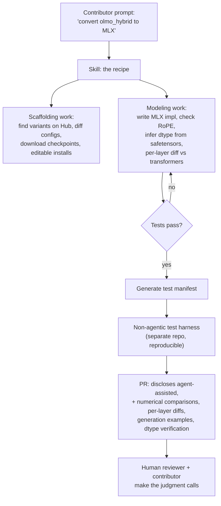

# AI-Native Open-Source Contribution

> When anyone with a coding agent can open a PR, the bottleneck moves entirely to review — so the winning pattern is a Skill that encodes maintainer judgment plus a deliberately *non-agentic* test harness that the reviewer can trust.

**Category**: topics
**Last updated**: 2026-05-28
**Status**: active

## What it is

In 2026, code agents started to actually work — one-shotting reasonable solutions from brief specs. Jensen Huang's framing: we went "from 30 million to one billion coders." The side effect: anyone can point an agent at an open issue and submit a PR, and they do — PR volume on libraries like `transformers` has gone up ~10×. But the number of maintainers who must read, understand, and judge each PR *cannot* scale the same way (team coordination doesn't).

The Hugging Face + MLX teams built a concrete answer for one task — porting language models from `transformers` to `mlx-lm` — that generalizes into a methodology. It has two parts:

1. **A Skill** (a text recipe that steers a coding agent through the port) — designed as *an aide, not an automation*.
2. **A separate, non-agentic test harness** — plain reproducible tests that are immune to LLM hallucination or complacency, producing artifacts a reviewer can trust without a leap of faith.

Source: Hugging Face, *"The PR you would have opened yourself"* (`transformers-to-mlx`, 2026-04-16).

## Why it matters

This is a genuinely AI-native shift in the *shape* of open-source work — not just "agents write code faster." Two assumptions agent-generated PRs routinely miss, and which this pattern designs around:

- **Codebases like `transformers` are human-to-human communication through code.** Model files read top-to-bottom with flat hierarchies *on purpose*, so practitioners can understand them. Agents lack that implicit context, so they "improve" code by applying generic best practices — verbose abstractions, premature generalization, refactors that break implicit contracts — and they're sycophantic, accepting any direction a maintainer would have killed with a terse comment.
- **The bottleneck is not typing speed; it's understanding the codebase well enough to change it without breaking explicit and implicit contracts with users.** So the leverage isn't generating *more* PRs — it's generating PRs that *survive review* and *reduce reviewer load*.

The deeper move: rather than fight agent-generated noise, **encode the maintainer's tacit knowledge into the Skill** (what to verify, what conventions to honor, what never to touch) and **shift verification to a tool that can't be fooled by the agent's own optimism.** That's a repeatable template for any high-care codebase feeling the same pressure.

## How it works

**Why a Skill (not just prompting).** Skills are recipes — simple text files of guidelines that steer the model through a complex task. They're not magic (you could get there with prompting + iteration), but they give **consistency** (every run follows the same process), minimize ambiguity, and serve as **readable documentation** anyone can audit and improve. They were bootstrapped by porting a model by hand in conversation with Claude, then having Claude summarize the process into a first draft, edited heavily over several loops. (A trick worth stealing: point the agent at a checkout with the known-good implementation *deleted*, so you can diff its output against ground truth.)

**What the Skill encodes — two registers:**
- *Technical:* the checks only an experienced porter would think to run — RoPE configs that produce plausible output but degrade on long sequences, float32 precision contamination that silently kills inference speed, config fields that vary across variants, per-layer comparisons to pinpoint divergence, dtype inferred from the safetensors header.
- *Cultural:* the conventions that make a PR cheap to review — no comments explaining code (the reviewer must parse comment *and* code), never propose refactors, don't touch shared utilities without asking. These cost the agent nothing and save the reviewer enormously.

**Why the test harness is deliberately non-agentic.** The Skill runs tests during conversion, but the reviewer shouldn't have to trust an LLM's self-report. A separate harness: (1) removes uncertainty about the model hallucinating or being complacent about results, (2) guarantees reproducibility (anyone can clone and run), (3) saves results at multiple levels (summaries, per-model detail, raw JSON I/O) plus the tests themselves. It is **not a CI gate** — most checks are qualitative judgment calls (is a 4% relative-logits difference acceptable? is repetition on long sequences normal for this base model?). The harness provides *signal*; the human still makes the call.

**The ownership rule.** The Skill won't open a PR until the contributor accepts the results, and the PR always discloses it was agent-assisted. The explicit norm: *own the code, be ready to iterate with reviewers, and never hand reviewer comments straight back to an agent* — LLMs double down, go on tangents, and don't push back effectively. Once review starts, it's a person-to-person conversation.

## Related
- [[skills-rules-subagents]]
- [[harness-and-scaffolding]]
- [[agent-building-judgment]]
- [[vibe-coding]]
- [[spec-driven-development]]
- [[llm-agent-evaluation]]
