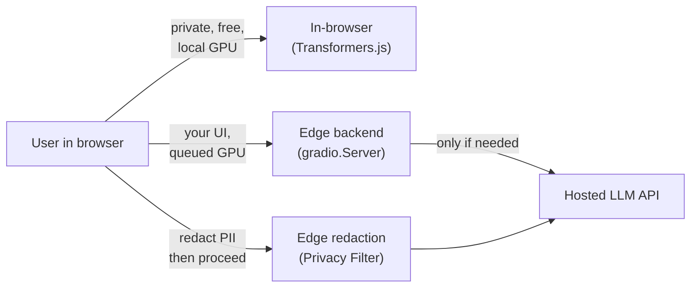
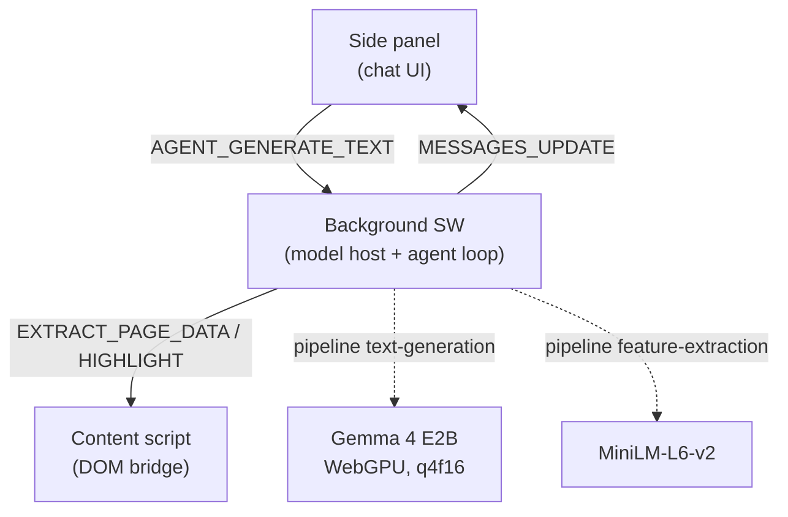

# Client-Side & Web ML

> Three concrete patterns for deciding *where* ML inference lives in a web app — in the browser, behind a queued edge backend, or as a client/edge PII-redaction step — and the perf/privacy/cost tradeoffs that pick one over another.

**Category**: topics
**Last updated**: 2026-05-28
**Status**: active

## What it is

Every ML feature in a web app makes one decision before anything else: *where does the forward pass actually run?* The browser (on the user's GPU via WebGPU), an edge/owned backend you control, or a hosted inference API. That single placement choice cascades into latency, privacy posture, cost, and how much of your stack you have to operate.

This page groups three recent Hugging Face write-ups that each stake out one point on that spectrum:

1. **In-browser inference** — Transformers.js running [[gemma-4]] (E2B) entirely inside a Chrome extension under Manifest V3. No server; the model executes on the user's machine.
2. **Bring-your-own-frontend + edge backend** — `gradio.Server` lets you point any custom frontend (React, Svelte, plain HTML/JS) at a Gradio-powered FastAPI backend, getting queuing/concurrency/GPU allocation without leaving your own UI.
3. **Client/edge PII redaction** — three web apps built on `gradio.Server` that use OpenAI's open-weight **Privacy Filter** to detect and redact PII server-side, then do all editing/compositing client-side so sensitive edits never round-trip.

The throughline: these are *placement architectures*, not models. The interesting engineering is the division of labor between browser and backend.

## Why it matters

The default reflex for "add an AI feature to a web app" is: call a hosted API from the frontend. That's fine until one of three constraints bites — and each source is a worked answer to one of them.

| Constraint that bites | Placement answer | Source pattern |
|---|---|---|
| **Privacy** — data must not leave the device | Run inference *in the browser* | Transformers.js extension |
| **Cost / GPU collisions** — concurrent users fighting for one GPU | Run inference behind a *queued* edge endpoint | `gradio.Server` |
| **Sensitive data hitting a third party** — PII in prompts/logs | *Redact at the edge* before anything is stored or shared | Privacy Filter apps |



The tradeoffs are not symmetric:

- **In-browser** is maximally private and has zero marginal inference cost to you, but you pay in model size (must be small/quantized — E2B at q4f16, not a frontier model), first-run download latency, and WebGPU availability on the user's hardware.
- **Edge backend** keeps your UI freedom and centralizes the GPU, but you operate that GPU and eat its cost; queuing turns "crashes under concurrency" into "users wait in line."
- **Edge redaction** is the cheap middle: a tiny model (1.5B / 50M active) strips PII so the *expensive* downstream call to a hosted LLM never sees raw sensitive data — privacy and cost win simultaneously, at the price of one extra hop.

For an engineer who already calls hosted APIs from a frontend, the upgrade is realizing placement is a *dial*, not a binary. You can pre-process on-device, redact at the edge, and only then spend a hosted-API call.

## How it works

### (a) In-browser inference — Transformers.js in a Chrome extension (MV3)

A browser extension powered by [[gemma-4]] E2B that runs **all inference locally** with Transformers.js, under Manifest V3's runtime constraints. The architectural spine is a strict separation of concerns across three Chrome runtimes:

| Runtime | Role | Owns |
|---|---|---|
| **Background service worker** | Control plane | Model loading, inference (text-gen + embeddings), tool execution, conversation history (`Agent.chatMessages`) |
| **Side panel** | Interaction layer | Chat input/output, streaming, setup controls |
| **Content script** | Page bridge | DOM extraction, element highlighting |

The load-bearing decision: **keep heavy orchestration and model execution in the background; keep UI and page scripts thin.** One model host serves all tabs/sessions — no duplicate loads, UI stays responsive, and model artifacts cache under the *extension* origin (`chrome-extension://<id>`) so there's one shared cache for the whole install rather than per-website caches.

Two model roles run side by side:

- **`onnx-community/gemma-4-E2B-it-ONNX`** (`text-generation`, `q4f16`, WebGPU) — reasoning + tool decisions
- **`onnx-community/all-MiniLM-L6-v2-ONNX`** (`feature-extraction`, `fp32`) — embeddings for semantic similarity search in tools like `ask_website` and `find_history` (see [[embeddings-and-rerankers]])

Runtimes communicate through a typed messaging contract (enums in `src/shared/types.ts`); the background is the single coordinator, side panel and content script are specialized clients. Typical flow: side panel sends `AGENT_GENERATE_TEXT` → background appends to history, runs model/tool steps → emits `MESSAGES_UPDATE` → side panel re-renders.



**Tool calling on-device.** You pass messages + a tool schema (`name`, `description`, `parameters`); Transformers.js formats the prompt via the model's chat template (so the exact tool-call format is model-specific). Gemma-4 templates emit a special tool-call token block, e.g.:

```
<|tool_call>call:getWeather{location:<|"|>Bern<|"|>}<tool_call|>
```

Because that raw output isn't deterministic, the project adds a normalization layer (`webMcp`) and a parser (`extractToolCalls`) to convert model output into reliable tool executions. The agent loop separates the *internal model transcript* (system/user/tool/assistant turns fed to `generator`) from the *UI transcript* (clean assistant text + tool metadata + perf metrics), looping until no tool calls remain.

**State placement by lifecycle:**

| State | Lives in | Why |
|---|---|---|
| Conversation | Background memory | Fast turn-by-turn orchestration |
| Tool preferences | `chrome.storage.local` | Persist across sessions |
| Semantic history vectors | IndexedDB (`VectorHistoryDB`) | Larger local retrieval data |
| Extracted page content | Background cache, keyed by URL | Ephemeral, per-page |

MV3 caveat: service workers can be **suspended and restarted**, so model runtime state must be treated as recoverable and re-initialized on demand. Permissions are treated as architecture, not an afterthought — request only what features need (`sidePanel`, `storage`, `scripting`, `tabs`, `host_permissions` for `http(s)://*/*`), because permission scope directly drives user trust and Web Store review risk. KV caching during generation uses a `DynamicCache` class.

### (b) Bring-your-own-frontend + Gradio backend — `gradio.Server`

The pitch: build with *your own* frontend framework (React, Svelte, vanilla HTML/JS) while still getting Gradio's backend engine — queuing, SSE streaming, concurrency control, `gradio_client` compatibility, and ZeroGPU on Spaces. `gradio.Server` **extends FastAPI**, so you keep custom routes, middleware, file uploads, and any response type, with Gradio's API engine layered on top.

The worked example is *Text Behind Image* — a photo editor that removes the background with an ML model (BiRefNet segmentation), then lets you place text *between* the foreground subject and background. The UI is a ~1300-line self-contained vanilla HTML/CSS/JS app (three-layer `z-index` canvas, drag-and-drop text, 20+ control parameters, client-side PNG export). None of that is expressible in Gradio components — but the team still wanted Gradio's backend. The entire backend is ~50 lines of Python.

The key distinction is the decorator:

| Decorator | What it does | When to use |
|---|---|---|
| `@app.api(name="...")` | Wraps the function in **Gradio's queue** — serializes requests, controls concurrency, composes with `@spaces.GPU` on ZeroGPU, and is callable from **both** the browser (`@gradio/client`) and Python (`gradio_client`) | Anything that touches the model / GPU |
| `@app.get` / `@app.post` (plain FastAPI) | Standard route, no queue | Static HTML, file lookups, cheap reads |

Why this matters: a plain `@app.post()` background-removal route works *until two users hit it at once* — both fight for the GPU and the app crashes or returns garbage. `@app.api()` serializes them through the queue instead. As a bonus, the same endpoint is instantly a programmatic API:

```python
from gradio_client import Client, handle_file
client = Client("ysharma/text-behind-image")
result = client.predict(image_path=handle_file("photo.jpg"),
                        api_name="/remove_background")
```

The frontend hits it through the Gradio **JS client** (not a raw `fetch`), which is what routes the call through the queue:

```js
import { Client, handle_file } from "https://cdn.jsdelivr.net/npm/@gradio/client/dist/index.min.js";
const client = await Client.connect(window.location.origin);
const result = await client.predict("/remove_background", {
  image_path: handle_file(file),
});
foregroundLayer.src = result.data[0].url; // transparent PNG
```

Everything else — text rendering, layer compositing, export — happens in the browser. **The division of labor: GPU-bound ML behind a queued endpoint; everything cheap and interactive stays client-side.** (Roadmap items mentioned: MCP tool registration via `@app.mcp.tool()`, SSE streaming, batch processing, multi-page apps with shared state.)

### (c) Client/edge PII redaction — OpenAI's Privacy Filter on `gradio.Server`

**Privacy Filter** is OpenAI's open-weight PII detector on the Hub: 1.5B parameters / **50M active**, Apache 2.0, **128k-token context**, labeling text across eight categories — `private_person`, `private_address`, `private_email`, `private_phone`, `private_url`, `private_date`, `account_number`, `secret` — in a **single forward pass** (state-of-the-art on PII-Masking-300k). The single-pass-over-128k property is the architectural unlock: no chunking, no stitching, span offsets line up directly with the rendered text. BIOES decoding keeps span boundaries clean through long ambiguous runs, and multilingual text routes through the same call with no change.

Three apps demonstrate the same backend role — **model work goes through `@server.api`, everything else stays on plain FastAPI routes** — with all editing/compositing client-side so edits never round-trip:

| App | Queued compute (`@server.api`) | Plain FastAPI routes | Client-side work |
|---|---|---|---|
| **Document Privacy Explorer** | `analyze_document` — extract text (PyMuPDF/python-docx), detect spans, compute stats | `GET /` serves the reader view | Category filters toggle CSS classes (no model re-run) |
| **Image Anonymizer** | `anonymize_screenshot` — Tesseract OCR → char-offset/box map → detect → pixel rectangles | `GET /`, `GET /examples/*` | Toggle/drag/draw bars, PNG export at natural resolution, no server round-trip |
| **SmartRedact Paste** | `create_paste` — detect, redact to `<CATEGORY>` placeholders, mint IDs | `GET /view/{pid}?token=...` (public + token-gated reveal), `GET /api/paste/{pid}` | — |

The recurring shape: the model runs **once** at the edge to produce structured spans/boxes/redactions, then the browser owns all subsequent interaction. In Image Anonymizer, for instance, the backend hands back pixel rectangles and the `<canvas>` owns toggles, drags, hand-drawn bars, and export — none of which touch the server again.

SmartRedact Paste shows *why* `gradio.Server` (vs. pure Gradio Blocks) matters here: it needs two distinct GET routes for the same paste ID — one public-redacted, one token-gated-original — and the bespoke URL shape `/view/{pid}?token=...` is the thing the user keeps. A queued endpoint can't give you that URL shape; a plain FastAPI route can, and the two coexist in one ~200-line process. Redaction is just "swap each detected span for a `<CATEGORY>` placeholder."

**The cost lever:** redaction with a 50M-active model at the edge is nearly free, and it lets you strip PII *before* spending an expensive hosted-LLM call — privacy and cost improve together.

## Sources

- Hugging Face Blog, *How to Use Transformers.js in a Chrome Extension* (Nico Martin, 2026-04-23) — `huggingface.co/blog/transformersjs-chrome-extension`
- Hugging Face Blog, *gradio.Server: Any Custom Frontend with Gradio's Backend* (Yuvraj Sharma, Abubakar Abid, 2026-04-01) — `huggingface.co/blog/introducing-gradio-server`
- Hugging Face Blog, *How to build scalable web apps with OpenAI's Privacy Filter* (Yuvraj Sharma, Freddy Boulton, Abubakar Abid, 2026-04-27) — `huggingface.co/blog/openai-privacy-filter-web-apps`

## Related

- [[gemma-4]]
- [[embeddings-and-rerankers]]
- [[model-compression]]
- [[open-model-releases-spring-2026]]
