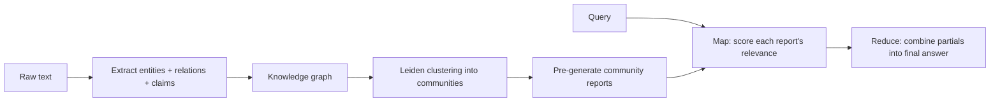

# Graph RAG

> RAG over a structured knowledge graph with pre-summarized entity communities, built to answer global "what are the main themes?" questions that vector search can't.

**Category**: topics
**Last updated**: 2026-05-25
**Status**: reference

## What it is

GraphRAG (Microsoft, arXiv 2404.16130) attacks the failure mode where vector RAG can't answer **global / query-focused-summarization (QFS)** questions directed at an entire corpus — "What are the main themes in this dataset?" — because no single chunk contains the answer and top-k can't aggregate across the whole index. Instead of relying on vector similarity, it constructs a knowledge graph from raw text: entities as nodes, relationships and claims as edges.

The graph is clustered (Leiden algorithm) into **communities** of closely-related entities, and each community is pre-summarized into a **community report** at index time. Communities are hierarchical, so you can answer at varying levels of abstraction.

## Why it matters

It's the right tool when the question is about the corpus as a whole rather than a specific fact. Standard retrieval (including everything in [[advanced-rag-techniques]] and [[pre-retrieval]]) is built for local lookup; GraphRAG scales summarization with both question generality and corpus size. It's also the answer to [[semantic-boundary-chunking]]'s explicit limitation: chunking keeps related info together *within* a document but can't bridge facts scattered *across* documents — a graph can.

## How it works

- **Index time**: derive entity KB → cluster into communities → generate a summary report per community.
- **Query time**: choose exploration depth across the community hierarchy (deeper = more LLM calls = more cost). Then **map-reduce**: *map* scores each community report's relevance to the query; *reduce* combines the relevant partial responses with the query into the final answer.

The depth knob is the central cost/quality tradeoff: more communities explored means broader synthesis but linearly more LLM calls.

## Dean-Relevance

**Adoption path**: watch
**Why**: Praxis retrieval is local/factoid over Qdrant, not corpus-level QFS — GraphRAG's indexing cost isn't justified unless a "summarize across all of a user's data" feature emerges.
**Analogy**: Vector RAG finds the right paragraph; GraphRAG reads the table of contents and chapter summaries to tell you what the whole book is about.
**Suggested next step**: —
**Watch for**: A Crafted feature requiring cross-document synthesis (e.g. "what are the recurring patterns across my entire journal?") — that's the trigger to prototype GraphRAG.

## Related
- [[advanced-rag-techniques]]
- [[semantic-boundary-chunking]]
- [[agentic-rag]]
- [[pre-retrieval]]
