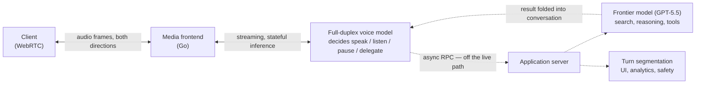

# Realtime Voice Agent Architecture

> What it takes to make a voice agent feel live: a full-duplex model that owns a continuous audio loop, with reasoning and tool use delegated off that loop to a frontier model.

**Category**: topics
**Last updated**: 2026-08-09
**Status**: active

## What it is

Voice agents have passed through three structural generations, and the differences are architectural rather than a matter of model quality.

**Cascaded** systems chain speech-to-text → LLM → text-to-speech. Each stage waits for the previous one, information like tone and pacing is lost at the transcription boundary, and responses arrive slow and stilted. **Turn-based speech-to-speech** models collapse that chain into one model that ingests and emits audio directly, which cuts latency and preserves prosody — but the interaction is still divided into discrete turns, gated by a *turn detector*: a small model that watches for silence and decides when the user is done. That detector is the ceiling. Guess early and you cut the user off; guess late and the reply feels sluggish. Because it is silence-based, a thinking pause or passing traffic reads as end-of-turn.

**Full-duplex** systems remove the turn detector from the audio path entirely. The voice model listens and speaks simultaneously, and makes interaction decisions many times per second: speak, keep listening, pause, interrupt, or invoke a tool. OpenAI's GPT‑Live is the first mainstream deployment of this shape. Its second move matters as much as the first: *talking is decoupled from thinking*. When a request needs search, deeper reasoning, or agentic work, the voice model delegates to a frontier model (GPT‑5.5 at launch) on an asynchronous path and keeps the conversation alive while that runs, folding the result in when it lands.

## Why it matters

The two-model split is the transferable idea, and it is not really about voice. It is a general latency architecture: **a fast interaction model owns a continuous loop, and a slow reasoning model sits behind an async boundary.** Any interactive agent with a hard responsiveness budget — a computer-use agent narrating while it works, an ambient assistant, a live coding companion — has the same shape available to it. It also means the interaction layer and the intelligence layer version independently: GPT‑Live can adopt each new frontier model without being retrained as one monolith.

The corollary is that the bottleneck moves out of the model and into the system around it. Once a model must be fed audio frames on schedule, the things that decide whether the product feels good are frame delivery, transport handshakes, session capacity, and how you compact a growing context without stalling the conversation. Two accounting shifts follow, and both are the kind of second-order infrastructure reality worth internalizing before you design anything streaming:

| Question the old architecture asked | Question a live architecture asks |
|---|---|
| How many requests can a GPU handle? | How many concurrent sessions can the whole system sustain with every frame on schedule? |
| Is the model fast enough? | Is any service on the path — CPU stream handlers, queues, regional capacity — slower than the frame budget? |

For a hosted consumer, the practical read is that "realtime API" is a claim about a serving stack, not a model. And the delegation pattern is directly usable: the reason GPT‑Live can afford to think is that it never stops talking while it does.

## How it works

### The fast path / slow path split

The system's primary job is to sustain an uninterrupted media loop. Everything else — delegation, tool calls, persistence, analytics — sits behind an asynchronous RPC boundary, so a slow backend delays its own result but cannot stall audio.

That boundary doubles as the customization seam: applications change tools, policies, and backend behavior without touching the component responsible for keeping audio moving. The live path stays small and predictable.

### Streaming, stateful inference

A live session holds model state for as long as the conversation lasts, which breaks the assumptions of request-response serving. Sessions run long, context grows continuously, and instances scale up and down underneath them. The mechanism that makes this survivable is a **seamless handoff**: warm a replacement instance alongside the live one, prefill it with the current session context, run inference against both in parallel, then cut over once the new instance is fully ready.

The same mechanism solves context growth. Compaction is expensive precisely when you need it — it rewrites past context, which invalidates the KV cache and forces a fresh prefill. So compaction is treated as another managed transition: the original instance keeps talking while the system compacts the context and prepares a replacement, and the switchover is invisible. **The pattern worth stealing: when an expensive state operation would block a live loop, do it on a warm parallel copy and cut over, rather than pausing to do it in place.** See [[context-engineering]] for the batch-agent version of the same compaction problem, and [[llm-inference-serving-internals]] for what statefulness does to serving.

### Spending the delegation budget

The voice model can cover a short gap conversationally, but not an arbitrary one, so the entire delegation loop — routing, prompt processing, inference, tool calls — counts against responsiveness. The optimizations are mostly about paying costs *before* they are on the critical path:

- **Pre-create and prefill.** When a voice session starts, the application server opens an inference session on the frontier model and prefills it with the initial context, so the prompt is already processed before the first delegated request arrives.
- **Keep the session and pin it.** That inference session stays available for the conversation's life, with stable session affinity across requests plus prompt caching, while a worker failure stays recoverable.
- **Tune the obvious levers.** Reasoning effort, output limits, tool schemas, and model-tool round trips all move the moment a useful result reaches the conversation.

### Turning a continuous stream back into turns

Everything downstream of a full-duplex model still wants discrete messages: the conversation UI, analytics, safety infrastructure. So the application server reconstructs turns from overlapping speech using partial transcripts and timing signals to infer who has the floor, finalizing a message only once a speaker has held the floor long enough for attribution to be reliable. Overlap makes this genuinely hard — a backchannel "mm hmm" while the user talks should not become its own message, but a substantive interjection should.

The resolution is a dual-view design that generalizes well beyond voice: **a speculative view of the current state, and an authoritative record of what was said.** The UI reads the speculative view because it can tolerate updates; the analytics pipeline waits for the final transcript. Every segmentation policy trades freshness against certainty, and keeping two views means you don't have to pick one globally.

### Transport: making the handshake disappear

WebRTC is the right foundation for low-latency media — it survives packet loss, clock drift, and connection changes, and can subtly stretch then accelerate audio to cover late packets. But it predates the round-trip-minimizing design of protocols like QUIC, and its layered protocols duplicate work (each shipping its own anti-DoS mechanism, for instance).

Two changes take startup off the critical path:

- **WARP** (WebRTC Abridged Roundtrip Protocol) collapses media and data startup from **six network round trips to one**, via backward-compatible improvements: piggybacking the DTLS handshake over ICE (SPED), DTLS 1.3, pre-negotiating the SCTP handshake (SNAP), and pre-negotiating data channels instead of using DCEP. It is published as open specifications, is moving through the IETF's TSVWG working group, and support has already landed in libwebrtc and Pion.
- **Instant Connect** removes the SDP signaling exchange from the critical path by negotiating those parameters ahead of time without reserving server capacity. It runs alongside standard signaling, so stale parameters simply fall back with no added latency.

Together, a client can start a session with a single UDP packet. One more implementation note with a number attached: rewriting the media frontend and inference logic in **Go**, replacing a Python asyncio implementation, improved frame-delivery smoothness enough that the new system's **p95 matches the old system's p50**.

### Shadow testing, because load tests don't find these bugs

Before GPT‑Live spoke to anyone, a **silent test** mirrored a gradually increasing share of real production Voice sessions onto the new stack in read-only mode while Advanced Voice Mode continued serving users. Real clients, real networks, real session lengths, real geography — with nothing reaching users' ears. What it caught is a good inventory of how streaming systems actually fail:

| Finding | Why a load test missed it |
|---|---|
| A non-GPU component saturated before inference, compounding latency | Capacity was modeled as GPU throughput, not sustained concurrent sessions |
| Geography became first-order; distant capacity added delay at several points | Load generators don't reproduce real client distribution |
| Long sessions surfaced memory and persistence pressure; reconnects exercised compaction and state restoration; ordinary disconnects revealed shutdown races | These depend on elapsed time and accumulated state, not request volume |
| Metrics conflated latency sources; dashboard aggregates hid individual unhealthy engines; config drifted between tested and deployed | Observability gaps are invisible until something needs diagnosing |

The response — granular telemetry, validation against known-good configurations, staged ramps, and the ability to isolate or disable individual paths quickly — turned the silent test into a launch rehearsal for *detection and recovery*, not just capacity. For any stateful streaming system, this is the lesson: the bugs live in time, accumulated state, and cross-service behavior, so shadow real traffic rather than synthesizing more of it.

### What shipped

GPT‑Live‑1 and GPT‑Live‑1 mini rolled out to ChatGPT globally on iOS, Android, and web, replacing Advanced Voice Mode as the default (mini for Free users), with API availability stated as coming soon. Users pick a reasoning level — Instant, Medium, or High — which selects how much thinking the delegated GPT‑5.5 does. The model backchannels ("mhmm", "got it"), waits through pauses when asked, holds up better against background noise, renders visual cards for things like weather and stocks mid-conversation, and ships nine remastered voices. Scale context for why the systems work was necessary: more than 150 million people per week talk to ChatGPT through Voice and Dictation.

On evaluation, OpenAI built human evaluations specifically for *pleasantness and conversational flow*, running matched 5–10 minute conversations scored on turn-taking, interruptions, flow, and naturalness — a reminder that a realtime interaction quality bar needs its own instrument, not a capability benchmark. Reported capability gains over Advanced Voice Mode come on GPQA (expert scientific reasoning), BrowseComp (agentic web search), and an internal τ³-Voice Telecom variant (multi-turn voice support tasks); the published claims are directional rather than numeric. [Needs Verification] for the specific margins.

Safety carries one structurally interesting piece for anyone building live agents: because output unfolds in real time, safeguards can act *while the model is speaking* — steering toward a safer response, surfacing resources, or ending the conversation in higher-risk cases. Supporting work included audio-native and synthetic-audio evaluations across self-harm, psychosis and mania, emotional reliance, violence, and sexual content; adapted crisis-support flows for voice; teen-specific protections with parental controls; and a predefined voice set with safeguards against impersonating a real person. See [[ai-guardrails]] for the general pattern.

## Timeline

- `2026-07` (release) OpenAI shipped GPT-Live-1 and GPT-Live-1 mini to ChatGPT globally, replacing turn-based Advanced Voice Mode with a full-duplex voice model that delegates reasoning to GPT-5.5 — the first mainstream removal of the turn detector from the audio path. [source](https://openai.com/index/introducing-gpt-live)
- `2026-08` (tooling) OpenAI and WebRTC community collaborators published WARP, collapsing WebRTC media and data startup from six network round trips to one, with support landing in libwebrtc and Pion and the specs moving through the IETF TSVWG working group. [source](https://openai.com/index/continuous-voice-interaction-with-gpt-live)
- `2026-08` (method) OpenAI published the system design behind GPT-Live: streaming stateful inference with warm instance handoff, compaction as a managed transition, asynchronous delegation, and a Go media frontend whose p95 matches the previous Python asyncio system p50. [source](https://openai.com/index/continuous-voice-interaction-with-gpt-live)
- `2026-08` (wiki) Page created from the GPT-Live launch and the realtime-systems engineering post.

## Sources

- OpenAI — *Introducing GPT-Live* (2026-07-08), `openai.com/index/introducing-gpt-live`
- OpenAI (Justin Uberti, Zahan Malkani) — *How we built a realtime system for responsive voice AI in six months* (2026-08-03), `openai.com/index/continuous-voice-interaction-with-gpt-live`

## Related

- [[context-engineering]]
- [[llm-inference-serving-internals]]
- [[computer-use-agents]]
- [[ai-guardrails]]
- [[frontier-model-launches-summer-2026]]
- [[client-side-and-web-ml]]
