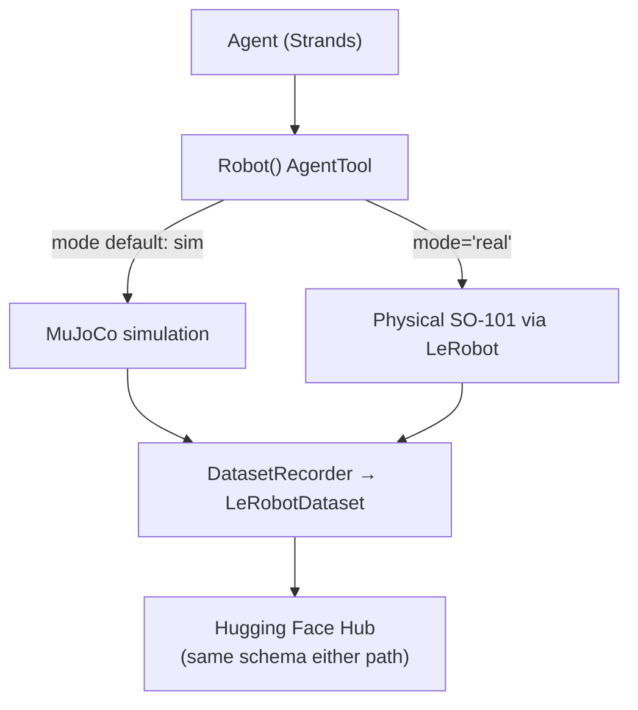

# Sim-to-Real Agent Tooling

> A design pattern, demonstrated by AWS's Strands Robots + Hugging Face's LeRobot integration: build agent tools so that swapping the backing environment — simulation for hardware, mock for production — is a config change, not a rewrite.

**Category**: topics
**Last updated**: 2026-06-18
**Status**: watching

## What it is

Strands Robots is an open-source SDK (Apache 2.0) from AWS that exposes robot simulation, hardware control, and the LeRobot stack as composable **AgentTools** — the same primitive an agent uses to call any other tool. The integration is deliberately thin: LeRobot's own CLIs still handle hardware recording and calibration; Strands only wraps the parts an agent actually orchestrates.

The pattern worth extracting has nothing to do with robots specifically. `Robot("so100")` returns a MuJoCo-backed simulation by default — no hardware, no risk. Passing `mode="real"` returns a hardware-backed robot driven by LeRobot instead. **The agent code is identical either way.** Both paths write through the same `DatasetRecorder`, so a dataset recorded in simulation and one recorded on a physical arm land in the exact same on-disk format (same parquet schema, same per-camera video layout) — a training script written against one consumes the other unmodified. The line between simulated and real becomes a deployment detail, not an architectural divide.

Two further pieces complete the picture: a **policy interface** (GR00T, LerobotLocal, Cosmos 3) that swaps inference backends behind one call signature, and a **peer mesh** (built on Zenoh, a broker-less peer-to-peer protocol) that lets every `Robot()` or `Simulation()` instance discover and coordinate with every other one on the network — one agent can broadcast a command to a five-robot fleet without managing IP addresses or a central registry.

## Why it matters

Strip the robotics framing and three transferable lessons remain, all squarely in Dean's frontier zone (agent tool design, multi-agent coordination, agent security):

- **The swap-a-kwarg-not-a-system pattern generalizes far past hardware.** The same shape applies to swapping a sandboxed execution environment for a production one, a local model for a hosted endpoint, or a mocked external API for the real one — anywhere "the agent needs to move from safe-to-test to actually-does-the-thing" is currently a different codepath instead of one parameter. It's the same decoupling instinct as the Responses-API boundary in [[embodied-ai-tooling-spring-2026]]'s Reachy Mini example (brain separate from the loop, same protocol either side), applied one layer down to the tool itself.
- **Default-deny human approval for irreversible actions, delivered out-of-band of the LLM.** Every physically-actuating mesh action (fleet broadcast, emergency stop, single-peer commands) pauses for operator approval by default. The approval prompt is delivered outside the LLM's own tool-call arguments specifically so a prompt-injection attempt can't forge an "approved" flag inside the command body it's trying to smuggle through. That's a sharper, more concrete version of the [[ai-guardrails]] "hard stops" principle — gate the action, not the model's stated intent.
- **Peer discovery without a broker is a real alternative to a central agent registry.** [[agentic-mesh]] describes registry/DNS/marketplace as the standard architecture for multi-agent discovery; Zenoh's multicast-based peer mesh is a working, lighter-weight alternative for the LAN/fleet case — agents appear on the mesh the moment they start, with no registration step. Worth knowing as a second pattern, not just a robotics detail.

## How it works

### The abstraction boundary

A five-line agent (`Robot("so100")` → `Agent(tools=[arm])` → `agent("Pick up the red cube")`) runs unchanged whether the robot underneath is simulated or physical. Step-by-step, the integration: (1) records a demonstration in simulation and pushes it to the Hub as a `LeRobotDataset`; (2) runs a trained policy (GR00T container or in-process `LerobotLocalPolicy`, both behind the same interface) against that same simulated robot; (3) re-runs the identical agent code against physical hardware by changing `mode="real"` plus connection details (port, cameras); (4) coordinates a fleet of robots through the `robot_mesh` tool, which exposes peer discovery and structured broadcast as agent-callable actions.

### Security considerations, by design rather than afterthought

The blog's own "Security Considerations" section is unusually direct for a getting-started post, and the three points generalize:

- **Prompt injection into a physically-actuating agent is a different risk class than a chatbot hallucinating text.** The stated mitigation is the standard one — only feed the agent trusted data, and restrict its tool surface when that isn't possible — but it's worth internalizing that the blast radius argument changes once a tool call moves a real object.
- **Local-dev shortcuts are explicitly labeled as such.** `STRANDS_MESH_LOCAL_DEV=1` runs the mesh with no authentication — any device on the network can command the fleet. The docs name `STRANDS_MESH_AUTH_MODE=mtls` as the production requirement rather than leaving the gap implicit.
- **The HITL gate is configurable but fails closed.** `STRANDS_MESH_HITL_ACTIONS` lets an operator tune which actions require approval (`all`, `none`, or a subset); outside an agent loop entirely (a bare script, a unit test), the gated actions simply fail rather than silently executing. Per-action rate limits and an audit trail run alongside the interrupt itself.

## Related
- [[embodied-ai-tooling-spring-2026]]
- [[agentic-mesh]]
- [[ai-guardrails]]
- [[vision-language-action-models]]
- [[agent-frameworks]]
- [[building-agents-best-practices]]
