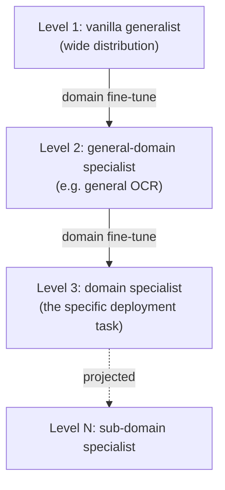

# Specialization Beats Scale

> When a model's training history is moved close enough to the deployment task, parameter count stops being the decisive variable — a 3B specialized model beat every frontier API tested on quality, cost, *and* stability.

**Category**: topics
**Last updated**: 2026-05-28
**Status**: active

## What it is

This is a strategic principle, not a tool: **distributional alignment — how close a model's training history has been moved to the task it will actually do — can dominate parameter count as the variable that decides performance.** It comes out of Dharma's DharmaOCR work (paper + benchmark + open models on the Hub, April 2026), but the authors deliberately isolate it as a *procurement* insight that generalizes beyond OCR.

The setup is the enterprise default everyone has run on for three years: capability scales with parameter count (Kaplan et al.'s 2020 scaling laws), frontier providers lead the benchmarks, so the safe buy is the biggest frontier model. That default was *correct* for most of the comparisons that produced it — GPT-4, Claude 3, Gemini 1.5 all really did beat the smaller models they were tested against. The argument here is not that the default was always wrong. It's that **the comparison set was incomplete**: it never included a small model whose training trajectory had been deliberately walked toward the deployment task through successive fine-tuning stages.

When you add that model, the ranking inverts. On a Brazilian-Portuguese OCR benchmark (printed, handwritten, legal/administrative docs), a specialized 3-billion-parameter model scored **0.911** composite — first place — against Claude Opus 4.6 at 0.833, Gemini 3.1 Pro at 0.820, GPT-5.4 at 0.750, and a tail of OCR-specific cloud services below that. The 8-point gap to Opus was wider than any gap between adjacent finishers. And it ran at roughly **52× lower cost per million pages**. The cheapest model was also the best model — which breaks the usual quality-for-cost tradeoff the procurement default assumes.

## Why it matters

The default treats parameter count as the dominant variable and training history as a secondary modifier. This flips the priority: **alignment to the task becomes the dominant variable, and parameter count becomes one factor among several that shape how much a given alignment step buys you.** The post's one-line version: *"Specialization is not a way to compensate for being small. It is a way to be aligned."*

What changes if this holds beyond one domain:

- **Benchmark leadership stops being sufficient evidence for a procurement decision.** The model that led the *public* benchmarks was not the model that delivered the best result on the deployment workload. Evaluation may need an extra layer run on representative tasks, not leaderboard scores.
- **The choice of *starting* model becomes strategic, not just the fine-tuning recipe.** Because alignment compounds (below), where you begin on the specialization hierarchy materially changes the outcome of an identical training budget.
- **The organizational shape changes.** If specialization compounds, the long-run win is *not* hunting for one universally capable model — it's building an ecosystem of models progressively aligned to your own domains, workflows, and constraints.

The post is careful about its own boundaries, which is part of why it's trustworthy: the hierarchy was shown in *one* domain, *one* benchmark, *two* model-pair comparisons. The mechanism has no OCR-specific reason to be confined to OCR, but the evidence elsewhere hasn't been gathered yet. So the honest claim is bounded: frontier models aren't inferior or disposable — they are *not necessarily* the best-performing choice for every workload, and alignment history is a variable serious evaluation currently underweights.

## How it works

### The variable the procurement default misses

Two ways of allocating the same intuition, made precise:

| | Procurement default | The reframe the paper proposes |
|---|---|---|
| Dominant variable | Parameter count | Distributional alignment to the task |
| Training history is… | A secondary modifier | The primary predictor of relative rank |
| Decision rule | Buy the largest frontier model | Test how aligned a model's training trajectory is to *your* task |
| Cost/quality relationship | Pay more for more quality | Aligned small model can be cheaper *and* better |

The cleanest evidence is a controlled pair — **same architecture, same training pipeline, same data, different starting point**:

- **Qwen2.5-VL-3B** (general-purpose start) → SFT + DPO on target domain → **0.793** quality, **1.41%** degeneration
- **Nanonets-OCR2-3B** (already an OCR specialist) → same procedure → **0.921** quality, **0.20%** degeneration

The only thing that differed was *the distance the model had already traveled toward the task before fine-tuning began.* That distance produced a ~16% quality gain and cut text-degeneration (a production failure where generation enters a self-reinforcing loop and never emits usable output) by ~7×.

### Specialization compounds — it's a hierarchy, not a switch

Alignment isn't binary. It's a position on a ladder a model can be moved up one rung at a time, and the *same* downstream training pays off differently depending on the rung you start from.

The 7B scale shows the same effect, ruling out "it only works for tiny models":

| Start | Type | After same fine-tune | Degeneration |
|---|---|---|---|
| Qwen2.5-VL-7B-Instruct | general-purpose | 0.906 | 1.01% |
| olmOCR-2-7B | already OCR-specialized | 0.927 | 0.40% |

Two pairs, two parameter scales, one consistent result: **the procedure doesn't create alignment from nothing — it builds on whatever alignment is already there.** A model already moved toward the broad *category* of its eventual task benefits more from the same domain-specific training than one starting from a wider distribution.

### The decision, distilled

The post reframes the buy as three questions, not one purchase:

1. Should distributional alignment be a *first-class* evaluation variable alongside parameter count? (The modest claim: it's large enough to test explicitly, not assume away.)
2. Is benchmark leadership alone sufficient evidence? (In this domain, no.)
3. Given that alignment compounds, what's the right *starting* model — and should the org build a specialization ecosystem rather than chase one universal model?

## Sources

- Erick Lachmann & Gabriel Pimenta de Freitas Cardoso (Dharma-AI), *"Specialization Beats Scale: A Strategic Variable Most AI Procurement Decisions Overlook"*, Hugging Face Blog, 2026-05-22.
- Cardoso et al., *"DharmaOCR: Specialized Small Language Models for Structured OCR…"*, arXiv:2604.14314 (2026).
- Supporting specialization literature cited in the post: Subramanian et al. (arXiv:2503.11872, 2025); Pecher et al. (2026); Kaplan et al., *Scaling Laws for Neural Language Models* (arXiv:2001.08361, 2020).

## Related

- [[model-compression]]
- [[synthetic-data]]
- [[gemma-4]]
- [[open-model-releases-spring-2026]]
- [[open-source-ai-state-spring-2026]]
- [[embeddings-and-rerankers]]
