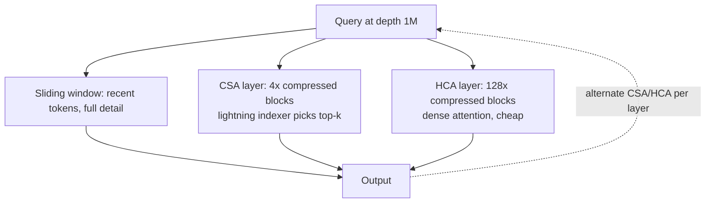

# DeepSeek-V4

> An open MoE model whose real advance isn't benchmark scores but making a 1M-token context *cheap enough for agents to actually use*, via hybrid compressed attention.

**Category**: topics
**Last updated**: 2026-05-28
**Status**: active

## What it is

DeepSeek released V4 as two open MoE checkpoints on the Hub: **V4-Pro** (1.6T total / 49B active) and **V4-Flash** (284B / 13B active), both with a **1M-token context window**. The benchmark numbers are competitive but not state-of-the-art — and the authors are explicit that this doesn't matter. The point of V4 is *long-context inference economics*: it is designed so a model can run hundreds of tool-call rounds without the context becoming unaffordable, which is the failure mode that breaks open models as agents today.

The framing is worth internalizing: **a 1M context window is capacity, not performance.** Whether you can use it depends on the cost of *every forward pass at that depth*. Two numbers govern that — single-token inference FLOPs and KV-cache size — and both normally grow with sequence length. V4's architecture is a direct assault on both.

At 1M tokens, V4-Pro uses **27% of the per-token FLOPs and 10% of the KV-cache memory** of DeepSeek-V3.2; V4-Flash drops to 10% of FLOPs and 7% of KV cache. Against standard 8-head grouped-query attention in bf16, V4 needs roughly **2% of the KV-cache size**.

Source: Hugging Face, *"DeepSeek-V4: a million-token context that agents can actually use"* (2026-04-24).

## Why it matters

This is the clearest statement yet that **the long-context bottleneck for agents is memory and compute per step, not the advertised window size**. Every frontier lab quotes a context number; almost none make that number economical to *fill repeatedly* in an agent loop, where each tool result is appended and every later token re-pays attention against everything before it.

What changes because V4 exists:

- **Open-weight agents become viable for long-horizon tasks.** V4-Pro lands at parity with frontier closed models on agent benchmarks (SWE Verified 80.6, MCPAtlas 73.6 — second only to Opus-4.6-Max) while being downloadable. That's a different posture than "open model that's cheaper but falls over in a long SWE-bench trace."
- **The community gets a reference design** for cheap long-context inference (hybrid compressed attention + aggressive low-precision KV storage) rather than just a bigger window.
- **Agent ergonomics move into the model itself** — interleaved thinking across tool calls, a parsing-robust tool schema, and an RL sandbox built for agent rollouts (see below). These are post-training and infrastructure decisions, not just architecture.

## How it works

### Hybrid attention: CSA + HCA, interleaved by layer

The efficiency comes from splitting attention into two mechanisms and alternating them across layers, because forcing one pattern across all layers wastes capacity.

| Mechanism | Compression | Selection | Intuition |
|---|---|---|---|
| **CSA** (Compressed Sparse Attention) | 4× along sequence (softmax-gated pooling + learned positional bias) | a "lightning indexer" (FP4, ReLU-scored) picks top-*k* compressed blocks per query | sparse attention, but run over blocks already 4× shorter — so the indexer's search space shrinks too. Inherits the sparse-selection idea from V3.2's DeepSeek Sparse Attention. |
| **HCA** (Heavily Compressed Attention) | 128× | none — every query attends *densely* to every compressed block | the compressed stream is short enough that dense attention is cheap again |

Both paths keep a sliding-window branch for the most recent uncompressed tokens (recency). In V4-Pro's 61-layer stack, layers 0–1 are HCA, layers 2–60 alternate CSA/HCA, and the final multi-token-prediction block runs sliding-window only.

Storage compounds the compression: **FP8 for most KV entries, BF16 only for RoPE dimensions, FP4 inside the CSA lightning indexer.** That stack is what produces the ~2% KV-cache figure.

Feed-forward layers use DeepSeekMoE; residual connections are replaced with **manifold-constrained hyper-connections (mHC)**.

### What changes for agents (post-training, not just architecture)

- **Interleaved thinking across tool calls.** V3.2 discarded reasoning whenever a new *user* message arrived. V4 *preserves* reasoning content across user-message boundaries when the conversation contains tool calls — so a multi-turn agent keeps a cumulative chain of thought instead of reconstructing state. (Tool-free conversations keep the old flush-per-turn behavior to stay concise.)
- **Tool-call schema with dedicated tokens.** A `|DSML|` special token + an XML-based format. XML reduces the escaping failures that plague JSON-in-string tool calls, and the schema separates string params (`string="true"`, passed as-is) from structured params (`string="false"`, passed as JSON), killing a class of number/boolean parsing errors.
- **DSec — a sandbox built for RL rollouts.** Agent behavior was trained with RL against real tool environments. DSec is a Rust platform exposing four execution substrates (function calls, containers, Firecracker microVMs, QEMU full VMs) behind one Python SDK, running hundreds of thousands of concurrent sandboxes. Key features: fast layered image loading (rollouts don't wait on container startup), preemption-safe trajectory replay (interrupted steps resume without re-running tool calls), and a uniform API across substrates.

### Results worth the asterisk

Knowledge/reasoning numbers are competitive, not leading. The *agent* numbers separate it: Terminal-Bench 2.0 67.9, SWE Verified 80.6, MCPAtlas 73.6, Toolathlon 51.8. Long-context retrieval (MRCR 8-needle) holds above 0.82 through 256K and 0.59 at 1M. In a survey of 85 DeepSeek developers using V4-Pro as a daily driver, 52% said it was ready to replace their primary coding model.

The instruct models offer three reasoning modes — Non-think, Think High, Think Max (needs ≥384K context). Recommended sampling: `temperature=1.0, top_p=1.0`.

## Dean-Relevance

**Adoption path**: experimental
**Why**: This is squarely Dean's frontier zone — model architecture that changes *practical* agent capability, not a leaderboard headline. Praxis runs long agentic loops on OpenRouter; the lesson here ("your context window is a lie until you cost out the per-step KV cache") is directly actionable when reasoning about why long agent traces get expensive or flaky. V4 is also a genuinely open option to evaluate against the Claude/Gemini defaults if context cost ever becomes the binding constraint.
**Analogy**: Most context windows are like a huge warehouse with a single narrow loading dock — the floor space is impressive, but everything still bottlenecks at the door each time you fetch something. V4 widens the *dock*, not the floor: CSA/HCA make the cost of re-reading the whole warehouse on every step collapse. The interleaved-thinking change is the agent keeping a running notebook instead of re-deriving its plan every time the user interrupts.
**Suggested next step**: When profiling a long Praxis agent run, separate the two cost drivers V4 names — per-step FLOPs vs. accumulated KV cache — and check which one actually grows your latency/bill as the trace lengthens. That diagnosis frame is useful regardless of which model you run.

## Related
- [[gemma-4]]
- [[decoupled-diloco]]
- [[model-compression]]
- [[llm-memory-architectures]]
- [[context-engineering]]
- [[harness-and-scaffolding]]
- [[train-time-rl-scaling]]
- [[verifiers-in-llm-reasoning]]
