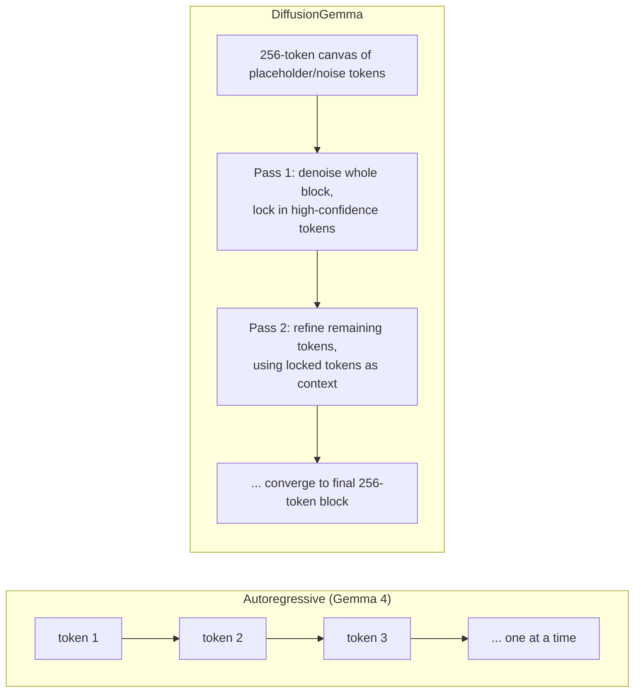

# DiffusionGemma

> Google DeepMind's first large-scale, openly-licensed text diffusion model — a 26B MoE built on Gemma 4 that generates whole blocks of text in parallel instead of token-by-token, trading some quality for up to 4x faster local inference.

**Category**: topics
**Last updated**: 2026-06-11
**Status**: active

## What it is

DiffusionGemma is an experimental open model (Apache 2.0, released 2026-06-10) from Google DeepMind that replaces autoregressive (AR) decoding with **text diffusion**: instead of predicting one token at a time left-to-right, it generates a 256-token block simultaneously, then iteratively denoises/refines the whole block across multiple passes until it converges on final text. It's built on the [[gemma-4]] architecture plus Gemini Diffusion research, as a 26B-total-parameter Mixture-of-Experts model that activates only 3.8B parameters per forward pass.

Unlike the [[llm-inference-serving-internals|Nemotron-Labs Diffusion]] models, which retrofit a dual-mode AR/diffusion switch onto one checkpoint, DiffusionGemma ships as a **separate, speed-first sibling** to standard Gemma 4. DeepMind's own framing is "use Gemma 4 for quality, DiffusionGemma for speed-critical local/interactive workloads" — not a replacement.

The headline numbers: 1000+ tokens/sec on a single H100, 700+ tokens/sec on a consumer RTX 5090, and the whole model fits in 18GB VRAM when NVFP4-quantized — i.e. it runs on a high-end gaming GPU.

## Why it matters

- **Diffusion LLMs just left the research-curiosity stage.** [[llm-inference-serving-internals|Nemotron-Labs Diffusion]] tops out at 14B and reads as an inference-engine trick; DiffusionGemma is a 26B model from a frontier lab with day-one support across vLLM, MLX, Transformers, Unsloth, and NeMo (llama.cpp "arriving soon"). That's the difference between "watch this technique" and "you can download and run this tonight."
- **It's a direct, concrete answer to the local-inference cost question.** Dean's profile flags local LLM inference and client-side ML as interesting-but-cost-cautious. 700 tok/s in 18GB VRAM on an RTX 5090 is the first time that trade-off looks genuinely favorable for an interactive, single-user workload — not just a smaller/quantized version of a cloud model.
- **Bidirectional attention changes what's *possible*, not just what's fast.** Every token in the 256-token block attends to every other token, on every refinement pass — a structurally different capability than AR's "never revise a committed token." The Sudoku fine-tune (via Unsloth) is the cleanest illustration: Sudoku is brutal for AR models because the correct value of cell 1 depends on cells 2–81, none of which exist yet when cell 1 is generated. Diffusion sees the whole board at once and refines toward global consistency — the same move image-diffusion models make when refining a whole image instead of painting it left-to-right, pixel by pixel. That reframes diffusion LLMs as a fit for **constraint-satisfaction-shaped problems**, not just "faster chat."
- **It's an honest, workload-shaped trade-off — useful as a calibration point.** DeepMind is explicit that quality is below AR Gemma 4, and that the speedup *inverts* in high-QPS cloud serving (where AR's batching already saturates the GPU). The win is real but specific: low-to-medium batch size, single accelerator, local/interactive use. Any future "diffusion replaces autoregressive" claim should be checked against this shape.

## How it works

### AR vs. diffusion decoding

### Architecture

- **Base**: [[gemma-4]] backbone (alternating local/global attention, Per-Layer Embeddings, shared KV cache) plus a new **diffusion head** for parallel block generation.
- **Size**: 26B total params, MoE, 3.8B active per forward pass.
- **Generation unit**: 256-token blocks, bidirectional attention within each pass.
- **Self-correction**: because the model re-evaluates the entire block on every pass, it can fix earlier mistakes mid-generation — AR has no equivalent.

### Hardware and serving

| Target | Notes |
|---|---|
| NVIDIA H100 | 1000+ tok/s, full precision |
| RTX 5090 / 4090 (consumer) | 700+ tok/s, NVFP4-quantized, fits 18GB VRAM |
| DGX Spark / DGX Station | local deskside deployment |
| RTX PRO | AI professional workstations |

Day-one support: **vLLM** (Red Hat-supported integration), **MLX**, **Hugging Face Transformers**, **Hackable Diffusion** (modular JAX fine-tuning toolbox), **Unsloth**, **NVIDIA NeMo**. **llama.cpp** support is "arriving soon."

### Where the speedup comes from — and where it stops

Local, single-user AR inference is **memory-bandwidth-bound**: the GPU mostly waits to load weights to produce one token. DiffusionGemma instead gives the GPU a 256-token block to compute per pass, shifting the bottleneck from memory bandwidth to compute — i.e. it actually uses the hardware it's running on. Cloud serving at high concurrency is already compute-saturated via batching across many users, so the same shift offers diminishing or negative returns there. **The throughput win is strongest at low-to-medium batch sizes on a single accelerator** — exactly the local/interactive profile.

## Related

- [[gemma-4]]
- [[llm-inference-serving-internals]]
- [[model-compression]]
- [[open-model-releases-spring-2026]]
