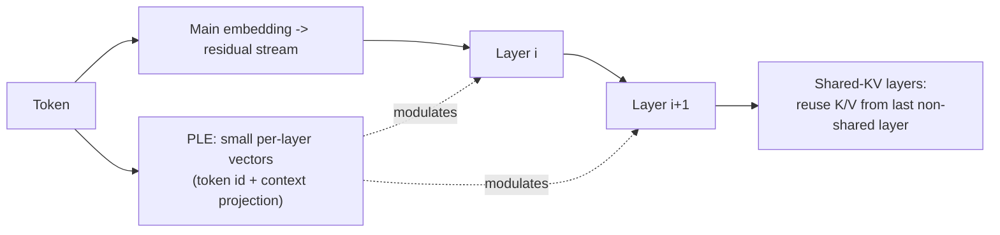

# Gemma 4

> Google DeepMind's truly-open (Apache 2) multimodal family that pushes frontier-arena quality down to on-device sizes — including audio — by combining proven architecture pieces instead of inventing new ones.

**Category**: topics
**Last updated**: 2026-05-28
**Status**: active

## What it is

Gemma 4 is an open multimodal model family (image + text + audio in, text out) released on Hugging Face under Apache 2 licenses, with first-day support across transformers, llama.cpp, MLX, transformers.js/WebGPU, Mistral.rs, and the major fine-tuning libraries. It comes in four sizes, all with base and instruction-tuned checkpoints:

| Model | Size | Context | Notes |
|---|---|---|---|
| Gemma 4 E2B | 2.3B effective (5.1B w/ embeddings) | 128K | + audio |
| Gemma 4 E4B | 4.5B effective (8B w/ embeddings) | 128K | + audio |
| Gemma 4 31B | 31B dense | 256K | |
| Gemma 4 26B A4B | MoE, 4B active / 26B total | 256K | |

The headline isn't a single trick — it's that Gemma 4 takes architecture components proven in earlier Gemma and other open models, **deliberately leaves out the complex/inconclusive ones (e.g. Altup)**, and combines them into a mix that is highly portable across libraries/devices, efficient on long context and agentic use, and friendly to quantization. The 31B dense reaches an estimated text-only LMArena score of ~1452; the 26B MoE reaches ~1441 with just 4B active parameters.

Source: Hugging Face, *"Welcome Gemma 4: Frontier multimodal intelligence on device"* (2026-04-02).

## Why it matters

Two things make this notable beyond "another open model":

- **Frontier-class quality at on-device sizes, openly licensed.** Apache 2 + sizes that run on a laptop or phone via MLX/WebGPU/llama.cpp moves capable multimodal inference off the API and onto local hardware. That's the local-inference / client-side-ML frontier Dean has flagged as interesting-but-cautious.
- **The "boring combination" thesis.** Gemma 4's design choice is *restraint* — reuse what's proven, drop what's inconclusive, optimize for compatibility and quantization. The reported result (the HF team "struggled to find good fine-tuning examples because they are so good out of the box") is a signal that the open-model floor has risen sharply, which changes the build-vs-buy and fine-tune-vs-prompt calculus.

It also pairs naturally with [[deepseek-v4]]: both are open releases whose real story is *inference economics and deployability* rather than top-line benchmark wins.

## How it works

### Architecture at a glance

- **Alternating attention** — local sliding-window layers (512 tokens on small dense models, 1024 on larger) interleaved with global full-context layers.
- **Dual RoPE** — standard RoPE for sliding layers, pruned RoPE for global layers, to extend usable context.
- **Per-Layer Embeddings (PLE)** — see below.
- **Shared KV cache** — see below.
- **Vision encoder** — learned 2D positions + multidimensional RoPE; preserves original aspect ratios; encodes images to selectable token budgets (70/140/280/560/1120) to trade speed vs. quality.
- **Audio encoder** — USM-style conformer (same base as Gemma-3n), on the E2B/E4B sizes.

### Per-Layer Embeddings (PLE)

In a standard transformer every token gets *one* input embedding, and that single vector must front-load everything any layer might later need. PLE adds a parallel, **lower-dimensional conditioning pathway**: for each token it produces a small dedicated vector *per layer*, combining a token-identity component (embedding lookup) with a context-aware component (a learned projection of the main embeddings). Each decoder layer uses its vector to modulate hidden states via a lightweight residual block. The effect: each layer gets its own channel to receive token-specific information *only when it becomes relevant*, adding per-layer specialization at modest parameter cost because the PLE dimension is much smaller than the hidden size. (For multimodal inputs, PLE is computed before soft tokens replace placeholders, since it depends on token IDs.)

### Shared KV cache

The last `num_kv_shared_layers` layers don't compute their own key/value projections — they **reuse** the K/V tensors from the last non-shared layer of the same attention type (sliding or full). Minimal quality impact, meaningfully lower memory and compute for long-context generation and on-device use.

Multimodal capabilities work out of the box (OCR, speech-to-text, object detection, GUI element pointing — natively returning JSON bounding boxes on a 1000×1000 reference grid), plus function calling, reasoning, and code tasks. Small variants ship multi-token-prediction drafters for faster decoding.

## Related
- [[deepseek-v4]]
- [[decoupled-diloco]]
- [[model-compression]]
- [[vision-language-action-models]]
- [[llm-memory-architectures]]
