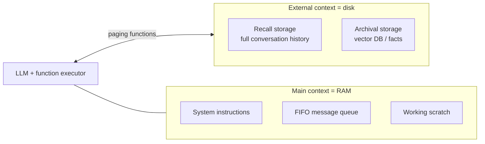

# LLM Memory Architectures

> Treating the KV cache and external storage as a memory *system* — OS-style context tiering (MemGPT), self-study distillation into cache (Cartridges), and serving-layer KV reuse (LMCache).

**Category**: topics
**Last updated**: 2026-05-25
**Status**: active

## What it is

A transformer's only native "memory" is its context window plus the **KV cache** — the keys/values it has already computed for the tokens in that window. Everything an LLM "remembers" mid-run lives there; everything else has to be fetched and re-inserted. This page is about the **systems and architectures** that manage that memory: how to page information in and out, how to compress it, and how to store and reuse it across requests.

It is the architectural counterpart to [[agent-memory-learning-from-experience]] (which is about *learning what to remember* as a policy). Here the question is mechanical: given finite context and a KV cache, how do you build something that behaves like long-term memory?

## Why it matters

Context is the scarcest resource in an agent. The two failure modes — running out of window, and recomputing the same prefix on every call — are both *memory-system* problems, not model problems. The frontier insight is that the **KV cache is the AI-native unit of memory**: if you can store, slice, compose, and reuse it, you get persistence and big serving savings without touching weights. For a system like Praxis that accumulates per-user context over time, this is the infrastructure layer of a self-updating knowledge base (squarely in Dean's ✅ zone).

## How it works

### MemGPT — an OS for context

MemGPT treats the LLM like a CPU and the context window like RAM, borrowing virtual-memory ideas:



- The model calls **functions** to read/write its own external memory (page facts in from archival storage, flush old turns out).
- A **FIFO queue** holds recent messages; when context fills past a threshold (~70%), older content is evicted/summarized; at ~100% it forces a flush.
- On its document-QA benchmark (Deep Memory Retrieval) this tiered scheme reached ~92.5%, far past a model limited to a single fixed window.

The point: **memory becomes a set of tool calls the model makes about its own state** — paging, not a bigger window.

### Cartridges — self-study compiled into the cache

Instead of re-feeding a big corpus every query, **Cartridges** has the model *study* a corpus offline and distill that knowledge into a small, trained **parameterized KV cache** (a "cartridge") you snap into context at inference.

- ~38.6× less memory than keeping the raw corpus in context.
- **Composable** — load multiple cartridges (different docs/domains) together.
- It's knowledge-as-an-artifact: precompute the expensive understanding once, attach it cheaply forever after.

### KV cache as memory at the serving layer

The KV cache for a given prefix is expensive to compute but cheap to store — so reuse it.

**LMCache** (PyTorch Foundation) builds a **hierarchical KV store**:

```
GPU HBM  →  CPU RAM  →  local SSD  →  remote object store (S3)
 fastest                                          cheapest
```

- **Prefix caching**: identical prompt prefixes (system prompt, shared docs) compute their KV once and reuse across requests.
- **PD disaggregation**: separate the compute-heavy **prefill** stage from the memory-bound **decode** stage onto different hardware.
- Core economic argument: **prefill (recompute) cost ≫ KV storage cost**, so almost any reuse wins. Reported KV reuse rates average ~1.21× — i.e. meaningful savings even when prompts only partly overlap.

**CacheBlend** extends reuse from *prefix-only* to **arbitrary substrings**: if a useful chunk appears in the middle of a new prompt (not just the start), reuse its cached KV and only **recompute the cross-attention** that ties it to the new surrounding context. This matters for RAG, where retrieved chunks recur across queries but rarely at the very front.

Related model-side trick: **DeepSeek's MLA** (Multi-head Latent Attention) shrinks the KV cache itself by compressing keys/values into a latent space — attacking the same cost from the architecture side.

## Related
- [[agent-memory-learning-from-experience]]
- [[context-engineering]]
- [[advanced-rag-techniques]]
- [[agentic-rag]]
- [[model-compression]]
- [[self-improving-ai-agents]]
