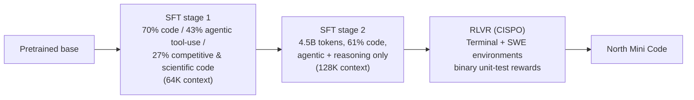

# North Mini Code

> Cohere's first developer-focused model: a 30B-A3B Mixture-of-Experts model built specifically for agentic coding, open under Apache 2.0, and deliberately trained across multiple agent harnesses so its skills generalize instead of overfitting to one tool-calling style.

**Category**: topics
**Last updated**: 2026-06-10
**Status**: active

## What it is

North Mini Code is the first release in Cohere's new "North" family aimed at developers — a 30B-parameter Mixture-of-Experts model with only 3B active parameters (128 experts, top-8 routing, sigmoid-gated, SwiGLU FFN experts, plus one dense layer before the sparse stack), released under Apache 2.0 in BF16 and FP8 on Hugging Face and available through OpenCode and the Cohere API.

On Artificial Analysis' Coding Index it scores 33.4 — ahead of Qwen3.5-35B-A3B, Gemma 4 26B-A4B, and Devstral Small 2 (24B dense), and even ahead of much larger models such as Nemotron 3 Super (120B-A12B), Mistral Small 4 (119B-A6B), and Devstral 2 (123B). Architecturally it's a decoder-only Transformer with sliding-window (RoPE) and global (no positional embeddings) attention interleaved 3:1 — a "boring combination" approach in the same spirit as [[gemma-4]]'s alternating attention.

## Why it matters

- **A small open model competitive with much larger ones, specifically for agentic coding.** Continues the trend Dean has been tracking in [[specialization-beats-scale]] and [[open-model-releases-spring-2026]] — 3B active parameters is squarely self-hostable territory, with frontier-adjacent agentic coding quality.
- **Trained across multiple agent harnesses on purpose.** Instead of optimizing for one scaffold, Cohere trained against SWE-Agent's rich CLI interface (`bash`, `str_replace_editor`, `submit`), mini-SWE-agent's bare single-`bash`-tool interface, OpenCode's typed-tool/JSON interface, and Terminal-Bench's plain-text-chat Terminus 2 harness. Skills transferred across harnesses "for free": a 61% pass@1 on mini-SWE-Agent emerged without targeted training for that harness. For Dean — who evaluates and builds with multiple agent harnesses — this is direct evidence that **harness-robustness is a trainable, measurable property**, not just a prompting concern. See [[harness-and-scaffolding]] and [[agent-frameworks]].
- **Async RL at the same disaggregated pattern the field converged on.** The RL recipe matches [[rl-post-training-libraries]]: a vLLM sidecar serves rollouts continuously while a trainer pushes weight updates every K=4 steps, with a windowed FIFO queue to drain straggler rollouts. The algorithm itself, **CISPO** (token-level importance-sampling correction on log-likelihoods, built on RLOO with stronger regularization), is a different point in the same design space as GRPO/PPO.
- **A small, copyable reward-shaping idea.** Invalid tool calls or unparseable output get reward 0 — which produced a "sharp drop in hallucinated or malformed tool calls within the first training steps." A concrete, reusable design choice for anyone building verifiable-reward environments — see [[verifiable-rl-environments]].

## How it works

### Architecture

| Spec | Value |
|---|---|
| Total / active params | 30B / 3B |
| Attention | Sliding-window (RoPE) : global (no positional embeddings), 3:1 ratio |
| MoE | 128 experts, top-8 routing, sigmoid router, SwiGLU FFN experts |
| Extra | One dense layer before the sparse stack |
| License | Apache 2.0 |
| Weights | BF16, FP8 |

### Post-training pipeline

- **"Long-to-longer" cascade**: SFT stage 1 trains at 64K context on a broad mix; stage 2 trains at 128K on a much smaller, higher-quality, agentic-only mixture. Training on a near-complete length distribution (rather than truncating) produced *shorter* trajectories at evaluation — the model learned to be efficient, not just capable.
- **SFT as RLVR priming, not an end in itself.** Rather than chasing SFT benchmark scores directly, the data mix optimizes for *sampling diversity and pass@K at high K* — giving RL more good trajectories to select from. Sample-level filtering removes invalid tool calls, malformed special tokens, and hallucinated citations.
- **RLVR setup**: 512 rollouts/batch, group size 8, a shared 128K context window, and per-task agentic-step budgets calibrated from pre-RL pass@k (an oversized turn budget was found to *encourage* unnecessary verbosity). Two environments trained jointly — terminal tasks (a ReAct harness with a single `bash` tool, on Harbor's Tmux backend) and SWE tasks (the SWE-agent harness, Docker images + unit-test verifiers). Over 70k verifiable tasks across ~5k repositories, deduplicated against SWE-Bench / SWE-Bench-Pro to avoid eval leakage.
- **Result of RLVR**: +7.9 points pass@1 on Terminal-Bench v2 and +3.0 on SWE-Bench Verified over the SFT checkpoint, plus fewer invalid tool calls, less repetitive looping, and more reliable trajectory termination (the model submits or responds rather than spinning). Joint multi-environment training beat training each environment separately, including on out-of-distribution tasks.

### Cross-harness generalization

Adding just 6% harness-diversity data in SFT stage 2 (vs. 50% for the primary SWE-Agent harness) produced a 10% gain on the OpenCode harness *without* hurting SWE-Agent/SWE-Bench performance — evidence that harnesses sharing overlapping tool capabilities (read/edit/run-shell) also share enough underlying structure that skills transfer cheaply between them. The team also found it necessary to deliberately vary harness *presentation* (data augmentation across near-identical harnesses) — otherwise the model pattern-matches the template instead of learning the underlying instruction-to-action mapping, which matters most when harnesses look superficially similar.

## Related

- [[harness-and-scaffolding]]
- [[agent-frameworks]]
- [[rl-post-training-libraries]]
- [[verifiable-rl-environments]]
- [[specialization-beats-scale]]
- [[open-model-releases-spring-2026]]
- [[gemma-4]]
