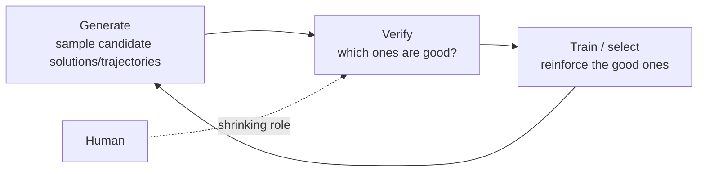

# Self-Improving AI Agents

> The unifying arc of a 15-lecture Stanford course: AI that improves itself by generating its own training signal, verifying it, and learning from it — and the one bottleneck (verification) that gates the entire loop.

**Category**: synthesis
**Last updated**: 2026-05-25
**Status**: active

## The one idea

Strip away the papers and the whole field reduces to a single loop:

**Self-improvement = generate → verify → train, with the human progressively removed from the loop.** Every lecture is an attack on one stage:

- **Generation** — sample more, smarter ([[test-time-compute-scaling]], evolutionary search).
- **Verification** — the hard part; the reliability ceiling on everything ([[verifiers-in-llm-reasoning]]).
- **Training** — fold the search back into the weights ([[train-time-rl-scaling]]).
- **Exploration** — find the reward-relevant trajectories in the first place ([[agentic-rl-exploration]]).

The course's thesis: **the better and more autonomous this loop, the less human supervision required — and verification is the chokepoint.** Where verification is cheap and reliable (code, math, CUDA kernels), self-improvement roars; where it's subjective, it stalls.

## Why this matters now

RL on LLMs only started reliably *working* around 2024 — two years earlier the consensus was that it never would. We are at the very start of a curve, not the middle. Simultaneously, the deep-RL era (~2011–2021) explored a rich menu of ideas (curiosity, curriculum, meta-RL) that were shelved during the pretraining boom and are now newly applicable. The practical stakes for a builder:

- **Compute is now a deploy-time dial**, not just a training decision ([[test-time-compute-scaling]]).
- **Reasoning models behave the way they do for a reason** — RL *elicits* rather than *expands* capability, which changes how you select and prompt them.
- **The frontier of automation** — agents that improve their own tooling and run research loops — is real but verification-bound ([[evolutionary-search-self-improving-agents]]).

## The arc, lecture by lecture

### 1. From alignment to agents (post-training's three eras)

Post-training evolved through three eras, each a different reward source:

| Era | Reward source | Hallmarks | Failure mode |
|---|---|---|---|
| **Alignment** | Human preference (RM, Bradley-Terry) | SFT → RLHF | Reward hacking |
| **Reasoning** | Verifiable correctness (RLVR) | CoT as latent variable, DeepSeek R1, o-series | Can't merge "reasoning" + "helpful" cleanly |
| **Agent** | Environment / execution feedback | Tool calls, MCP, SWE-Bench, "gyms" | Long-horizon reliability |

The trend line: reward moves from *what a human prefers* → *what is provably correct* → *what an environment confirms* — each step more scalable and less human-dependent. Coding agents are the sweet spot because code is **deterministic, observable, and verifiable**.

### 2. Reasoning is elicited, not installed

Denny Zhou's results reframe reasoning as something models can already do, latently:

- **CoT-decoding**: chains of thought appear in the sample distribution *without* any RL/SFT — you just have to decode for them.
- **Self-consistency = marginalization**: the right answer is the one most reasoning paths agree on — `argmax P(answer|problem) ≈ frequency` across samples.
- A theory result ("CoT empowers transformers to solve inherently serial problems"): generating more reasoning tokens substitutes for model depth.
- The recurring punchline that becomes the course's spine: **"a reliable verifier is the most crucial component in RL fine-tuning."**

### 3. Test-time scaling — spend compute at inference

→ full page: [[test-time-compute-scaling]]

Sample many answers; coverage (pass@k) climbs ~log-linearly (Large Language Monkeys; `coverage ≈ exp(a·k^b)`). The gap between pass@k (achievable) and Maj@k (what voting gets) **is** the generation–verification gap. "Optimal test-time scaling can beat pretraining." Parallel vs. sequential revision, PRM-guided beam search, compute-optimal allocation by difficulty, and **Archon** (Bayesian search over the inference architecture itself, à la DSPy/MIPRO).

### 4. Train-time RL scaling — fold the search into the weights

→ full page: [[train-time-rl-scaling]]

Generate, verify, train on the winners. **STaR** (bootstrap + rationalization) → **GRPO** (drops PPO's critic, uses a group-mean baseline, ~50% less memory) → **DAPO** (four fixes — Clip-Higher, Dynamic Sampling, Token-Level Loss, Soft Overlong Punishment — that take AIME ~30 → ~50). DeepSeekMath's unifying view: every method is `gradient = GradientCoefficient × ∇log p`. The load-bearing finding: **RL improves Maj@K, not Pass@K** — it sharpens elicitation, it doesn't expand the capability frontier.

### 5. Verifiers — the reliability bottleneck

→ full page: [[verifiers-in-llm-reasoning]]

The lineage is "get verification signal without armies of annotators": **Cobbe** (outcome verifiers, generation > verification) → **Lightman "Let's Verify Step by Step"** (process reward models beat outcome models and generalize OOD, but need step labels → PRM800K) → **Math-Shepherd** (auto-label steps by how often they lead to correct answers — Hard/Soft Estimate) → **Weaver** (fuse many *weak* verifiers via weak supervision, then distill 70B→400M keeping ~97%). Self-improvement works best where you can **exploit the generator–verifier gap**.

### 6. Learning from feedback — tools, code, and AI feedback

How agents get signal from the world:

- **ReAct** — interleave reasoning and acting in language space; thinking *is* an action. Fewer hallucinations on HotPotQA/FEVER/WebShop.
- **RLEF** — RL from *execution* feedback: code is the action, public/private test results are the reward, via a hybrid token/turn-level policy.
- **Constitutional AI / RLAIF** — replace human preference labels with a *constitution* the model critiques itself against; CAI + CoT pushes the helpfulness/harmlessness Pareto frontier.

### 7. Toward superhuman reasoning (neuro-symbolic AI for math)

Thang Luong's arc (NMT → chatbot → reasoning → superhuman):

- **AlphaGeometry** — neuro-symbolic: a System-1 language model proposes constructions, a System-2 symbolic engine (DDAR) verifies/derives; trained on ~100M synthetic proofs. Notably **not an LLM** (151M params).
- **AlphaProof** — formalize in Lean + AlphaZero-style search over a perfect verifier.
- The 2024 *formal* → 2025 *informal* shift (Gemini Deep Think) culminating in **IMO Gold 2025 (35/42)**; **IMO-ProofBench** as an autograder (r ≈ 0.93–0.96). A clean demonstration that a **perfect verifier** (formal proof) is the cheat code for self-improvement.

### 8. Memory — the KV cache as a memory system

→ full page: [[llm-memory-architectures]]

**MemGPT** (OS-style context tiering: main vs. external context, FIFO queue, recall/archival storage, memory as function calls) → **Cartridges** (self-study distilled into a parameterized KV cache, ~38.6× smaller, composable) → **LMCache** (hierarchical GPU→CPU→SSD→S3 KV store, prefix caching, PD disaggregation — because prefill cost ≫ storage cost) → **CacheBlend** (reuse arbitrary substrings, recompute only cross-attention). The KV cache is the AI-native unit of memory; the architectural sibling of learned [[agent-memory-learning-from-experience]].

### 9. Agentic frameworks for software engineering

Where the loop already works, because code is verifiable:

- **CodeMonkeys** — context → generation → selection state machines; the **selection problem** is the crux (oracle selection 69.8% vs. random 45.8%); "Barrel of Monkeys" ensembling.
- **KernelBench / Kevin** — LLM-as-compiler for CUDA kernels; multi-turn RL with per-turn compounding rewards ("you can't just throw GRPO at it").
- **Evolutionary search** (AlphaEvolve, Sakana CUDA engineer) — the bridge to lecture 15. Recurring lesson: **exploit the generator–verifier gap**, and beware **reward hacking**.

### 10. Agentic evals & long-horizon tasks

→ full page: [[agentic-evals-and-long-horizon-tasks]]

**METR** time horizon (50%-success ≈ 50 min, doubling ~7 months; but 80%-*reliable* ≈ only 4–10 min; ~1-month horizon by 2028–2031). **GDPval** win-rate vs. experts (roughly linear, Claude Opus 4.1 ~47.6%, approaching parity; under-specified context hurts). **DeepScholar-Bench** (deep research synthesis still <19%; quality–verifiability tradeoff). The tension: **reaching a long horizon ≠ producing high-quality output.**

### 11. Self-improvement with search & deep research

→ full page: [[evolutionary-search-self-improving-agents]] (AlphaCode line)

**AlphaCode** (1M samples, filter + cluster + submit) → **AlphaCode 2** (LLM family generates, scoring model selects; 100 samples match 1M). Then **agentic search / deep research** to enhance large reasoning models: **Search-o1** — agentic RAG (model emits `<begin_search_query>` tokens when it hits a knowledge gap) + a **Reason-in-Documents** module that refines retrieved docs before injecting them (raw docs disrupt coherence). **Search-R1** trains this with retrieved-token loss masking + outcome rewards. Theme: extended reasoning *creates* knowledge gaps → needs *dynamic*, multi-step retrieval, not one-shot RAG (see [[agentic-rag]]).

### 12. From vision-language to vision-language-action

→ full page: [[vision-language-action-models]]

Robotics' foundation-model moment: **PaLM-E** (obs → LM token space, positive transfer) → **RT-2** (first VLA, actions-as-tokens, hits the "dexterity wall") → **action chunking + diffusion** (commit to a trajectory; model multimodal continuous actions) → **π0 / π0-FAST** (VLM backbone + flow-matching action expert; FAST = DCT+BPE action tokenizer) → **Knowledge Insulation** (stop-gradient + co-train web data to avoid wrecking the backbone) → **π0.5** (scale diverse environments → open-world generalization). Robotics is still "in its infancy" on data — effectively the SFT stage.

### 13. Open problems in agentic learning (the RL foundations)

→ full page: [[agentic-rl-exploration]]

Agent learning *is* RL; the policy gradient is its fundamental equation (RL on an LLM = next-token prediction *weighted by return*). Three unsolved problems: **verification** (reward source), **credit assignment** (which actions earned the reward — largely unsolved for LMs), and **exploration** (which is the real frontier). The exploration ladder — sampling heuristics → intrinsic/curiosity (noisy-TV problem) → mutual-info skills → curriculum → task-directed (**RL²**, **AdA**, **Algorithm Distillation**). LLMs are stuck on rung 1 (best-of-N). **Without better exploration, LLMs only discover what they can randomly stumble onto.**

### 14. The discovery engines (TA lecture)

→ full page: [[evolutionary-search-self-improving-agents]] (AlphaEvolve / DGM / AI Scientist)

**AlphaEvolve** (LLM creativity + evolutionary search → novel matmul algorithms, denser sphere packing, +0.7% Google compute, +23% Gemini kernel). **Darwin Gödel Machine** (agents that edit their own codebase; empirical validation replacing Gödel's impractical proof search; *both* self-improvement and open-ended exploration required). **AI Scientist v1/v2** (full research loop; tree-based experimentation with VLM verification; honest limitations — hallucination, result misinterpretation). "An algorithm for making algorithms."

### Recap papers (the course's own greatest hits)

The overview lecture flagged four works as exemplars of the loop:

- **Multiagent Finetuning** — preserve diversity by fine-tuning a *society* of models, not one.
- **DeepSeekMath-V2** — self-verifiable proofs with a generator / verifier / meta-verifier.
- **Absolute Zero** — proposer–solver self-play with *zero* external data, using a learnability reward.
- **Intelligence-per-watt** — efficiency (accuracy/W) as a real axis; local vs. cloud inference.

## The cross-cutting threads

Reading all 15 together, five threads run through everything:

1. **Verification is the master key.** Every advance is downstream of "can you cheaply, reliably check the answer." Formal proofs and unit tests are where self-improvement is superhuman; subjectivity is where it breaks. → [[verifiers-in-llm-reasoning]]
2. **Generate-then-select beats clever single-shot** — but only as good as the selector. The pass@k↔Maj@k gap recurs from monkeys to AlphaCode to DeepScholar. → [[test-time-compute-scaling]]
3. **Compute substitutes for human labels and for parameters.** Self-generated, verifier-checked data is the new fuel; the human role keeps shrinking. → [[train-time-rl-scaling]]
4. **Exploration is the unsolved frontier.** RL works now, but LLMs explore weakly (best-of-N); real discovery needs the deep-RL ideas (curriculum, meta-RL) ported over. → [[agentic-rl-exploration]]
5. **Reward hacking and reliability are the persistent dangers.** From RLHF's reward hacking to AI Scientist misinterpreting its own results to DGM's safety guardrails — autonomy raises the stakes on the verifier being honest.

## Dean-Relevance

**Adoption path**: experimental
**Why**: The course is a systems-level map of where AI capability is going, which suits a pattern-first systems thinker — and three of its pillars are directly buildable on Dean's API-based stack *without* training infra: verifier/eval design ([[verifiers-in-llm-reasoning]] + [[llm-agent-evaluation]]), test-time selection ([[test-time-compute-scaling]]), and evolutionary loops over scored artifacts ([[evolutionary-search-self-improving-agents]]). The deepest resonance is conceptual: the **generate→verify→train loop with a shrinking human role** is the abstract form of his "director-not-operator" ambition, and the **curriculum / zone-of-proximal-development** framing in [[agentic-rl-exploration]] is the Praxis human-growth thesis stated in RL terms.
**Analogy**: The whole field is a student who got good at *grading their own homework*. Once the answer key is trustworthy, they can practice endlessly without a teacher — and the only question that matters is how honest the answer key is.
**Suggested next step**: Treat "build a reliable verifier" as the highest-leverage move for Praxis — start with a Weaver-style multi-judge fusion on one output type, then layer best-of-N selection on top of it. The loop only compounds once the verifier is trustworthy; everything else is downstream of that.
**Watch for**: A genuine exploration method that works on LLMs (beyond best-of-N). That's the field's stated bottleneck and the leading indicator that agents shift from *recalling and recombining* to *discovering*.

## Related
- [[test-time-compute-scaling]]
- [[train-time-rl-scaling]]
- [[verifiers-in-llm-reasoning]]
- [[agentic-rl-exploration]]
- [[evolutionary-search-self-improving-agents]]
- [[llm-memory-architectures]]
- [[agentic-evals-and-long-horizon-tasks]]
- [[vision-language-action-models]]
- [[agentic-rag]]
- [[agent-memory-learning-from-experience]]
- [[llm-agent-evaluation]]
