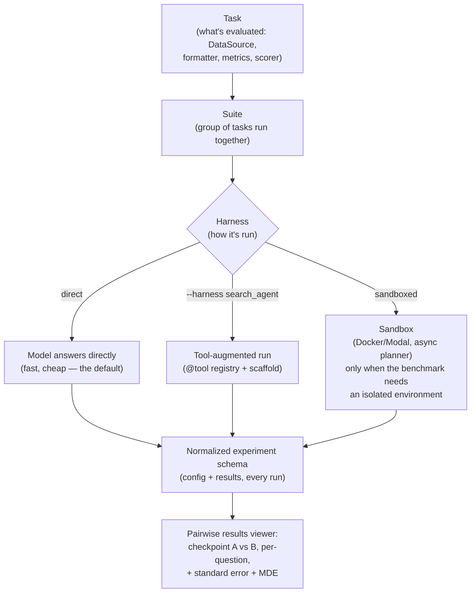

# olmo-eval

> Allen AI's open-source evaluation workbench for the *loop* of model development — same benchmark, different harness, with a built-in answer to "is this 2pp change real or noise?"

**Category**: tools
**Last updated**: 2026-06-13
**Status**: active

## What it is

Evaluating a model in production (run fixed benchmarks, get a leaderboard score) and evaluating a model *while you're building it* (run the same probes after every data/architecture/hyperparameter tweak, and ask "did that help, specifically?") are different problems. Most eval tooling is built for the first case — or, for agents, for running multi-step tool-use tasks inside a sandbox. Neither is built for the second: a tight, repeated loop across checkpoints where you need to know not just the score, but whether it moved for a real reason.

olmo-eval is Allen AI's answer, building on their 2024 **OLMES** standard (which pinned down prompt formatting and scoring so benchmark numbers were comparable across papers and models). olmo-eval keeps that reproducibility guarantee but extends it across the whole dev loop with one core separation: a **Task** (what's being measured — data source, formatter, sampling params, metrics, scorer) is decoupled from a **Harness** (how it's run — which provider, what tools are available, what scaffold, whether it runs in a sandbox). **Suites** group tasks that run together. Because task and harness are independent, the *same* benchmark can run as a plain baseline or get re-run with a tool-using / search-agent scaffold just by swapping the harness — no rewrite.

Agentic and multi-turn evaluation is first-class, not bolted on: `ExternalEval` / `SandboxedExternalEval` wrap an existing agent benchmark (keeping its own runner and scoring) and normalize the result into olmo-eval's schema. A sandbox + capability-routing layer (Docker or Modal, with an async planner) is opt-in per-benchmark — a benchmark that just needs the model to answer questions runs directly and cheaply; one that needs to execute model-written code gets an isolated container. Every run lands in a normalized experiment schema, and a results viewer does **pairwise, per-question comparison between two checkpoints**, reporting standard error and the **minimum detectable effect** — the smallest difference that's distinguishable from noise.

Source: Allen AI, *"olmo-eval: An evaluation workbench for the model development loop"*, Hugging Face Blog (2026-06-12). Code: [github.com/allenai/olmo-eval](https://github.com/allenai/olmo-eval).

## Why it matters

[[harness-and-scaffolding]] already names the concept Dean would want here: *"An eval harness is the same loop pattern but records metrics at a checkpoint instead of updating weights."* olmo-eval is that idea, shipped as a working library — and its central design choice is the transferable lesson, independent of whether Dean ever runs the code:

- **Write the eval once, decide how it runs later.** A Task is a fixed definition of "what good looks like." The Harness — direct call, tool-augmented agent, sandboxed code-exec — is swappable underneath it. That maps cleanly onto an OpenRouter-style multi-provider setup: define a quality probe for Praxis once, then run it against different models or different agent scaffolds without re-deriving the benchmark each time.
- **"Is this real or noise?" is the actual question in an iteration loop.** Every prompt tweak, retrieval-config change, or model swap produces *some* score delta. The pairwise checkpoint comparison + minimum-detectable-effect framing is a generalizable pattern for any of Dean's eval work — RAG quality, agent task-completion, or Praxis's growth-zone scoring — where the risk is chasing noise instead of signal.
- **Sandboxing as an exception, not a default.** olmo-eval's "lightweight by default, isolated container only when the benchmark needs one (e.g. executing model-written code)" mirrors the cost-discipline Dean already applies elsewhere (don't reach for Docker/Ray when a direct call will do).
- **A live comparison point for agent-eval infrastructure.** olmo-eval explicitly contrasts itself with **Harbor** — another open framework for agent evals — on exactly the axis [[agent-evaluation-and-failure-modes]] cares about: does the eval observe the whole trajectory, and does it stay cheap enough to run constantly rather than occasionally.

## How it works



### Defining a benchmark vs. defining a policy variant

A Task is plain Python — data source, formatter, sampling params, and a scorer:

```python
@register("internal_freshqa")
class InternalFreshQA(Task):
    data_source = DataSource(path="s3://evals/internal/freshqa.jsonl", split="test")
    formatter = ChatFormatter()
    sampling_params = SamplingParams(temperature=0.0)
    metrics = (AccuracyMetric(scorer=ExactMatchScorer),)

    @property
    def instances(self):
        for idx, doc in enumerate(DataLoader().load(self.config.get_data_source())):
            yield Instance(question=doc["question"], gold_answer=doc["answer"],
                            metadata={"id": doc.get("id", f"freshqa_{idx}")})

# Same benchmark, different evaluation policy — no duplication
register_variant("internal_freshqa", "3shot", num_fewshot=3, fewshot_seed=1234)
register_variant("internal_freshqa", "zero", num_fewshot=0)
```

Running it is where the harness swap happens — the benchmark definition above never changes:

```bash
# Baseline: model answers directly
olmo-eval run -m my-instruct-checkpoint -t internal_freshqa:zero

# Same task, same scoring — now with a tool/search-using runtime
olmo-eval run -m my-instruct-checkpoint -t internal_freshqa:zero --harness search_agent
```

### olmo-eval vs. Harbor

| | Harbor | olmo-eval |
|---|---|---|
| Built for | Publishing / sharing agent benchmarks | The everyday model-dev loop: iterate → compare → repeat |
| Execution | Always sealed, reproducible containers | Lightweight direct run by default; sandbox only when the benchmark requires one |
| Adding a benchmark | Extra verification steps, built for public release | Scales to what's needed: short definition, optional tool use, or a thin wrapper (`ExternalEval` / `SandboxedExternalEval`) around an existing runner |
| Output | Overall score per model | Overall score + standard error + minimum detectable effect, plus pairwise per-question comparison across checkpoints |
| Task / harness coupling | — | Decoupled — the same Task runs under different Harnesses (provider, tools, scaffold, sandbox) without being rewritten |

The four components — task/suite/harness abstraction, sandbox + capability routing, normalized experiment schema, pairwise results viewer — are each useful standalone, but the schema is what makes the others compound: every run, regardless of harness, lands in the same comparable format.

## Related
- [[harness-and-scaffolding]]
- [[llm-agent-evaluation]]
- [[agent-evaluation-and-failure-modes]]
- [[agentic-evals-and-long-horizon-tasks]]
