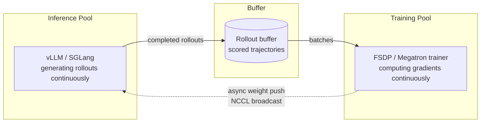

# RL Post-Training Libraries

> The open-source software layer that turns "reward a model for getting things right" into a runnable system — and the one design lesson the whole field converged on: keep the inference GPUs generating while the training GPUs train.

**Category**: tools
**Last updated**: 2026-05-28
**Status**: active

## What it is

This page covers two staged Hugging Face pieces that, read together, map the *RL post-training library* landscape — the tools you'd reach for to fine-tune an LLM with reinforcement learning (GRPO, PPO, RLVR, on-policy distillation) rather than plain supervised data.

- **"Keep the Tokens Flowing"** is a survey of **16 open-source async-RL libraries** (verl, SLIME, AReaL, NeMo-RL, ROLL, SkyRL, open-instruct, PRIME-RL, PipelineRL, OAT, ART, Atropos, MILES, TorchForge, Tunix, verifiers-rl). It compares them across **seven design axes** and extracts the architectural principles the field independently arrived at.
- **"TRL v1.0"** is the release note for Hugging Face's **TRL** — the general-purpose post-training library (3M downloads/month) that Unsloth and Axolotl build on. v1.0 is less a feature drop than a *stability contract* and a statement of design philosophy for a field that won't sit still.

The two are linked at the source: the TRL team wrote the 16-library survey to design TRL's own upcoming async trainer. So this is one story — "what does post-training infrastructure look like when the methods underneath it keep getting invalidated?" — told from two angles: the comparative landscape, and the library trying to absorb all of it without breaking its users.

The single fact to anchor on: **in RL post-training, generation (the model writing rollouts) dominates wall-clock time, not the gradient step.** A batch of 32K-token rollouts on a 32B model can take *hours* on one GPU while the training GPUs sit idle. Everything in both articles is downstream of trying to stop that idling.

## Why it matters

RL post-training is how the current generation of reasoning and agent models got good at math, code, and tool use — you reward verifiable outcomes instead of imitating a fixed dataset. But the *systems* problem underneath it is brutal and was, until recently, solved privately inside frontier labs. These two posts are the open ecosystem catching up and writing down its conventions.

What changes because this exists:

- **There is now a shared vocabulary and a reference taxonomy** (the seven axes) for reasoning about any RL trainer. If you ever evaluate or debug one, you can ask the right questions: how does it sync weights, how does it handle stale rollouts, can it overlap generation and training at all.
- **The bottleneck has a name and a shape.** "Your GPUs are idle 60% of the time" is a synchronous-loop problem, and the entire field converged on the same fix (below). That convergence is itself the signal — when 16 independent teams build the same architecture, it's a real invariant, not a fashion.
- **TRL v1.0 makes the most accessible RL library *stable*** — semver guarantees, a clear stable/experimental split — which lowers the barrier for anyone who wants to *try* RL fine-tuning without standing up a Ray cluster.
- **It exposes where RL is heading**: MoE post-training, process rewards, multi-agent co-evolution, and on-policy distillation — each of which stresses today's infrastructure in a specific, predictable way.

For an AI engineer who *uses* models rather than trains frontier ones, the value is a clear-eyed map: when RL post-training would actually matter for a system you're building, and what it costs to get there.

## How it works

### The core insight all 16 libraries converged on

Synchronous RL runs one loop: sample prompts → generate G completions each → score them → compute advantages → backward pass → optimizer step → push new weights to the inference engine → repeat. Every phase *blocks* the next. Because generation dominates, the training GPUs idle for most of the wall clock.

The universal fix is **disaggregation + async weight sync**:

Put inference and training on **separate GPU pools**, connect them with a **rollout buffer**, and push updated weights **asynchronously** so neither side waits. The inference pool generates batch N+K while the trainer is still on batch N. This is "async training": generation and training *actually overlapping*, which only disaggregated mode can do (colocated mode shares GPUs and must take turns).

The cost: you now have rollouts generated under an *old* policy version while the trainer has moved on — **staleness** — plus the problem of getting fresh weights back to inference before rollouts go stale, plus what to do with a half-finished rollout when new weights land mid-sequence. Those three problems generate most of the seven axes.

### The 16-library survey: seven axes as a comparison map

The survey's real contribution is the **taxonomy**, not the per-library specs. Grouped by what each axis decides:

| Axis | The question it answers | The options (and who picks what) |
|---|---|---|
| **1. Orchestration** | How are distributed components coordinated? | **Ray actor model** dominates (8/16: verl, SkyRL, NeMo-RL, SLIME, MILES, ROLL, OAT, open-instruct) — richest abstraction, heavy dependency. **Native Python** (asyncio/threading: PipelineRL, AReaL, ART, verifiers-rl) — light, debuggable, single-node-leaning. **Pub/sub** (PipelineRL inter-pool, Redis). **HTTP microservices** (Atropos). Meta's **Monarch** (TorchForge) is a PyTorch-native actor model; Google's **Tunix** is JAX/TPU and off in its own world. |
| **2. Rollout buffer depth** | How much data is in flight? | **No buffer / synchronous** (TRL today, ART) → **double-buffer / one-step-ahead** (verifiers-rl, MILES, OAT) → **bounded queue / 2–K** (verl, SkyRL, NeMo-RL, PRIME-RL, open-instruct, AReaL, …) → **unbounded stream** (PipelineRL, Atropos). Deeper = more throughput, more staleness. |
| **3. Weight sync protocol** | How do new weights reach inference, and does generation pause? | **Transport**: NCCL broadcast is the default; verl adds bucketing (~20ms); CUDA IPC / shared memory for colocated. **Interrupt model** is the interesting part: from *never stop* (PipelineRL swaps weights between token decode steps) → abort-per-HTTP-request → soft-pause/drain → full per-batch block. |
| **4. Staleness management** | What to do with off-policy rollouts? | Three *orthogonal* strategies, usually combined: **version rejection** (tag each sample, drop if too old), **depth bounding** (queue capacity caps lag structurally), **IS correction** (importance-sample-reweight stale samples instead of dropping). Production systems (PRIME-RL, AReaL, open-instruct) trend toward **hybrid** depth-bound + optional IS. |
| **5. Partial rollout handling** | What happens to an in-flight generation when weights update? | Ranges from *implicit continuation* (PipelineRL — sequence just keeps going on new weights) through *abort + prefix-resume* (SkyRL, SLIME) and *explicit save/resume* (verl) to *no support / wait for batch boundary* (verifiers-rl, OAT, Atropos, Tunix). Matters most for long agentic rollouts that take minutes. |
| **6. LoRA support** | Can you train adapters only, and sync just the deltas? | LoRA is **sparsely supported and inconsistent**. When present + inference-server-aware, it enables *adapter-only sync*: push ~50MB of rank-32 deltas (sub-ms) instead of broadcasting a whole 7B+ model. Three families: HF `peft` (most common), Megatron-Bridge (for 3D parallelism), and custom (NeMo-RL, PRIME-RL, Tunix/qwix). SLIME and TorchForge: no LoRA at all. |
| **7. Training backend & parallelism** | How big a model can it train; can it do MoE? | DeepSpeed ZeRO / FSDP2 / Megatron. **MoE / Expert Parallelism is the emerging differentiator** — only Megatron-backed libs (verl, SLIME, MILES, ROLL, NeMo-RL) and PRIME-RL's FSDP2+EP path handle it correctly. ZeRO-only libs can *load* an MoE but negate its sparsity. |

**Reading the landscape by personality:**

- **verl** (ByteDance, ~20k stars) and **SLIME** / **AReaL** are the heavyweight, Megatron-backed, MoE-capable production systems — what you'd use to post-train a frontier-class open model.
- **PipelineRL** (ServiceNow) is the throughput specialist: its never-stop weight swap is qualitatively different from everyone else.
- **PRIME-RL**, **AReaL**, **open-instruct** are the hybrid-staleness production references.
- **verifiers-rl**, **OAT**, **Atropos** are lighter / research-scale; verifiers-rl deliberately makes staleness impossible by construction (depth=1).
- **TorchForge** (Meta/Monarch) and **Tunix** (Google/JAX) are the new ecosystem-specific entrants.

### The "next wave" — where RL is going and what breaks

The survey's most useful forward-looking section frames each trend as "if this wins, what breaks in my stack?":

- **Critic-free algorithms (GRPO etc.)** free ~50% of training memory (no value network) but *increase* sync pressure — bigger groups, faster policy drift. Per-sample version tagging stops being optional.
- **Process rewards (PRMs)** break the assumption that scoring is cheap. A PRM forward pass over a 32K trace can rival generation cost, forcing async reward pipelines and dedicated scoring GPU tiers.
- **Multi-agent co-evolution** changes the atomic unit from a (prompt, completion, reward) triple to an *episode* (a graph of turns), and compounds the straggler problem multiplicatively.
- **MoE training-inference mismatch** (the DeepSeek-V3.2 case study) is the sleeper insight: vLLM and Megatron can route the *same token to different experts* due to floating-point rounding in the gating function, corrupting the gradient. The fixes — *Keep Routing* and *Keep Sampling Mask* — require the inference server to hand back extra metadata (`expert_routing`, `sampling_mask`) alongside logprobs. **No open library implements this yet** — it's a correctness, not performance, issue for MoE RL.
- **On-policy distillation** is structurally *the same async problem*: student generates, teacher scores (replacing the verifier). The lesson: don't build async RL infra as GRPO-specific — treat the scoring phase as a pluggable interface, and the same buffer/staleness/sync machinery covers RL, PRMs, and distillation.

### TRL v1.0: what changed and why

TRL's release is philosophically the opposite of the survey's deep-systems focus — it's about **how to ship stable software for a field that keeps invalidating its own assumptions**. Post-training's center of gravity has moved repeatedly: PPO (policy + reward model + value model + RL loop) → DPO-style preference optimization (no reward model needed) → RLVR/GRPO (rewards from verifiers, rollouts matter again). Each shift made previously-"fundamental" components optional. TRL's answer:

| Change in v1.0 | What it means |
|---|---|
| **Stable / experimental under one roof** | `from trl import SFTTrainer` (stable, semver) vs. `from trl.experimental.orpo import ORPOTrainer` (no promises, moves fast). New methods land in experimental; they graduate only when usage justifies maintenance cost. Stable core = SFT, DPO, Reward modeling, RLOO, GRPO. |
| **Deliberately minimal abstractions** | Counterintuitive design: *avoid generic base classes, favor explicit implementations, accept duplication.* RLOO and GRPO share near-identical code on purpose — keeping deltas small makes them easier to evolve than a shared hierarchy that the next paradigm breaks. (The abandoned `Judge` abstraction is their cited cautionary tale.) Mirrors the Transformers "single-file" philosophy. |
| **Acknowledged it's infrastructure** | 75+ post-training methods, 3M downloads/month, Unsloth/Axolotl built on top. A renamed argument was already someone else's production incident — v1.0 makes the implicit stability contract explicit. |
| **Roadmap** | **Async GRPO** (applying exactly the survey's lessons: bounded queue, per-token `model_version`, NCCL packed transfers, partial-rollout prefix-resume/abort-retry), deeper MoE/expert-parallelism support, and **"making training legible to agents"** — emitting structured warnings (`Group reward std is 0.01 — advantage signal collapsed`) a beginner *or an agent* can act on, instead of vibes-based loss-curve watching. |

TRL's positioning vs. the survey libraries: it's the **general-purpose, low-infrastructure, broadly-integrated** option (single GPU, standard stack, full HF Hub integration, any experiment tracker). It explicitly does *not* compete with verl on 671B-scale throughput or PipelineRL on async generation — those are the specialist tools the survey covers. TRL is where you start.

## Dean-Relevance

**Adoption path**: watch

**Why**: This is squarely in your "understand the landscape" frontier zone — RL for agents, reward design, training methodology — but it's not hands-on for you. Praxis is built on hosted models via OpenRouter (Claude/Gemini); you don't own model weights to post-train, and almost everything you want from a Praxis agent today is reachable through prompt engineering, context engineering, and verifiable scaffolding rather than RL fine-tuning. The honest trigger for crossing from *watch* to *experimental* is narrow: you'd need (a) a task where verifiable reward signals exist (your growth-zone scoring is *exactly* the kind of deterministic check RLVR feeds on), (b) a small open model you control, and (c) evidence that no amount of prompting closes the gap. Until then this is a map, not a tool — but it's a map worth holding, because it tells you *what RL post-training costs* before you ever consider it, which is the systems-level judgment you actually use.

**Analogy**: The async-RL architecture is a restaurant kitchen that stopped making the waiters wait. The synchronous version: one cook takes an order, cooks the whole dish, plates it, *then* takes the next order — everyone else stands idle. Disaggregation puts a line of cooks (inference GPUs) plating continuously onto a pass (the rollout buffer), while the head chef (the trainer) tastes and adjusts the recipe (weights) and slips updated recipe cards back to the line *without stopping service*. "Staleness" is a cook still working off last week's recipe card; "Keep Routing" is two cooks who read the same recipe but reach for different spice jars and quietly ruin the dish. TRL's design philosophy is the opposite move — refusing to build a fancy universal kitchen for a menu that changes every season, and instead writing each recipe out longhand so any one can be rewritten without breaking the others.

**Suggested next step**: None hands-on — keep this as your landscape map. If Praxis ever hits a wall where a hosted model *structurally* can't be steered to your growth-pedagogy via prompting, the first experiment is the cheap one: TRL's stable `GRPOTrainer` on a small open model with your growth-zone scorer as the verifiable reward, single GPU, no Ray. That's the lowest-friction on-ramp the ecosystem offers, and this page tells you it exists before you'd need to go looking.

## Sources

- Hugging Face Blog, *"Keep the Tokens Flowing: Lessons from 16 Open-Source RL Libraries"* (2026-03-10) — Dirhoussi, Gallouédec, Rasul, Tunstall, Beeching, et al.
- Hugging Face Blog, *"TRL v1.0: Post-Training Library Built to Move with the Field"* (2026-03-31) — Gallouédec, Liu, Cuenca, Paniego.

## Related
- [[train-time-rl-scaling]]
- [[verifiers-in-llm-reasoning]]
- [[verifiable-rl-environments]]
- [[agentic-rl-exploration]]
- [[llm-inference-serving-internals]]
- [[evolutionary-search-self-improving-agents]]
- [[harness-and-scaffolding]]
- [[test-time-compute-scaling]]
- [[deepseek-v4]]
