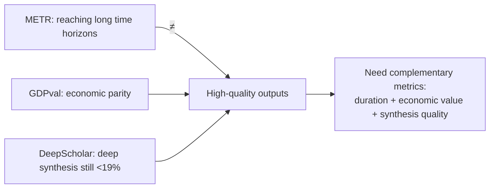

# Agentic Evals & Long-Horizon Tasks

> Measuring agents by the *length* of task they can complete (METR time horizon), the *economic value* they deliver (GDPval), and the *quality* of open-ended research synthesis (DeepScholar-Bench) — three complementary lenses on "how capable, really?"

**Category**: topics
**Last updated**: 2026-05-25
**Status**: active

## What it is

Traditional single-shot benchmarks (answer one question, score it) saturate fast and say little about whether an agent can sustain a *long, multi-step* task. Three benchmarks attack the gap from different angles:

| Benchmark | The question it asks | Metric |
|---|---|---|
| **METR** | *How long* a task can the agent complete? | Time horizon — human-time of tasks done at X% success |
| **GDPval** | *Is the output good enough vs. a human expert?* | Win rate vs. industry professionals (economic value) |
| **DeepScholar-Bench** | *Can it do deep research synthesis?* | Knowledge synthesis + retrieval + verifiability |

This is the *capability-measurement* counterpart to [[llm-agent-evaluation]] (which is about the metric stack — faithfulness, task completion, tool correctness). Here the focus is on macro trajectories: how fast is the frontier moving, and on what.

## Why it matters

These evals are how you reason about *forecasting and deployment*, not just A/B-testing a prompt. METR's doubling trend is the single most-cited number for "when can agents do a day/week of work autonomously," and GDPval reframes progress around the only axis that ultimately matters economically: is the work as good as a person's? The throughline for a builder — and the reflection that closes the lecture — is that **reaching a long time horizon is not the same as producing high-quality output**, so picking which long-horizon tasks to trust an agent with is a live judgment call.

## How it works

### METR — time horizon and the doubling law

METR measures the **duration (for a skilled human) of tasks a model completes at a given success rate**, using a human completion time as a universal difficulty anchor.

- Task suites span **6 orders of magnitude**: **SWAA** (atomic actions, seconds) → **HCAST** (diverse software/research, 1 min–30 hrs) → **RE-Bench** (ML research, ~8 hrs); ~170 tasks total.
- Difficulty is set by the **geometric mean of expert completion times** for successful human attempts (a caveat: success-conditioning may *underestimate* difficulty).
- **Strong correlation** (R² ≈ 0.83) between model success rate and human time-to-complete: the longer a task takes a human, the less likely the model succeeds. Past a few hours of "deep work," success collapses.

**The headline trend:**

| Threshold | Current frontier (~2025) | Doubling time |
|---|---|---|
| 50% success | ~50–59 min (Claude 3.7) | ~7 months |
| 80% success (reliable) | ~4–10 min only | ~213 days (~5× shorter horizon) |

Extrapolating ~7-month doublings → a **1-month task horizon by ~2028–2031** (with caveats). Note the gap: high *reliability* (80%) lags far behind 50%, which is the real constraint for production.

**Failure-mode analysis** (a transferable eval technique on its own): the common patterns are poor planning/tool choice, incorrect reasoning, **premature task abandonment**, and repeating failed actions. SWE-bench replication shows the same exponential trend (~70-day doubling); annotators tend to *underestimate* messy real-repo difficulty, so horizons measure "low-context human" capability.

### GDPval — economic value vs. experts

GDPval evaluates output on **real, economically valuable tasks** drawn from the **O*NET** occupation taxonomy (9 sectors >5% of GDP, 44 occupations, 1,320 tasks / 220 in the open gold set; avg ~7 hrs, ~$398 value, 67.7% need reference files).

- Scored by **pairwise expert preference** ("is the AI's output better than a professional's?").
- Trend is **roughly linear, not exponential** like METR — Claude Opus 4.1 ~47.6% win+tie, *approaching parity* with experts on many tasks.
- **Performance varies by sector/duration/modality**: best on 0–2 hr tasks; declines on longer ones; Claude stronger on multimodal (slides, spreadsheets, PDFs), GPT-5 stronger on pure text/accuracy.
- **Context experiment**: deliberately under-specifying prompts (42% shorter) dropped win rate 47.7% → 44.3% — models struggle to "figure out what to work on," which is exactly the context-acquisition humans provide.
- Severity of failures: ~48% "acceptable but subpar," ~29% bad/catastrophic, and **23% of the time human graders disagreed** with the original assessment — output quality is genuinely subjective.

### DeepScholar-Bench — open-ended research synthesis

A **live** benchmark (re-runnable monthly on fresh post-cutoff papers, avoiding contamination): generate the Related Work section for a recent arXiv paper. Scored on three axes — **Knowledge Synthesis** (organization, nugget coverage), **Retrieval Quality** (relevance, reference coverage), **Verifiability** (citation precision, claim coverage).

- **No system exceeds ~19% overall.** Even with an *oracle* giving perfect sources, models surface only ~52.8% of key facts.
- A hard **quality–verifiability tradeoff**: systems with the best synthesis have the weakest citations, and vice-versa — none excels at both.

### The unifying tension

External validity is the open question — and all three still need validation against humans who can actually solve the tasks.

## Dean-Relevance

**Fit score**: 7/10
**Adoption path**: watch
**Why**: Dean builds agents, so the long-horizon *reliability* gap (80% success ≈ only 4–10 min tasks) is the single most important calibration for what to trust an agent with vs. keep a human in the loop — and the GDPval finding that under-specified context tanks performance is a direct argument for the context-engineering discipline he already values. The closing reflection ("what makes humans valuable and distinct, and how they use AI to reach greater heights") is almost a restatement of the Crafted/Praxis human-growth thesis.
**Analogy**: METR is a stopwatch on a worker (how long a job before they lose the thread); GDPval is a blind taste-test against a pro; DeepScholar is asking whether the intern's literature review is actually trustworthy. A model can be fast and still serve a dish no one wants.
**Suggested next step**: When scoping a Crafted/Praxis agent feature, sanity-check it against METR's 80%-reliability horizon (minutes, not hours) — design the agent to checkpoint and hand off rather than run unattended for long stretches, and add a GDPval-style pairwise "better than a human draft?" judge to one output type.
**Watch for**: METR/GDPval results on the next model generation — if the 80% (reliable) horizon starts doubling as fast as the 50% horizon, the case for longer unattended agent runs changes materially.

## Related
- [[llm-agent-evaluation]]
- [[agentic-errors]]
- [[building-agents-best-practices]]
- [[agentic-rl-exploration]]
- [[self-improving-ai-agents]]
- [[advanced-rag-techniques]]
