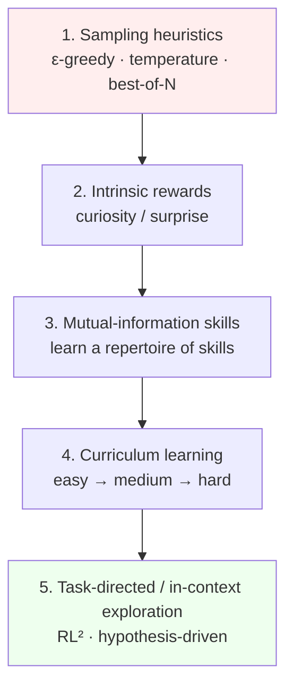

# Agentic RL & the Exploration Problem

> Agent learning *is* reinforcement learning, and RL has three unsolved problems — verification, credit assignment, and exploration. Exploration is the one LLMs have barely touched, and it's the gate to models that *discover* rather than recall.

**Category**: topics
**Last updated**: 2026-05-25
**Status**: active

## What it is

An agent, by definition, perceives an environment and acts to maximize reward — so "agentic learning" is reinforcement learning sitting on top of an LLM. The **fundamental equation** is the policy gradient:

```
∇θ J(πθ) = E[ Σ_t  ∇θ log πθ(a_t | s_t) · R(τ) ]
```

For a language model, the action `a_t` *is* the next token and the state `s_t` is the context — so RL on an LLM is literally **maximizing the likelihood of the next token, weighted by the return**. If the return were 1 everywhere, you'd recover ordinary next-token prediction. That reframing is the whole bridge between pretraining and agentic RL.

From this one equation fall **three fundamental problems**:

1. **Verification** — where does the return `R(τ)` even come from? (See [[verifiers-in-llm-reasoning]].)
2. **Credit assignment** — of all the actions in a long trajectory, which ones *earned* the reward? Largely **unsolved in the LM setting**: you take a whole sequence of actions, see one reward at the end, and must back-propagate credit to the right steps.
3. **Exploration** — under what data distribution do you sample trajectories? The agent must simultaneously exploit known-good trajectories and explore to find the reward-relevant ones.

## Why it matters

We are *far earlier* than it feels: RL only started reliably working on LLMs around 2024 — two years prior, people thought it never would (optimization too hard, reward hacking). Meanwhile the **deep-RL era (≈2011–2021)** explored a rich menu of exploration ideas that got shelved during the LM-pretraining boom and are now newly relevant.

The stakes: **without good exploration, an LLM can only discover what it can randomly stumble onto in N tries** (best-of-N). Unlocking real exploration is the difference between a model that *recalls and recombines* and one that *discovers* — which is the entire premise of [[self-improving-ai-agents|self-improving agents]] and ties to the discovery engines in [[evolutionary-search-self-improving-agents]]. For Dean, the lecture is also unusually rich in **human-learning analogies**, which is its own payload.

## How it works

### The exploration ladder — weakest to strongest



**Where LLMs are today: stuck on rung 1** (sampling heuristics, greedy decoding). Worse, because reasoning is a *low-entropy* distribution, people often do the **opposite** of exploration — steering models into low-entropy regions to elicit reasoning, which collapses exploratory ability.

### Rung 1 — sampling heuristics

- **ε-greedy**: act greedily, but a small ε of the time take a random action (how DQN started). Risk: if you greedily sample the "optimal" action from an *approximate* policy, you collapse the policy.
- **Temperature tuning**: a single exploration knob; too high → noise.
- **Best-of-N (random shooting)**: sample N trajectories, keep the best — the strongest of the weak methods, and essentially where LLMs live (GRPO is best-of-N with a Monte-Carlo advantage baseline).

### Rung 2 — intrinsic rewards (curiosity)

Reward the agent for **surprise** — the prediction error of its own world model (Pathak et al. 2017, ICM):

```
r_t = ‖ φ̂(s_{t+1}) − φ(s_{t+1}) ‖²      (predicted vs. actual next-state features)
```

The agent gets "bored" of well-modeled regions (low error) and seeks novelty (high error) — it learned to play Mario with *no extrinsic reward*. **Why it breaks on LLMs**: the **noisy-TV problem** — in a stochastic environment, unpredictable noise gives infinite "surprise," so the agent fixates on static. With a 100k-token vocabulary over long sequences, the out-of-distribution space is so vast that maximizing prediction error just yields a **random soup of tokens**.

### Rung 3 — mutual-information skills (DIAYN family)

Learn a set of distinct *skills* with no reward by maximizing mutual information `I(τ; Z) = H(τ) − H(τ|Z)` between trajectories `τ` and a latent skill vector `Z`: increase trajectory diversity while making each skill easily identifiable. Simulated agents learned to walk/run/flip with no extrinsic reward — each cluster of behavior was a `Z`. Same noisy-TV / huge-action-space obstacles in the LM setting.

### Rungs 4–5 — curriculum + task-directed (the ones that scale)

These are the methods that *worked at scale* in deep RL and look most LM-feasible:

- **RL²: Fast RL via Slow RL** (Duan et al. 2016): keep multiple episodes in context and **maximize aggregate return over K episodes**, not one. The agent learns to use episode 1's experience to B-line in episode 2 — **hypothesis-driven, directed exploration** emerges. This is "learning to learn," and it maps cleanly onto an LLM's long context: an agent that tries, observes feedback, and tries smarter.
- **AdA — Human-Timescale Adaptation** (DeepMind): combine RL² with a **curriculum** (a fitness function picks tasks at the *border* of what the agent can do — the **zone of proximal development**). At large engineering scale the agent adapted to novel 3D tasks faster than humans. Stores attempts in context only when it *learned* something → hypothesis-driven.
- **Algorithm Distillation** (Laskin et al.): turn exploration into a *next-token-prediction* problem. Train an RL agent, **store its entire learning history** (not just the final expert policy) as a sequence, and train a transformer to model that sequence. Result: the transformer **learns to learn in-context** — give it a bad policy and it improves it. Crucial contrast: distilling *expert trajectories only* (ED) yields imitation that **never improves**; distilling the *learning algorithm* (AD) yields a model that improves from bad data. (This reframes the SFT step in reasoning-model training: imitate optimal traces → static; distill the learning process → improvable.)

### Curriculum mechanics (from AdA)

Replace the high-variance return with an **advantage** (how much better an action is than typical). If a task is too easy or always-solved, advantage → 0 and there's no signal — so **sample tasks at the frontier of ability**. Exactly the zone of proximal development: too easy or way-over-your-head both teach little; progress lives at the edge, in micro-steps.

## Dean-Relevance

**Fit score**: 7/10
**Adoption path**: watch
**Why**: This is the most *conceptually load-bearing* lecture for a systems-thinker — it explains *why* current agents are limited to best-of-N and what the unlock looks like. More pointedly for Dean: the curriculum / **zone-of-proximal-development** framing and the curiosity-as-growth analogy ("face your fear, go into the unknown, maximize the reward") are essentially the **Crafted/Praxis human-growth thesis stated in RL terms** — task-directed exploration at the edge of ability is what good human learning *is*. The RL²/algorithm-distillation idea ("learn to learn in context, not imitate") is also a sharp lens on agent design.
**Analogy**: A toddler learning to walk *uses the skill of crawling* to bootstrap — and a good coach keeps drills just past current ability, never trivially easy or impossibly hard. That's curriculum + task-directed exploration; it's also how Praxis should sequence a human's growth.
**Suggested next step**: — (foundational/conceptual). When designing Crafted/Praxis learning loops, borrow the curriculum principle explicitly: select the next challenge at the *frontier* of the user's demonstrated ability (where "advantage" is non-zero), not random or far-beyond.
**Watch for**: A credible exploration method that works on LLMs (beyond best-of-N) — that would be a genuine capability jump and is the field's stated bottleneck; worth tracking as a leading indicator of "discovering" agents.

## Related
- [[verifiers-in-llm-reasoning]]
- [[train-time-rl-scaling]]
- [[test-time-compute-scaling]]
- [[evolutionary-search-self-improving-agents]]
- [[self-improving-ai-agents]]
- [[agent-memory-learning-from-experience]]
- [[agentic-evals-and-long-horizon-tasks]]
