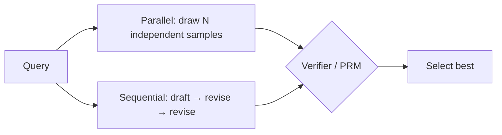

# Test-Time Compute Scaling

> Spending more compute at inference — sampling many candidate solutions and selecting among them — to buy accuracy you didn't pay for at training time.

**Category**: topics
**Last updated**: 2026-05-25
**Status**: active

## What it is

A fixed model has a fixed pretraining cost, but you can choose how much compute to spend *per query* at inference. Test-time (inference-time) scaling is the family of methods that trade extra inference compute for higher accuracy: instead of taking one greedy answer, you draw many samples, revise, search, and **select** the best one.

The foundational empirical result is **Large Language Monkeys** (Brown et al.): if you let a model take *k* attempts at a problem, the fraction of problems where at least one attempt succeeds (**coverage**, i.e. pass@k) keeps climbing — often log-linearly — as *k* grows into the hundreds or thousands. A weaker model with enough draws can match a stronger model's single-shot accuracy.

The catch, and the whole subject of this page: **generating** a correct answer somewhere in 10,000 samples is easy; **identifying** which one is correct is the hard part. Test-time scaling only converts to real accuracy when paired with a reliable [[verifiers-in-llm-reasoning|verifier]].

## Why it matters

It reframes "how good is the model" into "how good is the model × how much do I let it think." Two consequences:

- **Compute becomes a dial at deploy time.** You can push accuracy on a hard query without retraining — relevant to anyone calling models via API rather than owning training infra.
- **"Optimal test-time scaling can beat pretraining"** (Snell et al.): on a compute-matched basis, spending FLOPs at inference can outperform spending the same FLOPs making the base model bigger — for some problem regimes. That inverts the "just scale the model" reflex.

The bottleneck moves from *generation* to *verification* — which is why this page and [[verifiers-in-llm-reasoning]] are two halves of one story, and why [[train-time-rl-scaling]] exists (RL is one way to fold the search back into the weights).

## How it works

### Coverage scales with samples

Coverage (pass@k) as a function of attempts *k* follows an approximately exponentiated power law:

```
coverage(k) ≈ exp(a · k^b)
```

Plotted on a log axis it's close to a straight line over many orders of magnitude. Implication (the **long-tail-of-hard-problems** observation): there's always a tail of problems that need exponentially more samples, so coverage rises steadily but never trivially saturates — buying accuracy on the tail costs a lot of draws.

### pass@k vs Maj@k — coverage is not selection

| Metric | What it measures | The gap it exposes |
|---|---|---|
| **pass@k** | At least one of *k* samples is correct (needs an oracle to check) | Upper bound — what's *achievable* if selection were perfect |
| **Maj@k** | The majority-voted answer over *k* samples is correct | What you actually get with voting, no verifier |
| **best-of-N + verifier** | A verifier/PRM scores *N* samples; you take the top | The realistic operating point; quality tracks verifier quality |

The distance between pass@k and Maj@k *is* the **generation–verification gap** — the accuracy left on the table because you can't tell which sample is right.

### Where verification is robust, scaling is a free lunch

Test-time scaling pays off most when correctness is **cheaply and reliably checkable**:

- **Formal proofs** (Lean) — machine-checked, zero false positives.
- **Unit tests / executable code** — run it, see if it passes (the engine behind [[evolutionary-search-self-improving-agents|AlphaCode and AlphaEvolve]]).
- **"LLM-as-compiler" for CUDA kernels** — compile + benchmark the generated kernel.

Where the verifier is weak or absent (open-ended writing, subjective tasks), more samples just produce more plausible-wrong answers you can't filter.

### Parallel vs sequential, and compute-optimal allocation



- **Parallel sampling** — N independent shots; great breadth, no learning between them.
- **Sequential revision** — the model critiques and rewrites its own draft; great for problems where the first attempt is close.
- **Beam search guided by a Process Reward Model (PRM)** — expand the most promising partial reasoning steps (see PRMs in [[verifiers-in-llm-reasoning]]).
- **Compute-optimal scaling** (Snell et al.): the *right* mix of parallel vs sequential depends on problem difficulty — easy problems favor a little sequential revision, hard problems favor broad parallel search. Allocating a fixed budget by difficulty beats a fixed strategy.

### Archon — searching the inference architecture itself

The selection/composition of inference-time moves (how many samples, which ranker, fusion, verification cascade) is itself a search space. **Archon** treats "inference-time architecture search" (ITAS) as an optimization problem and uses Bayesian optimization (the same family as **MIPRO / DSPy** prompt optimizers) to find a good inference pipeline per task — a meta-layer on top of all the above.

## Dean-Relevance

**Fit score**: 7/10
**Adoption path**: experimental
**Why**: Dean calls Claude/Gemini through OpenRouter, so every technique here is reachable *without training infra* — best-of-N, self-consistency, and verifier-gated sampling are pure orchestration. Archon/ITAS is conceptually the same move as the DSPy/MIPRO prompt optimization that fits his Jinja2-templated pipelines, and the "compute as a deploy-time dial" framing matches a builder who wants to tune quality without swapping models.
**Analogy**: Rolling dice for a 20. One die rarely hits; ten dice almost always *contain* a 20 — but only if you can read the dice afterward. The reader (the verifier) is the whole game, not the rolling.
**Suggested next step**: On one hard, checkable task in Crafted/Praxis (e.g. structured extraction with a schema), wire best-of-N + a cheap LLM-judge or schema-validator as the selector, and compare to single-shot — that's the generation–verification gap measured on his own traffic.
**Watch for**: Cheaper reasoning models making large-N sampling economical per-request rather than reserved for hard queries — that flips test-time scaling from "special case" to default.

## Related
- [[verifiers-in-llm-reasoning]]
- [[train-time-rl-scaling]]
- [[evolutionary-search-self-improving-agents]]
- [[self-improving-ai-agents]]
- [[agentic-rl-exploration]]
- [[llm-agent-evaluation]]
