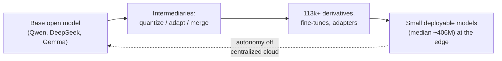

# State of Open-Source AI — Spring 2026

> Open AI stopped being the cheap-and-worse option and became the *substrate*: the floor under everyone, where most adaptation, specialization, and deployment now happens — and where the strongest argument for openness has quietly shifted from cost to security.

**Category**: synthesis
**Last updated**: 2026-05-28
**Status**: active

## What it is

Two Hugging Face pieces from spring 2026 — a data-heavy *State of Open Source* ecosystem report and an argument essay, *Why Openness Matters* (cybersecurity) — that, read together, describe the same phenomenon from two angles. The first measures *where the ecosystem went*. The second argues *why that direction is structurally safer*, not just cheaper.

The headline numbers: Hugging Face crossed **13M users, 2M+ public models, 500K+ public datasets** in 2025 — nearly doubling across the board. But the more telling shift is *who* and *what*: the share of model development coming from **industry labs fell from ~70% (pre-2022) to ~37% in 2025**, while **independent/unaffiliated developers rose from 17% to 39% of downloads** — at times a majority. And geographically, **China surpassed the U.S. in monthly and all-time downloads, with Chinese models reaching ~41% of downloads** (a plurality), driven by the post-DeepSeek-R1 open-source pivot.

The cybersecurity essay reframes all of this. Triggered by *Mythos* (a frontier model that autonomously finds and patches software vulnerabilities), it argues the capability is a *system* property — compute + security-relevant training data + scaffolding + speed + autonomy — not a model property. And once it's a system recipe others can rebuild, openness stops being a liability and becomes a defensive advantage: defenders need the same class of capability attackers already reach for.

## Why it matters

For an AI engineer, three implications compound:

**1. The open-model floor is rising fast, and it's where the real work happens.** The report's sharpest framing: open source is "where much of the *practical* work of AI development, adaptation, and deployment takes place." The ecosystem is no longer consumers pulling pretrained weights — it's participants producing fine-tunes, adapters, quants, merges, and benchmarks. Alibaba's Qwen family alone has **113,000+ direct derivative models** (200,000+ when counting all that tag it) — more than Google and Meta's open derivatives *combined*. The base-model release is now just the seed; the value is in the downstream tree.

**2. Build-vs-buy is being rewritten by *small* open models, not just frontier ones.** Smaller models dominate actual deployment — the median downloaded model is still only ~406M params, and even normalizing for release volume, top 1–9B models are downloaded ~4x more than 100B+ models. Capability gaps close rapidly through fine-tuning and task-specific adaptation (this is the [[specialization-beats-scale]] thesis in aggregate data form). For someone building a product, the question is no longer "can I afford the frontier model?" but "is there an open small model I can specialize that pushes autonomy to the edge and off a centralized provider?" Efficiency gains are pushing costs **10x–1000x below flagship pricing**.

**3. Openness-as-security is the non-obvious argument worth internalizing.** The intuitive case for open is cost and control. The deeper case is that *security is a four-stage speed race* — detection, verification, coordination, patch propagation — and openness distributes those stages across a community while closed systems centralize them inside one vendor, creating a single point of failure. Proprietary obscurity ("security through nobody-can-read-it") is decaying precisely because AI is getting good at reverse-engineering stripped binaries and legacy firmware. The closed attack surface is becoming legible from the outside *faster* than the single owning org can patch it from the inside.

## How it works

### Section 1 — The spring-2026 ecosystem data

| Dimension | One year ago | Spring 2026 | What it signals |
|---|---|---|---|
| Scale | ~1M models | **2M+ models, 13M users, 500K+ datasets** | Participation, not just consumption |
| Who develops | Industry ~70% (pre-2022) | **Industry ~37%; independents 39% of downloads** | Power decentralizing to individuals + small collectives |
| Geography | U.S.-led (Llama era) | **China plurality (~41% of downloads)** | Post-DeepSeek-R1 open pivot |
| Most-liked #1 | Meta Llama | **DeepSeek-R1** | International rebalancing of community attention |
| Big Tech contributor | — | **NVIDIA strongest; Baidu 0→100+ releases; ByteDance/Tencent 8–9x** | Even closed-leaning orgs (Baidu, MiniMax) went open |
| Deployed model size | — | **median ~406M; mean rose 827M→20.8B** | Quant/MoE pull the *mean*; real usage stays small |
| Fortune 500 on HF | — | **30%+ with verified accounts** | Enterprise normalization |

Structural facts worth carrying:

- **Extreme concentration.** ~half of all models have <200 downloads; the top **0.01% of models account for 49.6% of all downloads**. Open source is not one market — it's overlapping sub-ecosystems with their own sustained-reuse dynamics.
- **Engagement is brief and brutal.** Mean engagement duration per model is **~6 weeks**. Relevance requires frequent updates or domain-specific fine-tunes; stagnation loses share fast. (DeepSeek stayed competitive via V3 → R1 → V3.2 → [[deepseek-v4]] cadence.)
- **Intermediaries steer the ecosystem.** Individuals quantizing, adapting, and redistributing base models now meaningfully decide *what typical users can actually run*. The quant author is a power node.
- **Fastest-growing frontiers are physical and scientific.** Robotics datasets exploded **1,145 → 26,991** (rank 44 → #1 category on the Hub); AI-for-science (protein folding, molecular dynamics, drug discovery) coordinates hundreds of cross-institution contributors. Open source is expanding past text/image into the physical and experimental.
- **Sovereignty is now a driver.** Open weights let governments fine-tune on local data, run on domestic hardware, and pass regulatory review. South Korea named national champions and had three models trending simultaneously (Feb 2026); Switzerland, the EU, and the UK ("public money, public code") follow similar logic. Chinese models increasingly ship with explicit domestic-chip support.
- **The 2026 open question:** can Western commercial-friendly open efforts — **GPT-OSS, AI2's OLMo, Google's [[gemma-4]]** — match the *adoption momentum* of Qwen and DeepSeek? Releasing open weights is easy; capturing the derivative tree is the hard part.

### Section 2 — Why openness matters (the cybersecurity thread)

This is a distinct argument, not a continuation of the data. Its spine:

1. **Capability is a system, not a model.** Mythos finds/patches vulnerabilities because of compute + security-data training + scaffolding + speed + autonomy *together*. AI cyber capability is **"jagged"** — it doesn't scale smoothly with model size or general benchmarks. A *smaller* model in a well-built security system can match a frontier one. (This is [[specialization-beats-scale]] applied to security, and the system-over-model framing mirrors [[deepseek-v4]]'s "the window is capacity, the system is performance.")

2. **Reproducibility cuts both ways — so close the defender gap.** Because it's a recipe, attackers *and* defenders can build it. The core problem is **capability asymmetry**: leave the capability concentrated in a few well-resourced entities and defenders fall behind. Open models/tooling hand defenders the same class of capability.

3. **Obscurity is decaying as a defense.** AI-assisted reverse engineering of stripped binaries makes closed, binary-only legacy firmware — a huge, unmaintained attack surface — increasingly legible from the outside.

4. **AI inside closed codebases can make things worse.** Under bad incentives (rewarding feature volume over quality), AI-accelerated development injects *more* vulnerabilities — which then sit behind a single-org firewall where only that org can find them, while external AI attackers probe freely. More bugs, faster, behind one wall: exactly the imbalance open ecosystems avoid.

5. **The sweet spot is semi-autonomous + open + auditable.** Full autonomy (which Mythos approaches) is advised against. Semi-autonomous agents — prespecified actions, human approval gates — hit the benefit/risk sweet spot. But "human in the loop" only means something **if the human can see into the loop**: open scaffolding, open rule engines, and auditable decision logs/traces. A black box defeats the premise. High-stakes orgs can run open security agents privately — inspect the monitoring, fine-tune on their own secure data, keep everything behind their own firewall.

The unifying claim across both pieces: **the future is decided by the ecosystem around the model, not the model.** Security as a distributed, open, four-stage speed race; capability as a system recipe; value as a derivative tree. Same shape, three domains.

## Dean-Relevance

**Adoption path**: watch

**Why**: This is squarely in Dean's frontier zone — the open-vs-closed dynamic and ecosystem trends, read as a *system* rather than a feed of releases. It connects directly to his open/local-inference curiosity and his bias toward foundational, cross-domain implications over trend trivia. There's nothing to install; the value is a sharper mental model for build/buy decisions on Praxis (where to specialize a small open model vs. lean on OpenRouter's closed defaults) and for reasoning about *why* openness is structurally, not just economically, advantageous.

**Analogy**: Open-source AI is behaving like an **ecosystem, not a marketplace** — and Dean's native Meadows/*Thinking in Systems* lens fits it exactly. A base model is a keystone species; its real impact is the food web of 100k+ derivatives that grow on it (Qwen as the oak that an entire forest depends on). The security argument is the immune-system version of the same idea: a *monoculture* (one closed vendor owning detection→patch end to end) is efficient until one pathogen finds the single point of failure and sweeps through; a *diverse, distributed* population fails gracefully because detection and response are spread across many independent agents. Closed = monoculture; open = biodiversity. Resilience is an emergent property of distribution, not a feature you bolt on.

**Suggested next step**: Carry one heuristic into Praxis design reviews — **"capability is jagged; the system beats the model."** Concretely: before reaching for a frontier closed model for any agentic subtask, ask whether a *smaller open model + better scaffolding/retrieval/guardrails* clears the bar, given that median real-world deployment is ~406M params and gaps close fast under specialization. Treat the model as one component in a system you can inspect and audit — not the system itself. That framing also future-proofs against the "6-week engagement half-life": build the scaffolding to be model-swappable rather than betting the architecture on any single checkpoint.

## Sources

- Hugging Face — *State of Open Source on Hugging Face: Spring 2026* (Ghosh, Kaffee, Jernite, Solaiman; 2026-03-17)
- Hugging Face — *AI and the Future of Cybersecurity: Why Openness Matters* (Mitchell, Jernite, Clem; 2026-04-21)

## Related

- [[open-model-releases-spring-2026]]
- [[specialization-beats-scale]]
- [[deepseek-v4]]
- [[gemma-4]]
- [[model-compression]]
- [[embeddings-and-rerankers]]
