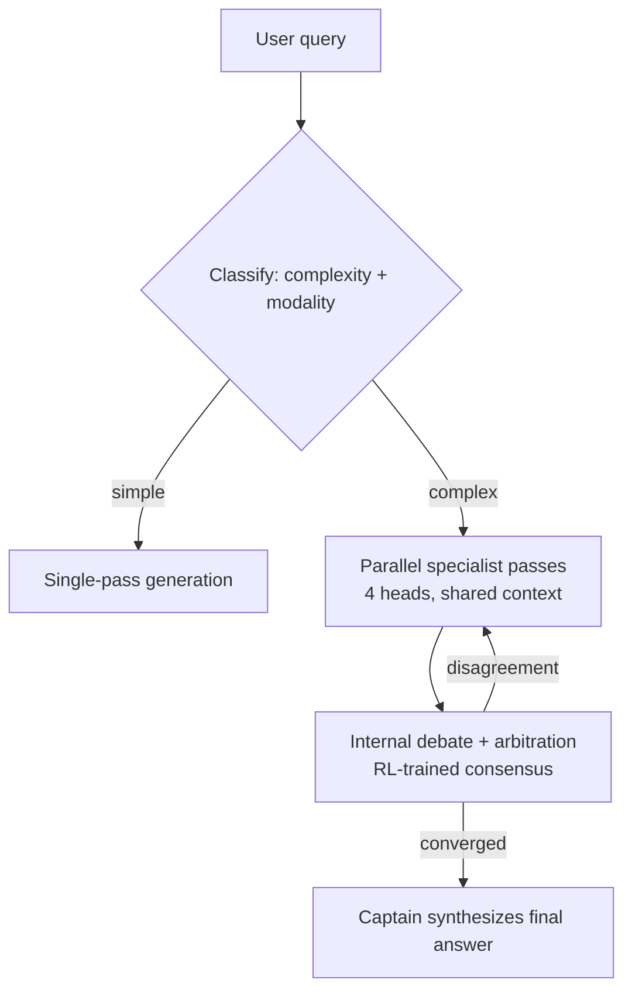

# Grok 4.20

> A frontier-scale Mixture-of-Experts LLM with a built-in four-agent inference layer — multi-agent collaboration baked *inside* one model rather than orchestrated outside it.

**Category**: topics
**Last updated**: 2026-05-25
**Status**: active

## What it is

Grok 4.20 (xAI) is a ~3T-parameter MoE transformer wrapped in a native multi-agent inference layer: four specialized "agent heads" over a shared base model, RL-heavy post-training, and trained-in tool use for search/code. *[Needs Verification — the parameter count, version naming, and agent-head design come from staged notes and are not independently confirmed.]*

The headline idea isn't MoE (known substrate — many FFN experts per layer, a gating net routing each token to top-k, huge capacity at small per-token compute). It's the architectural bet layered on top: instead of bolting a multi-agent system *outside* an LLM (planner + workers + orchestration glue), the collaboration happens *inside* one model. Four personas share weights and a single context buffer, run in parallel on complex queries, critique each other, and a coordinator synthesizes the answer.

This page exists to capture that bet — **experts inside vs. agents outside** — and what it implies for anyone building multi-agent systems the conventional way.

## Why it matters

The dominant pattern for serious agentic systems today is external orchestration: a planner/router, specialized workers, RAG per agent, and a pile of bespoke coordination code (see [[agentic-patterns]], [[agent-frameworks]]). Production reports put naive multi-agent failure rates at 40–80%, dominated by coordination and spec-ambiguity failures (see [[agentic-errors]]). Grok 4.20 is a bet that much of that fragility is *accidental complexity* — an artifact of gluing non-differentiable components together — and that folding routing, collaboration, and tool-use policy into one end-to-end-trained model removes it.

If the bet pays off, it reframes a build-vs-buy decision every agent engineer faces: how much of your orchestration layer is durable engineering, and how much is scaffolding a stronger base model will simply absorb. It's the "fold it into the model" answer to the same question [[context-engineering]] answers with "discipline one agent."

## How it works

**Four agent heads** — shared weights, differentiated by persona/adapters + prompting (not four separate models): *[Needs Verification on names/roles]*

| Head | Role |
|---|---|
| Grok / Captain | Coordinator + final aggregator |
| Harper | Research / factual verification; real-time web + X data |
| Benjamin | Math, logic, code, rigorous checking |
| Lucas | Creative, communication, UX, "what if" angles |

**Query flow:**

**The core argument — inside vs. outside:**

| Dimension | Experts/agents *inside* (Grok) | Agents *outside* (conventional multi-agent) |
|---|---|---|
| Latency / bandwidth | Shared activations + context; no re-encoding | Repeated tokenization, network hops, context stuffing |
| Training signal | Routing/collaboration/tool-use trained end-to-end with RL | Router/planner mostly prompt-engineered + offline eval |
| Error propagation | Differentiable, optimized to global loss | Symbolic routing glued with heuristics; local ≠ global |
| Coordination | Constrained, in-distribution protocol | Role confusion, conflicting answers, wasteful loops |
| Tool policy | Learned ("question type X → tool Y") | Hand-tuned prompts/heuristics |
| Runtime | One (internally complex) call | Combinatorial graph of agents + ops |

**Where conventional multi-agent still wins:** private-domain control via RAG, hard business constraints/guardrails injected as orchestration code, mixing model families per task, and upgrading one component without retraining a frontier model. The honest trade: external systems are bounded by their weakest piece (usually the planner/router) and can't "train away" pathologies — you detect them with evals and patch with prompts/code.

## Related
- [[context-engineering]]
- [[agentic-patterns]]
- [[agent-frameworks]]
- [[mcp-and-a2a]]
- [[model-compression]]
- [[building-agents-best-practices]]
